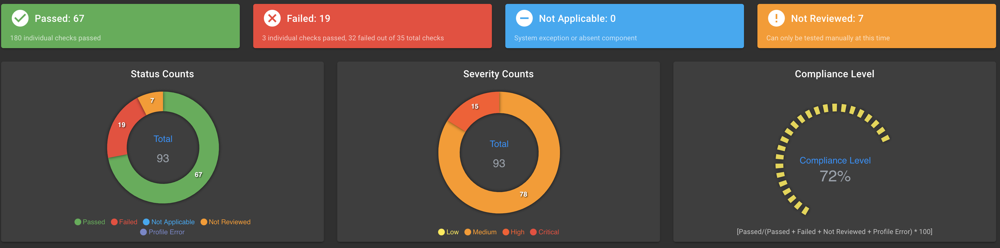
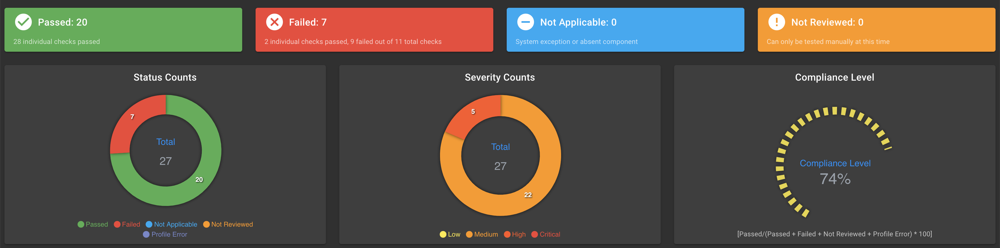
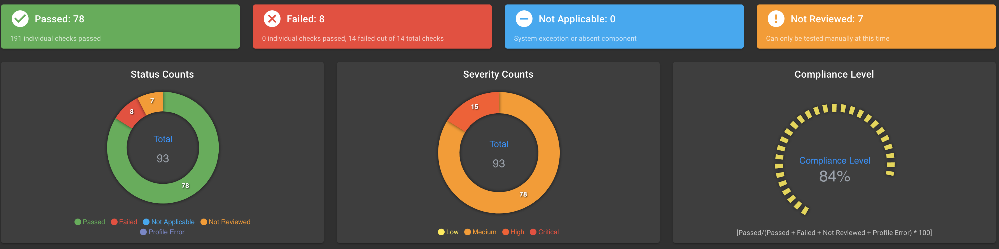
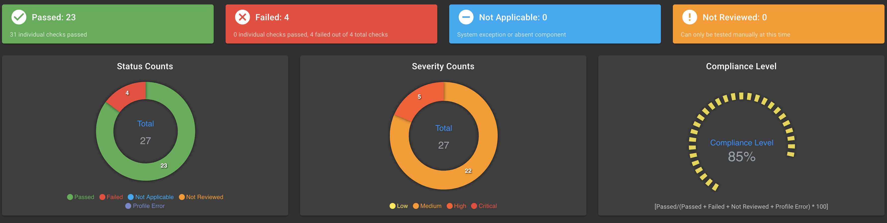
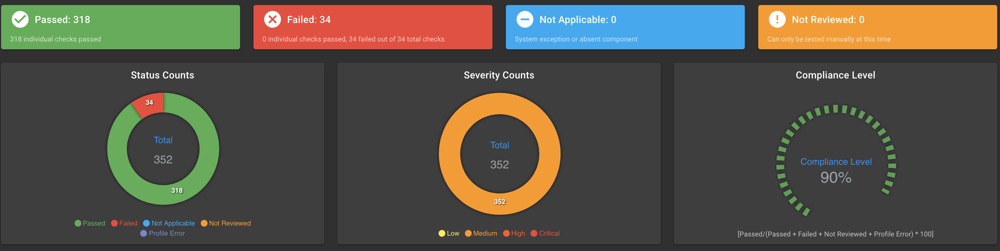
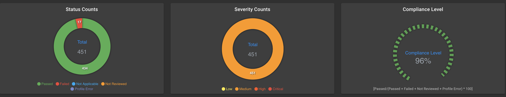

VMware Tanzu Kubernetes Grid multi-cloud's releases are continuously validated against the Defense Information Systems Agency (DISA) [Kubernetes Security Technical Implementation Guide (STIG)](https://ncp.nist.gov/checklist/996) and [NSA/CISA Kubernetes Hardening Guidance](https://media.defense.gov/2021/Aug/03/2002820425/-1/-1/1/CTR_KUBERNETES%20HARDENING%20GUIDANCE.PDF)

The following is covered in this blog:
- [STIG](#stig)
  - [Pre Hardening Results](#pre-hardening-results)
  - [Hardening](#hardening)
  - [Post Hardening Results](#post-hardening-results)
- [CISA/NSA](#cisansa)
  - [Pre Hardening Results](#pre-hardening-results-1)
  - [Hardening](#hardening-1)
  - [Post Hardening Results](#post-hardening-results-1)
- [Detailed STIG Results and Exceptions for Control Plane Results/Exceptions](#detailed-stig-results-and-exceptions-for-control-plane-resultsexceptions)
- [Detailed STIG Results and Exceptions for Worker Nodes Results/Exceptions](#detailed-stig-results-and-exceptions-for-worker-nodes-resultsexceptions)
- [Detailed NSA/CISA Kubernetes Hardening Guidance Results/Exceptions](#detailed-nsacisa-kubernetes-hardening-guidance-resultsexceptions)

## STIG

### Pre Hardening Results

The results for Tanzu Kubernetes Grid 1.4 out of the box for STIG are as follows:

- Control Plane

    

- Worker Node

    


### Hardening

Tanzu Kubernetes Grid cluster can me customized by using `ytt` overlay. See [Customizing Clusters and Plans with ytt Overlays](https://docs.vmware.com/en/VMware-Tanzu-Kubernetes-Grid/1.4/vmware-tanzu-kubernetes-grid-14/GUID-ytt.html)

To further harden the Tanzu Kubernetes Grid clusters VMware provides the following:

- STIG hardening: `ytt` overlay.
  
  Below snippet is a `ytt` overlay to set `tls-min-version` (STIG: V-242378) on the `api-server`

  ```
  #@ load("@ytt:overlay", "overlay")
  #@ load("@ytt:data", "data")
  #@overlay/match missing_ok=True,by=overlay.subset({"kind":"KubeadmControlPlane"})
  ---
  spec:
    kubeadmConfigSpec:
      clusterConfiguration:
        apiServer:
          extraArgs:
          #@overlay/match missing_ok=True
          tls-min-version: VersionTLS12
  ```

### Post Hardening Results

After hardening the Tanzu Kubernetes Grid clusters for STIG, the following results are seen:

- Control Plane

    

- Worker Node

    

## CISA/NSA

### Pre Hardening Results

The results for Tanzu Kubernetes Grid 1.4 out of the box for NSA/CISA Hardening Guidance are as follows

**Note** The counts in the heat maps are higher the number of hardening control since each control applies to multiple Kubernetes resource:



### Hardening
To further harden the Tanzu Kubernetes Grid clusters VMware provides the following:

- NSA/CISA hardening: Antrea `ClusterNetworkPolicies`

    Below is a Antrea `ClusterNetworkPolicies` for Network policies control to set default policy selecting all Pods to deny all ingress and egress traffic and ensure any unselected Pods are isolated.

  ```
  apiVersion: security.antrea.tanzu.vmware.com/v1alpha1
  kind: ClusterNetworkPolicy
  metadata:
    name: default-deny
  spec:
    priority: 150
    tier: baseline
    appliedTo:
      - namespaceSelector: {}
    ingress:
      - action: Drop              # For all Pods in every namespace, drop and log all ingress traffic from anywhere
        name: drop-all-ingress
        enableLogging: true
    egress:
      - action: Drop              # For all Pods in every namesapces, drop and log all egress traffic towards anywhere
        name: drop-all-egress
        enableLogging: true

  ```

- NSA/CISA hardening: Antrea network policy

  Below is an Antrea network policy to allow `tanzu-capabilities-manager` egress to `kube-apiserver` ports `443` and `6443` 

  ```
  apiVersion: security.antrea.tanzu.vmware.com/v1alpha1
  kind: NetworkPolicy
  metadata:
    name: tanzu-cm-apiserver
    namespace: tkg-system
  spec:
    priority: 5
    tier: securityops
    appliedTo:
      - podSelector:
          matchLabels:
          app: tanzu-capabilities-manager
    egress:
      - action: Allow
        to:
        - podSelector:
            matchLabels:
            component: kube-apiserver
          namespaceSelector:
            matchLabels:
              kubernetes.io/metadata.name: kube-system
        ports:
        - port: 443
          protocol: TCP
        - port: 6443
          protocol: TCP
        name: AllowToKubeAPI

  ```

- NSA/CISA hardening: OPA constraints
  
  Below is an example of using OPA gatekeeper to restrict allowed images repositories

    - OPA template

      ```
      apiVersion: templates.gatekeeper.sh/v1beta1
      kind: ConstraintTemplate
      metadata:
        name: k8sallowedrepos
        annotations:
          description: Requires container images to begin with a repo string from a specified
            list.
      spec:
        crd:
          spec:
            names:
              kind: K8sAllowedRepos
            validation:
              # Schema for the `parameters` field
              openAPIV3Schema:
                type: object
                properties:
                  repos:
                    type: array
                    items:
                      type: string
        targets:
          - target: admission.k8s.gatekeeper.sh
            rego:|
              package k8sallowedrepos

              violation[{"msg": msg}] {
                container := input.review.object.spec.containers[_]
                satisfied := [good| repo = input.parameters.repos[_] ; good = startswith(container.image, repo)]
                not any(satisfied)
                msg := sprintf("container <%v> has an invalid image repo <%v>, allowed repos are %v", [container.name, container.image, input.parameters.repos])
              }

              violation[{"msg": msg}] {
                container := input.review.object.spec.initContainers[_]
                satisfied := [good| repo = input.parameters.repos[_] ; good = startswith(container.image, repo)]
                not any(satisfied)
                msg := sprintf("container <%v> has an invalid image repo <%v>, allowed repos are %v", [container.name, container.image, input.parameters.repos])
              }
      ``` 

    - OPA constraint

      ```
      apiVersion: constraints.gatekeeper.sh/v1beta1
      kind: K8sAllowedRepos
      metadata:
        name: repo-is-openpolicyagent
      spec:
        match:
          kinds:
            - apiGroups: [""]
              kinds: ["Pod"]
        parameters:
          repos:
            - "<ALLOWED_IMAGE_REPO>"
      ```

- NSA/CISA hardening: OPA mutations
  
  Below is an example of using OPA mutation to set `allowPrivilegeEscalation` to `false` of it is missing in the pod spec

  ```
  apiVersion: mutations.gatekeeper.sh/v1alpha1
  kind: Assign
  metadata:
    name: allow-privilige-escalation
  spec:
      match:
        scope: Namespaced 
        kinds:
          - apiGroups: ["*"]
            kinds: ["Pod"]
        excludedNamespaces: 
        - kube-system
      applyTo:
      - groups: [""]
        kinds: ["Pod"]
        versions: ["v1"]
      location: "spec.containers[name:*].securityContext.allowPrivilegeEscalation"
      parameters:
        pathTests:  
        - subPath: "spec.containers[name:*].securityContext.allowPrivilegeEscalation"
          condition: MustNotExist
        assign:
          value: false

  ```

Antrea CNI is used in this guide for network hardening as it provides fine grained control of network policies using [tiers](https://antrea.io/docs/v1.3.0/docs/antrea-network-policy/#tier) and the ability to apply a cluster-wide security policy using [`ClusterNetworkPolicy`](https://github.com/antrea-io/antrea/blob/main/docs/antrea-network-policy.md#antrea-clusternetworkpolicy).

[Open Policy Agent](https://www.openpolicyagent.org/docs/latest/kubernetes-introduction/) (OPA) is used instead of pod security policies as they were deprecated in Kubernetes 1.21. 

`ytt` overlays, network policies and OPA policies are created in a way to make it easy for cluster admins to opt out of hardening controls for certain workloads. We suggest not completely opting out of the hardening practices and instead isolating workloads in namespaces where these hardening controls are not applied. Opting out of hardening controls also depends on the risk appetite of the Tanzu Kubernetes Grid deployment.

### Post Hardening Results

After hardening the Tanzu Kubernetes Grid clusters for NSA/CISA Hardening Guidance, the following results are seen *:



* NSA/CISA Hardened results have additional controls when compared to out-of-the-box results due to resources created by the hardening process

## Detailed STIG Results and Exceptions for Control Plane Results/Exceptions

|	VID	|Finding Title|Compliant by default?|Can be Resolved?|Explanation/Exception|
|-----|	--------------|	--------	|	----------|----------	|
|V-242376|The Kubernetes Controller Manager must use TLS 1.2, at a minimum, to protect the confidentiality of sensitive data during electronic dissemination.|No| Yes|This can be resolved with a `ytt` overlay|
|V-242377|The Kubernetes Scheduler must use TLS 1.2, at a minimum, to protect the confidentiality of sensitive data during electronic dissemination.|No|Yes|This can be resolved with a `ytt` overlay|
|V-242378|The Kubernetes API Server must use TLS 1.2, at a minimum, to protect the confidentiality of sensitive data during electronic dissemination.|No|Yes|This can be resolved with a `ytt` overlay|
|V-242379|The Kubernetes etcd must use TLS to protect the confidentiality of sensitive data during electronic dissemination.|No|Yes|This can be resolved with a `ytt` overlay|
|V-242380|The Kubernetes etcd must use TLS to protect the confidentiality of sensitive data during electronic dissemination.|Yes|||
|V-242381|The Kubernetes Controller Manager must create unique service accounts for each work payload.|Yes|||
|V-242382|The Kubernetes API Server must enable Node,RBAC as the authorization mode.|Yes|||
|V-242383|User-managed resources must be created in dedicated namespaces.|Yes|||
|V-242384|The Kubernetes Scheduler must have secure binding.|Yes|||
|V-242385|The Kubernetes Controller Manager must have secure binding.|Yes|||
|V-242386|The Kubernetes API server must have the insecure port flag disabled.|Yes|||
|V-242387|The Kubernetes Kubelet must have the read-only port flag disabled.|Yes|||
|V-242388|The Kubernetes API server must have the insecure bind address not set.|Yes|||
|V-242389|The Kubernetes API server must have the secure port set.|Yes|||
|V-242390|The Kubernetes API server must have anonymous authentication disabled.|No|No|**Exception** `RBAC` authorization is enabled on the api server( V-242382 ), it is generally considered reasonable to allow anonymous access to the API Server for health checks and discovery purposes when `RBAC` is enabled|
|V-242391|The Kubernetes Kubelet must have anonymous authentication disabled.|Yes|||
|V-242392|The Kubernetes kubelet must enable explicit authorization.|Yes|||
|V-242393|Kubernetes Worker Nodes must not have `sshd` service running.|Yes|||
|V-242394|Kubernetes Worker Nodes must not have the `sshd` service enabled.|No|No|**Exception** `ssh` is restricted to only the bastion server and is needed to enable serving certificates and install monitoring tools. Also this is not a worker node|
|V-242395|Kubernetes dashboard must not be enabled.|Yes|||
|V-242396|Kubernetes Kubectl `cp` command must give expected access and results.|Yes|||
|V-242397|The Kubernetes kubelet static `PodPath` must not enable static pods.|No|No|**Exception** Tanzu Kubernetes Grid utilizes the `staticPodPath` to launch numerous components so it can not be disabled|
|V-242398|Kubernetes `DynamicAuditing` must not be enabled.|Yes|||
|V-242399|Kubernetes `DynamicKubeletConfig` must not be enabled.|Yes|||
|V-242400|The Kubernetes API server must have Alpha APIs disabled.|Yes|||
|V-242401|The Kubernetes API Server must have an audit policy set.|Yes|||
|V-242402|The Kubernetes API Server must have an audit log path set.|Yes|||
|V-242403|Kubernetes API Server must generate audit records that identify what type of event has occurred, identify the source of the event, contain the event results, identify any users, and identify any containers associated with theevent.|Yes|||
|V-242403|Kubernetes API Server must generate audit records that identify what type of event has occurred, identify the source of the event, contain the event results, identify any users, and identify any containers associated with theevent.|Yes|||
|V-242403|Kubernetes API Server must generate audit records that identify what type of event has occurred, identify the source of the event, contain the event results, identify any users, and identify any containers associated with theevent.|Yes|||
|V-242403|Kubernetes API Server must generate audit records that identify what type of event has occurred, identify the source of the event, contain the event results, identify any users, and identify any containers associated with theevent.|Yes|||
|V-242403|Kubernetes API Server must generate audit records that identify what type of event has occurred, identify the source of the event, contain the event results, identify any users, and identify any containers associated with theevent.|Yes|||
|V-242403|Kubernetes API Server must generate audit records that identify what type of event has occurred, identify the source of the event, contain the event results, identify any users, and identify any containers associated with theevent.|Yes|||
|V-242404|Kubernetes Kubelet must deny hostname override.|No|No|**Exception** This is needed for public cloud kubernetes clusters.|
|V-242405|The Kubernetes manifests must be owned by root.|Yes|||
|V-242406|The Kubernetes kubelet configuration file must be owned by root.|Yes|||
|V-242407|The Kubernetes kubelet configuration file must be owned by root.|Yes|||
|V-242408|The Kubernetes manifests must have least privileges.|Yes|||
|V-242409|Kubernetes Controller Manager must disable profiling.|No|Yes|This can be resolved with a `ytt` overlay|
|V-242410|The Kubernetes API Server must enforce ports, protocols, and services(PPS) that adhere to the Ports, Protocols, and Services Management Category Assurance List (PPSM CAL).|No|No|**Exception** Manual Review - Handled by PPSM monitoring solution|
|V-242411|The Kubernetes Scheduler must enforce ports, protocols, and services(PPS) that adhere to the Ports, Protocols, and Services Management Category Assurance List (PPSM CAL).|No|No|**Exception** Manual Review - Handled by PPSM monitoring solution|
|V-242412|The Kubernetes Controllers must enforce ports, protocols, and services(PPS) that adhere to the Ports, Protocols, and Services Management Category Assurance List (PPSM CAL).|No|No|**Exception** Manual Review - Handled by PPSM monitoring solution|
|V-242413|The Kubernetes etcd must enforce ports, protocols, and services (PPS)that adhere to the Ports, Protocols, and Services Management Category Assurance List (PPSM CAL).|No|No|**Exception** Manual Review - Handled by PPSM monitoring solution|
|V-242414|The Kubernetes cluster must use non-privileged host ports for `userpods`.|No|No|**Exception** Manual Review - Handled by PPSM monitoring solution|
|V-242415|Secrets in Kubernetes must not be stored as environment variables.|Yes|||
|V-242416|Kubernetes Kubelet must not disable timeouts.|No|Yes|This can be resolved with a `ytt` overlay|
|V-242417|Kubernetes must separate user functionality.|No|No|**Exception** Manual Review|
|V-242418|The Kubernetes API server must use approved cipher suites.|Yes|||
|V-242419|Kubernetes API Server must have the SSL Certificate Authority set.|Yes|||
|V-242420|Kubernetes Kubelet must have the SSL Certificate Authority set.|Yes|||
|V-242421|Kubernetes Controller Manager must have the SSL Certificate Authorityset.|Yes|||
|V-242422|Kubernetes API Server must have a certificate for communication.|Yes|||
|V-242423|Kubernetes etcd must enable client authentication to secure service.|Yes|||
|V-242424|Kubernetes Kubelet must enable `tls-private-key-file` for client authentication to secure service.|No|Yes|This can be enabled manually after the feature gate for the controller manager and kubelet, `RotateServerCertificates`, is added to the overlay along with the `client-ca-file` defined in the `kubelet` and the `kubelet-certificate-authority` defined in the API Server. Once the cluster starts with the aforementioned enabled the certificates can be manually approved as `kubelet-serving` certificates are not auto approved and then the kubelet configs can be modified to include `tls-private-key-file` and `tls-cert-file` both pointing at the newly create `kubelet-server-current.pem file`. Then simply restart the kubelet|
|V-242425|Kubernetes Kubelet must enable `tls-cert-file` for client authentication to secure service.|No|Yes|This can be enabled manually after the feature gate for the controller manager and kubelet, `RotateServerCertificates`, is added to the overlay along with the `client-ca-file` defined in the `kubelet` and the `kubelet-certificate-authority` defined in the API Server. Once the cluster starts with the aforementioned enabled the certificates can be manually approved as `kubelet-serving` certificates are not auto approved and then the kubelet configs can be modified to include `tls-private-key-file` and `tls-cert-file` both pointing at the newly create `kubelet-server-current.pem file`. Then simply restart the kubelet|
|V-242426|Kubernetes etcd must enable client authentication to secure service.|Yes|||
|V-242427|Kubernetes etcd must have a key file for secure communication.|Yes|||
|V-242428|Kubernetes etcd must have a certificate for communication.|Yes|||
|V-242429|Kubernetes etcd must have the SSL Certificate Authority set.|Yes|||
|V-242430|Kubernetes etcd must have a certificate for communication.|Yes|||
|V-242431|Kubernetes etcd must have a key file for secure communication.|Yes|||
|V-242432|Kubernetes etcd must have peer-cert-file set for secure communication.|Yes|||
|V-242433|Kubernetes etcd must have a peer-key-file set for securecommunication.|Yes|||
|V-242434|Kubernetes Kubelet must enable kernel protection.|No|Yes|This can be resolved after creating either a custom AMI or setting up the host's properly ahead of time and then enabling it via a `ytt` overlay|
|V-242435|Kubernetes must prevent non-privileged users from executing privileged functions to include disabling, circumventing, or altering implemented security safe guards/countermeasures or the installation of patches and updates.|Yes|||
|V-242435|Kubernetes must prevent non-privileged users from executing privileged functions to include disabling, circumventing, or altering implemented security safe guards/countermeasures or the installation of patches and updates.|Yes|||
|V-242435|Kubernetes must prevent non-privileged users from executing privileged functions to include disabling, circumventing, or altering implemented security safe guards/countermeasures or the installation of patches and updates.|Yes|||
|V-242436|The Kubernetes API server must have the ValidatingAdmissionWebhookenabled.|Yes|||
|V-242437|Kubernetes must have a pod security policy set.|No|No|**Exception** OPA Gatekeeper is the recommended solution for Pod Security after the deprecation of Pod Security Policies|
|V-242438|Kubernetes API Server must configure timeouts to limit attack surface.|Yes|||
|V-242439|Kubernetes API Server must disable basic authentication to protect information in transit.|Yes|||
|V-242440|Kubernetes API Server must disable token authentication to protect information in transit.|Yes|||
|V-242441|Kubernetes endpoints must use approved organizational certificate and key pair to protect information in transit.|Yes|||
|V-242442|Kubernetes must remove old components after updated versions have beeninstalled.|No|No|**Exception** Manual Review|
|V-242443|Kubernetes must contain the latest updates as authorized by IAVM's,CTOs, DTMs, and STIGs.|Yes|||
|V-242444|The Kubernetes component manifests must be owned by root.|Yes|||
|V-242445|The Kubernetes component etcd must be owned by etcd.|No|No|**Exception** The data directory (`/var/lib/etcd`) is owned by root:root.To provision clusters, Tanzu Kubernetes Grid uses Cluster API which, in turn, uses the kubeadm tool to provision Kubernetes.kubeadm makes etcd run containerized as a static pod, therefore the directory does not need to be set to a particular user.kubeadm configures the directory to not be readable by non-root users.|
|V-242446|The Kubernetes configuration files must be owned by root.|Yes|||
|V-242447|The Kubernetes Kube Proxy must have file permissions set to 644 or more restrictive.|No|No|**Exception** Kubeconfig for `kube-proxy` is a symlink. The base file is 0644 or less permissive. Manual Review|
|V-242448|The Kubernetes Kube Proxy must be owned by root.|Yes|||
|V-242449|The Kubernetes Kubelet certificate authority file must have file permissions set to 644 or more restrictive.|Yes|||
|V-242450|The Kubernetes Kubelet certificate authority must be owned by root.|Yes|||
|V-242451|The Kubernetes component PKI must be owned by root.|Yes|||
|V-242452|The Kubernetes kubelet config must have file permissions set to 644 or more restrictive.|Yes|||
|V-242453|The Kubernetes kubelet config must be owned by root.|Yes|||
|V-242454|The Kubernetes kubeadm must be owned by root.|Yes|||
|V-242455|The Kubernetes kubelet service must have file permissions set to 644 or more restrictive.|Yes|||
|V-242456|The Kubernetes kubelet config must have file permissions set to 644 or more restrictive.|Yes|||
|V-242457|The Kubernetes kubelet config must be owned by root.|Yes|||
|V-242458|The Kubernetes API Server must have file permissions set to 644 or more restrictive.|Yes|||
|V-242459|The Kubernetes etcd must have file permissions set to 644 or morerestrictive.|Yes|||
|V-242460|The Kubernetes `admin.conf` must have file permissions set to 644 or more restrictive.|Yes|||
|V-242461|Kubernetes API Server audit logs must be enabled.|Yes|||
|V-242462|The Kubernetes API Server must be set to audit log max size.|Yes|||
|V-242463|The Kubernetes API Server must be set to audit log maximum backup.|Yes|||
|V-242464|The Kubernetes API Server audit log retention must be set.|Yes|||
|V-242465|The Kubernetes API Server audit log path must be set.|Yes|||
|V-242466|The Kubernetes PKI CRT must have file permissions set to 644 or more restrictive.|Yes|||
|V-242467|The Kubernetes PKI keys must have file permissions set to 600 or more restrictive.|Yes|||
|V-242468|The Kubernetes API Server must prohibit communication using TLS version 1.0 and 1.1, and SSL 2.0 and 3.0.|No|Yes|This can be resolved with a `ytt` overlay|

## Detailed STIG Results and Exceptions for Worker Nodes Results/Exceptions

|	VID	|Finding Title|Compliant by default?|Can be Resolved?|Explanation/Exception|
|-----|	--------------|	--------	|	----------|----------	|
|V-242387|The Kubernetes Kubelet must have the read-only port flag disabled. |Yes|||
|V-242391|The Kubernetes Kubelet must have anonymous authentication disabled.|Yes|||
|V-242392|The Kubernetes kubelet must enable explicit authorization. |Yes|||
|V-242393|Kubernetes Worker Nodes must not have `sshd` service running.|Yes|||
|V-242394|Kubernetes Worker Nodes must not have the `sshd` service enabled.|No|No|**Exception** `ssh` is restricted to only the bastion server and is needed to enable serving certificates and install monitoring tools |
|V-242396|Kubernetes Kubectl `cp` command must give expected access and results.|Yes|||
|V-242397|The Kubernetes kubelet static Pod Path must not enable static pods. |No|No|**Exception** `staticPodPath` is needed for Tanzu Kubernetes Grid to install properly as several of the pods in the `tkg-system` are defined there |
|V-242398|Kubernetes `DynamicAuditing` must not be enabled.|Yes|||
|V-242399|Kubernetes `DynamicKubeletConfig` must not be enabled.|Yes|||
|V-242400|The Kubernetes API server must have Alpha APIs disabled.|Yes|||
|V-242404|Kubernetes Kubelet must deny hostname override.|No|No|**Exception** `hostname-override` is needed for public cloud deployments of kubernetes |
|V-242406|The Kubernetes kubelet configuration file must be owned by root.|Yes|||
|V-242407|The Kubernetes kubelet configuration file must be owned by root.|Yes|||
|V-242416|Kubernetes Kubelet must not disable timeouts.|No|Yes|This can be resolved with a `ytt` overlay|
|V-242420|Kubernetes Kubelet must have the SSL Certificate Authority set.|Yes|||
|V-242425|Kubernetes Kubelet must enable `tls-cert-file` for client authentication  to secure service.|No|Yes|This can be enabled manually after the feature gate for the controller manager and kubelet, `RotateServerCertificates`, is added to the overlay along with the `client-ca-file` defined in the `kubelet` and the `kubelet-certificate-authority` defined in the API Server. Once the cluster starts with the aforementioned enabled the certificates can be manually approved as `kubelet-serving` certificates are not auto approved and then the kubelet configs can be modified to include `tls-private-key-file` and `tls-cert-file` both pointing at the newly create `kubelet-server-current.pem file`. Then simply restart the kubelet|
|V-242434|Kubernetes Kubelet must enable kernel protection.|No|Yes|This can be resolved after creating either a custom AMI or setting up the host's properly ahead of time and then enabling it via a ytt overlay |
|V-242449|The Kubernetes Kubelet certificate authority file must have file  permissions set to 644 or more restrictive.|Yes|||
|V-242450|The Kubernetes Kubelet certificate authority must be owned by root.|Yes|||
|V-242451|The Kubernetes component PKI must be owned by root.|Yes|||
|V-242452|The Kubernetes kubelet config must have file permissions set to 644 or  more restrictive.|Yes|||
|V-242453|The Kubernetes kubelet config must be owned by root.|Yes|||
|V-242454|The Kubernetes kubeadm must be owned by root.|Yes|||
|V-242455|The Kubernetes kubelet service must have file permissions set to 644  or more restrictive. |Yes|||
|V-242456|The Kubernetes kubelet config must have file permissions set to 644 or  more restrictive.|Yes|||
|V-242457|The Kubernetes kubelet config must be owned by root.|Yes|||
|V-242466|The Kubernetes PKI CRT must have file permissions set to 644 or more  restrictive. |Yes|||


## Detailed NSA/CISA Kubernetes Hardening Guidance Results/Exceptions

|Title|Compliant By Default?|Can be resolved?|Explanation/Exception|
|---|---|---|---|
|Allow privilege escalation |No |Yes|Resolved with OPA Gatekeeper Policy as well as mutations|
|Non-root containers|No |Yes|Resolved with OPA Gatekeeper Policy as well as mutations. <br/>**Exception** Some pods such as contour/envoy need root in order to function. Tanzu System Ingress needs to interact with the network|
|Automatic mapping of service account|No |Yes| Resolved with OPA Gatekeeper Mutation. <br/> **Exception** Gatekeeper needs access to the API server so its service accounts are auto-mounted|
|Applications credentials in configuration files|No | No|**Exception** All of the detected credentials in config files were false positives as they were public keys|
|Linux hardening|No|Yes|Resolved with OPA gatekeeper constraint as well as mutation to drop all capabilities<br/>**Exception** Some pods such as contour/envoy need advanced privileges in order to function. Tanzu System Ingress needs to interact with the network|
|`Seccomp` Enabled|No |Yes|Resolved with OPA gatekeeper mutation to set a `seccomp` profile for all pods|
|Host PID/IPC privileges|No|Yes|A gatekeeper constraint has been added to prohibit all pods from running with PID/IPC|
|Dangerous capabilities |No|Yes|A gatekeeper constraint has been added to prohibit dangerous capabilities and a mutation has been added to set a default.<br/> **Exception** Some pods such as contour/envoy need advanced privileges in order to function. Tanzu System Ingress needs to interact with the network|
|Exec into container|No |No|Kubernetes ships with accounts that have exec access to pods this is likely needed by admins and a customer facing solution would be advised. Such as removing exec in RBAC for normal end users |
|Allowed hostPath|No|Yes|A gatekeeper constraint has been added to prevent the host path from being mounted|
|Host Network access |No|Yes|A gatekeeper constraint has been added to prevent the host network from being used.<br/>**Exception** The Kapp controller needs access to the host for tanzu to function and is the only pod outside the control plane allowed host network access|
|Exposed dashboard|Yes||||
|Cluster-admin binding|No |No|A cluster admin binding is needed for k8s to start and should be the only one in the cluster|
|Resource policies|No |Yes|Fixed by setting a default for all pods via a gatekeeper mutation|
|Control plane hardening|Yes||||
|Insecure capabilities|No|Yes|A gatekeeper constraint has been added to prohibit dangerous capabilities and a mutation has been added to set a default.<br/> **Exception** Some pods such as contour/envoy need advanced privileges in order to function. Tanzu System Ingress needs to interact with the network|
|Immutable container filesystem |No|Yes|A gatekeeper constraint has been added to prevent `readOnlyRootFilesystems` from being disabled.<br/>**Exception** Pods created by contour/envoy, fluentd, the kapp controller, telemetry agents, and all other data services that need to run on Kubernetess **Caution** This mutation can cause issues within the cluster and may not be the wisest to implement.|
|Privileged container|No|Yes|By default all pods have privileged set to false but a constraint has been added to enforce that a user does not enable it.|
|Ingress and Egress blocked |No|Yes|A default deny cluster network policy can be implemented in Antrea|
|Container `hostPort` |No|Yes|A gatekeeper constraint has been added to ensure users do not use hostPorts.<br/>**Exception** The Kapp controller needs access to the host for tanzu to function and is the only pod outside the control plane allowed host network access|
|Network policies|No|Yes|A suite of network policies can be installed to ensure all namespaces have a network policy|
|Fluent Bit Forwarding to SIEM|No|Yes|Fluent bit needs to be installed and point at a valid output location|
|Fluent Bit Retry Enabled|No|Yes|Fluent bit needs to be installed by the user with retries enabled in the config|
|IaaS Metadata endpoint blocked |No|Yes|A Cluster Network Policy can be implemented to restrict all pods from hitting the endpoint|