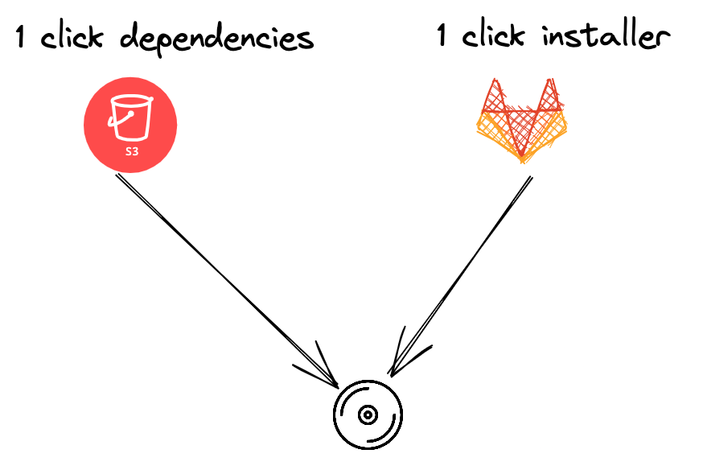
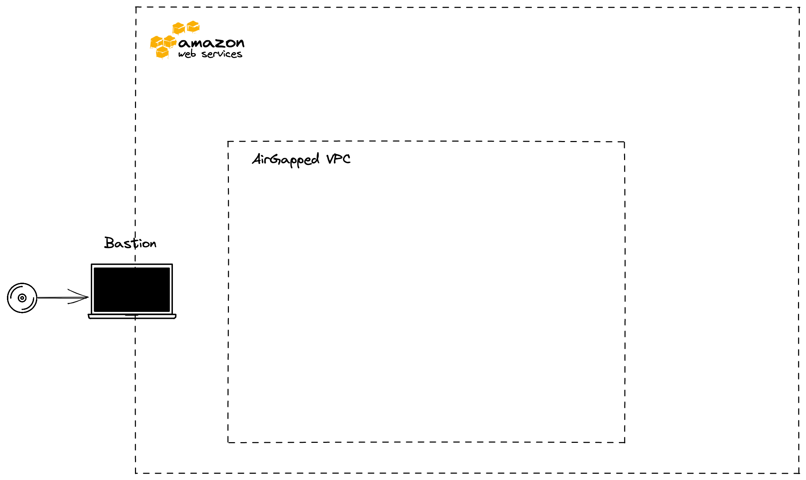
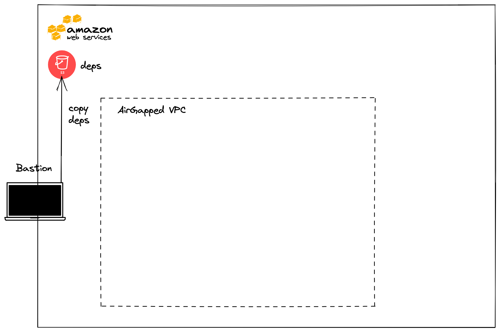
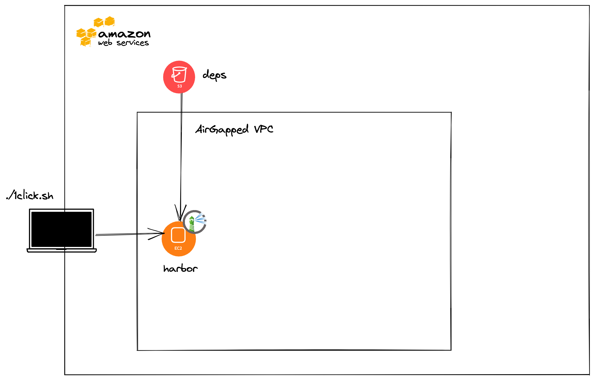
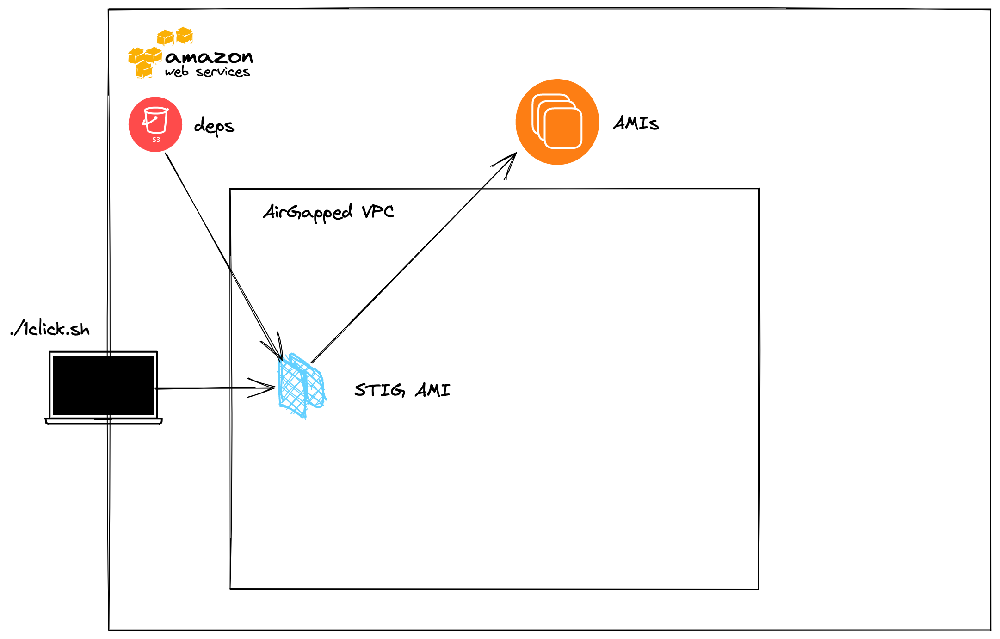
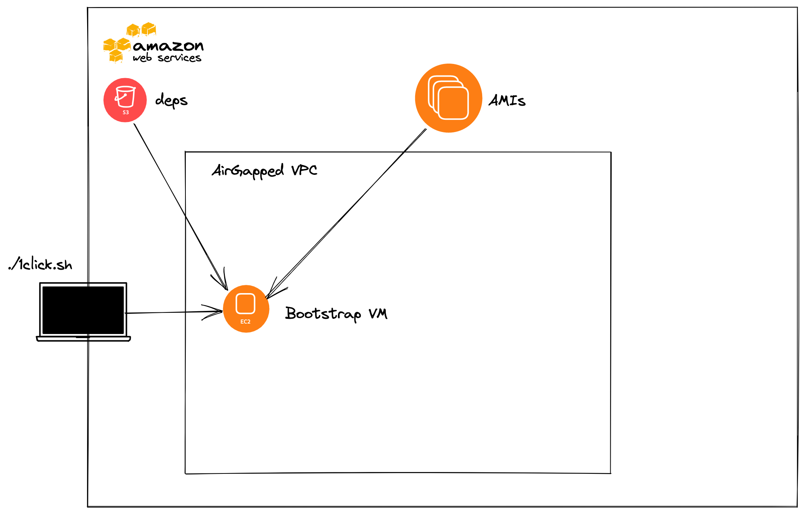
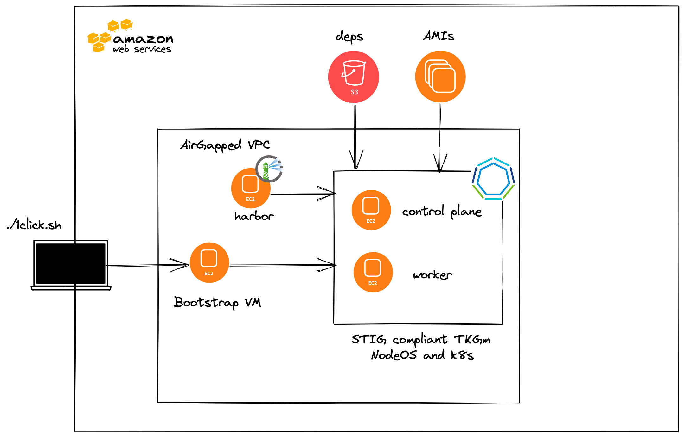
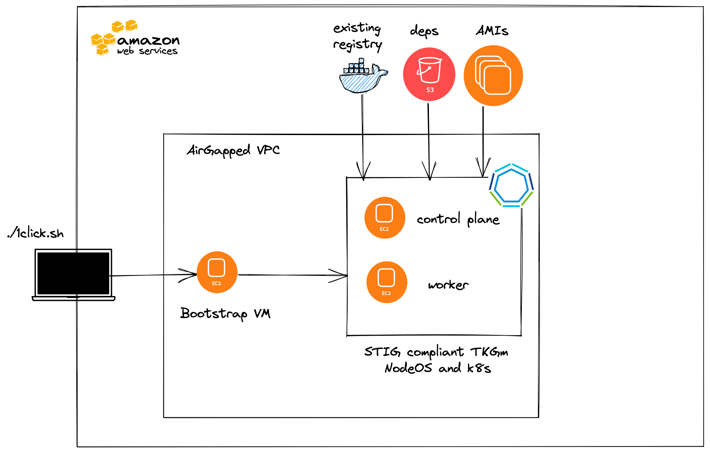

This blog post walks you through installing a Security Technical Implementation Guide (STIG)–hardened VMware Tanzu Kubernetes Grid for multi-cloud clusters with Federal Information Processing Standards (FIPS) enabled on Amazon Web Services(AWS). After all of the prerequisites are met, it is as simple as exporting some environment variables and running one script to deploy.

## Prerequisites
In order to install Tanzu Kubernetes Grid for multi-cloud into an air-gapped environment with one click, there are numerous prerequisites that are outlined below.

1. A preexisting `AirGapped` Virtual Private Connection (VPC) in AWS. This AWS VPC should have VPC endpoints enabled to allow access within the VPC to the following AWS services:
    * STS
    * SSM
    * EC2
    * `ec2messages`
    * `elasticloadbalancing`
    * `secretsmanager`
    * `ssmmessages`
    * S3

2. An AWS S3 bucket that is in the same AWS region as your `AirGapped` VPC. This will be used to store and retrieve the Tanzu Kubernetes Grid `1click` dependencies.

3. A portable media device with the following:
    * The Tanzu Kubernetes Grid `1click` dependencies
    * `1click` installer repo
4. A bastion VM with ssh access to the air-gapped environment that has:
    * Docker
    * AWS
    * `jq`
    * `make` (build-essential)
    * Terraform
 
     

## Installing Tanzu Kubernetes Grid

1. Copy the contents of the portable media to the bastion VM.

     

2. Copy `1click` dependencies to the AWS S3 bucket by executing the below inside the `1click` dependencies directory.

    ```sh
    aws s3 cp . s3://<BUCKET_NAME> --recursive
    ```

     

3. Export the following environment variables.

    ```sh
    export BUCKET_NAME=<AWS S3 bucket name containing 1 click dependencies>
    export VPC_ID=<AirGapped VPC ID>
    export SUBNET_ID=<Private Subnet ID where TKGm will be installed>
    export SSH_KEY_NAME=<AWS RSA SSH key>
    export AWS_AZ_ZONE=<AWS AZ_ZONE>
    export AWS_ACCESS_KEY_ID=<AWS Access Key ID>
    export AWS_SECRET_ACCESS_KEY=<AWS Secret Access Key>
    export AWS_DEFAULT_REGION=<AWS Region where TKGm will be installed>
    export TKR_VERSION=<Tanzu Kubernetes Release Version>
    export TKG_VERSION=<Tanzu Kubernetes Grid Version>
    ```

**NOTE: Currently only `TKG_VERSION 1.4.0` and `TKR_VERSION 1.21.2` are supported which pull `TKG v1.4.0-fips.1` and `TKR v1.21.2_vmware.1-fips.1-tkg.1`. `TKG_VERSION 1.5.x` and `TKR_VERSION 1.22.5` are coming soon.**

4. Execute the below inside the 1 click installer repo

    ```sh
    ./1click.sh
    ```

## What is installed?

The 1-click script has the following flow by default.

1. Creates an Amazon Linux 2 AMI, which starts Harbor, an open source image registry, and populates Tanzu Kubernetes Grid images into it.

    ```sh
    ./1click.sh
    pushd terraform-harbor; pwd; terraform init --backend   --backend-config="bucket=tkg-1click-dependencies"    --backend-config="key=terraform/harbor-state"  --backend-config="region=us-east-1"; terraform apply     -auto-approve; popd
    bash: gcloud: command not found
    /home/ubuntu/tkg-1click/terraform-harbor /home/ubuntu/  tkg-1click
    /home/ubuntu/tkg-1click/terraform-harbor

    Initializing the backend...

    Successfully configured the backend "s3"! Terraform will    automatically
    use this backend unless the backend configuration changes.

    Initializing provider plugins...
    - Finding latest version of hashicorp/template...
    - Finding latest version of hashicorp/aws...
    - Installing hashicorp/aws v3.74.0...
    - Installed hashicorp/aws v3.74.0 (signed by HashiCorp)
    - Installing hashicorp/template v2.2.0...
    - Installed hashicorp/template v2.2.0 (signed by HashiCorp)

    Terraform has created a lock file .terraform.lock.hcl to    record the provider
    selections it made above. Include this file in your version     control repository
    so that Terraform can guarantee to make the same selections     by default when
    you run "terraform init" in the future.

    Terraform has been successfully initialized!

    You may now begin working with Terraform. Try running   "terraform plan" to see
    any changes that are required for your infrastructure. All  Terraform commands
    should now work.

    If you ever set or change modules or backend configuration  for Terraform,
    rerun this command to reinitialize your working directory.  If you forget, other
    commands will detect it and remind you to do so if necessary.

    Terraform used the selected providers to generate the   following execution plan. Resource actions are indicated  with the following symbols:
      + create
    ```

    After Terraform finishes, you will see:

    ```sh
    instance_profile = "tkg-1click-s3_instance_profile"
    private_dns = "ip-10-0-10-203.ec2.internal"
    /home/ubuntu/tkg-1click
    Harbor still starting waiting 60 seconds
    ```
    
    If you would like to follow the Harbor logs, you can SSH into the private DNS returned by Terraform as `ec2-user` and run the below.
    
    ```sh
    sudo tail -f /var/log/cloud-init-output.log
    ```
    
    You will see `Harbor still starting waiting 60 seconds` every minute until Harbor starts.

     


2. Creates a Tanzu Kubernetes Grid Bootstrap Amazon Machine Image (AMI) using the contents of AWS S3 bucket containing `1click` dependencies.

    ```sh
    make[1]: Entering directory '/home/ubuntu/tkg-1click/ami/tkg-bootstrap'
    rm -fr tkg-imagebuilder
    mkdir -p tkg-imagebuilder
    aws s3 cp s3://tkg-1click-dependencies/tkg/tkg-v1.4.0/tanzu.tar tkg-imagebuilder/tanzu.tar
    debug2: channel 0: window 999362 sent adjust 49214file(s) remaining
    debug2: channel 0: window 999412 sent adjust 49164file(s) remaining
    download: s3://tkg-1click-dependencies/tkg/tkg-v1.4.0/tanzu.tar to tkg-imagebuilder/tanzu.tar
    aws s3 cp s3://tkg-1click-dependencies/tkr/tkr-v1.21.2/kubectl.gz tkg-imagebuilder/kubectl.gz
    download: s3://tkg-1click-dependencies/tkr/tkr-v1.21.2/kubectl.gz to tkg-imagebuilder/kubectl.gz
    aws s3 cp s3://tkg-1click-dependencies/kind/kind tkg-imagebuilder
    download: s3://tkg-1click-dependencies/kind/kind to tkg-imagebuilder/kind
    aws s3 cp s3://tkg-1click-dependencies/yq tkg-imagebuilder
    download: s3://tkg-1click-dependencies/yq to tkg-imagebuilder/yq
    docker build --build-arg REGISTRY=ip-10-0-10-86.ec2.internal --build-arg IMAGEBUILDER_TAG=v0.1.11_vmware.3 -t ip-10-0-10-86.ec2.internal/tkg/bootstrap-ami-builder:v0.1.11_vmware.3 .
    Sending build context to Docker daemon  489.9MB
    Step 1/12 : ARG IMAGEBUILDER_TAG=v0.1.11_vmware.3
    Step 2/12 : ARG REGISTRY=projects.registry.vmware.com
    Step 3/12 : FROM ${REGISTRY}/tkg/image-builder:${IMAGEBUILDER_TAG}
    v0.1.11_vmware.3: Pulling from tkg/image-builder
    c616abe99889: Pulling fs layer
    1513d588eda0: Pulling fs layer
    70d7b43b56dd: Pulling fs layer
    f64c4b1b0b04: Pulling fs layer
    5fc19e10136c: Pulling fs layer
    ebad13d4ea37: Pulling fs layer
    90e21a8e6487: Pulling fs layer
    a3ccf3efce3a: Pulling fs layer
    3e5b504a643a: Pulling fs layer
    f4d870b6d072: Pulling fs layer
    d0dbfdedb04c: Pulling fs layer
    f64c4b1b0b04: Waiting
    5fc19e10136c: Waiting
    ebad13d4ea37: Waiting
    90e21a8e6487: Waiting
    a3ccf3efce3a: Waiting
    3e5b504a643a: Waiting
    f4d870b6d072: Waiting
    d0dbfdedb04c: Waiting
    c616abe99889: Verifying Checksum
    c616abe99889: Download complete
    70d7b43b56dd: Verifying Checksum
    70d7b43b56dd: Download complete
    5fc19e10136c: Verifying Checksum
    5fc19e10136c: Download complete
    ebad13d4ea37: Verifying Checksum
    ebad13d4ea37: Download complete
    90e21a8e6487: Verifying Checksum
    90e21a8e6487: Download complete
    a3ccf3efce3a: Verifying Checksum
    a3ccf3efce3a: Download complete
    3e5b504a643a: Verifying Checksum
    3e5b504a643a: Download complete
    f4d870b6d072: Verifying Checksum
    f4d870b6d072: Download complete
    f64c4b1b0b04: Verifying Checksum
    f64c4b1b0b04: Download complete
    c616abe99889: Pull complete
    1513d588eda0: Verifying Checksum
    1513d588eda0: Download complete
    d0dbfdedb04c: Verifying Checksum
    d0dbfdedb04c: Download complete
    1513d588eda0: Pull complete
    70d7b43b56dd: Pull complete
    f64c4b1b0b04: Pull complete
    5fc19e10136c: Pull complete
    ebad13d4ea37: Pull complete
    90e21a8e6487: Pull complete
    a3ccf3efce3a: Pull complete
    3e5b504a643a: Pull complete
    f4d870b6d072: Pull complete
    d0dbfdedb04c: Pull complete
    Digest: sha256:b18f9ef8d4a155c7b2fd6ca6d370ea3934a9212f89ece163111190bf268cbdb9
    Status: Downloaded newer image for ip-10-0-10-86.ec2.internal/tkg/image-builder:v0.1.11_vmware.3
    ---> 1a56014c8882
    Step 4/12 : COPY --chown=imagebuilder:imagebuilder roles roles/
    ---> d3c211cb3200
    Step 5/12 : COPY --chown=imagebuilder:imagebuilder packer packer/
    ---> cfa3970bd0ad
    Step 6/12 : COPY --chown=imagebuilder:imagebuilder Makefile Makefile
    ---> c90cce4de064
    Step 7/12 : COPY --chown=imagebuilder:imagebuilder playbook.yml playbook.yml
    ---> 6f30643fd7d4
    Step 8/12 : COPY --chown=imagebuilder:imagebuilder tkg-imagebuilder/tanzu.tar roles/bootstrap/files/packages/
    ---> ddee0b9ae4f8
    Step 9/12 : COPY --chown=imagebuilder:imagebuilder tkg-imagebuilder/kind roles/bootstrap/files/bin
    ---> 3bfac5185b70
    Step 10/12 : COPY --chown=imagebuilder:imagebuilder tkg-imagebuilder/yq roles/bootstrap/files/bin
    ---> 3bc7de6c5a88
    Step 11/12 : COPY --chown=imagebuilder:imagebuilder tkg-imagebuilder/kubectl.gz roles/bootstrap/files/bin
    ---> b276457824e6
    Step 12/12 : RUN  gunzip -c roles/bootstrap/files/bin/kubectl.gz > roles/bootstrap/files/bin/kubectl && rm roles/bootstrap/files/bin/kubectl.gz
    ---> Running in d88570e16df8
    Removing intermediate container d88570e16df8
    ---> 44b015f2e593
    Successfully built 44b015f2e593
    Successfully tagged ip-10-0-10-86.ec2.internal/tkg/bootstrap-ami-builder:v0.1.11_vmware.3
    rm -fr tkg-imagebuilder
    envsubst < local.list.txt > local.list
    docker run --net host --rm --name bootstrap-ami-builder \
        -e VPC_ID \
        -e TKG_VERSION \
        -e TKR_VERSION \
        -e SUBNET_ID \
        -e REGISTRY \
        -e AWS_DEFAULT_REGION \
        -e AWS_SECRET_ACCESS_KEY \
        -e AWS_ACCESS_KEY_ID \
        -e BUCKET_NAME \
        -e PACKER_VAR_FILES='/home/imagebuilder/user.json' \
        -v /home/ubuntu/tkg-1click/ami/tkg-bootstrap/local.list:/home/imagebuilder/local.list \
        -v /home/ubuntu/tkg-1click/ami/tkg-bootstrap/roles/bootstrap/files/ca:/home/imagebuilder/roles/bootstrap/files/ca \
        -v /home/ubuntu/tkg-1click/ami/tkg-bootstrap/user_offline.json:/home/imagebuilder/user.json \
        ip-10-0-10-86.ec2.internal/tkg/bootstrap-ami-builder:v0.1.11_vmware.3 \
        build-ubuntu-1804
    packer build -var-file="/home/imagebuilder/user.json"  -var-file=packer/ubuntu-1804.json -var-file=packer/ansible.json packer/packer.json
    aws-tkg-bootstrap-builder: output will be in this color.

    ==> aws-tkg-bootstrap-builder: Prevalidating any provided VPC information
    ==> aws-tkg-bootstrap-builder: Prevalidating AMI Name: tkg-v1.4.0-v1.21.2-bootstrap-ubuntu-18.04-1646329996
        aws-tkg-bootstrap-builder: Found Image ID: ami-0cc01dc1dd19d98c2
    ==> aws-tkg-bootstrap-builder: Creating temporary keypair: packer_6221008d-230d-ff49-9e2a-51a77ad50dcf
    ==> aws-tkg-bootstrap-builder: Creating temporary security group for this instance: packer_62210090-a050-4036-5214-afc5bc4084f6
    ==> aws-tkg-bootstrap-builder: Authorizing access to port 22 from [0.0.0.0/0] in the temporary security groups...
    ==> aws-tkg-bootstrap-builder: Launching a source AWS instance...
    ==> aws-tkg-bootstrap-builder: Adding tags to source instance
        aws-tkg-bootstrap-builder: Adding tag: "Name": "Packer Builder"
        aws-tkg-bootstrap-builder: Instance ID: i-0664f98bc22e66519
    ==> aws-tkg-bootstrap-builder: Waiting for instance (i-0664f98bc22e66519) to become ready...
    ```         

    You will see the following upon completion.

    ```sh
    ==> aws-tkg-bootstrap-builder: Waiting for the instance to stop...
    ==> aws-tkg-bootstrap-builder: Creating AMI tkg-v1.4.0-v1.21.2-bootstrap-ubuntu-18.04-1646329996 from instance i-0664f98bc22e66519
    aws-tkg-bootstrap-builder: AMI: ami-071cb2e44a2055ef0
    ==> aws-tkg-bootstrap-builder: Waiting for AMI to become ready...
    ==> aws-tkg-bootstrap-builder: Modifying attributes on AMI (ami-071cb2e44a2055ef0)...
    aws-tkg-bootstrap-builder: Modifying: description
    ==> aws-tkg-bootstrap-builder: Modifying attributes on snapshot (snap-06214e392eb553332)...
    ==> aws-tkg-bootstrap-builder: Terminating the source AWS instance...
    ==> aws-tkg-bootstrap-builder: Cleaning up any extra volumes...
    ==> aws-tkg-bootstrap-builder: No volumes to clean up, skipping
    ==> aws-tkg-bootstrap-builder: Deleting temporary security group...
    ==> aws-tkg-bootstrap-builder: Deleting temporary keypair...
    ==> aws-tkg-bootstrap-builder: Running post-processor: manifest
    Build 'aws-tkg-bootstrap-builder' finished after 11 minutes 49 seconds.

    ==> Wait completed after 11 minutes 49 seconds

    ==> Builds finished. The artifacts of successful builds are:
    --> aws-tkg-bootstrap-builder: AMIs were created:
    us-east-1: ami-071cb2e44a2055ef0

    --> aws-tkg-bootstrap-builder: AMIs were created:
    us-east-1: ami-071cb2e44a2055ef0
    ```

     

 3. Creates a STIG AMI with FIPS enabled using the contents of AWS S3 bucket containing `1click` dependencies.

    ```sh
    make[1]: Leaving directory '/home/ubuntu/tkg-1click/ami/tkg-bootstrap' /home/ubuntu/tkg-1click pushd ami/stig; \
	make docker-aws-offline; \
    popd
    /home/ubuntu/tkg-1click/ami/stig /home/ubuntu/tkg-1click
    make[1]: Entering directory '/home/ubuntu/tkg-1click/ami/stig'
    cat: tkg-imagebuilder/tkg.json: No such file or directory
    cat: tkg-imagebuilder/tkg.json: No such file or directory
    cat: tkg-imagebuilder/tkg.json: No such file or directory
    rm -fr tkg-imagebuilder
    mkdir -p tkg-imagebuilder
    aws s3 cp s3://tkg-1click-dependencies/tkr/tkr-v1.21.2/tkg tkg-imagebuilder/tkg --recursive
    download: s3://tkg-1click-dependencies/tkr/tkr-v1.21.2/tkg/tasks/aws.yml to tkg-imagebuilder/tkg/tasks/aws.yml
    download: s3://tkg-1click-dependencies/tkr/tkr-v1.21.2/tkg/defaults/main.yml to tkg-imagebuilder/tkg/defaults/main.yml
    download: s3://tkg-1click-dependencies/tkr/tkr-v1.21.2/tkg/tasks/main.yml to tkg-imagebuilder/tkg/tasks/main.yml
    download: s3://tkg-1click-dependencies/tkr/tkr-v1.21.2/tkg/tasks/ubuntu.yml to tkg-imagebuilder/tkg/tasks/ubuntu.yml
    download: s3://tkg-1click-dependencies/tkr/tkr-v1.21.2/tkg/tasks/azure.yml to tkg-imagebuilder/tkg/tasks/azure.yml
    download: s3://tkg-1click-dependencies/tkr/tkr-v1.21.2/tkg/tasks/vsphere.yml to tkg-imagebuilder/tkg/tasks/vsphere.yml
    download: s3://tkg-1click-dependencies/tkr/tkr-v1.21.2/tkg/tasks/amazon-2.yml to tkg-imagebuilder/tkg/tasks/amazon-2.yml
    aws s3 cp s3://tkg-1click-dependencies/tkr/tkr-v1.21.2/tkg.json tkg-imagebuilder/tkg.json
    download: s3://tkg-1click-dependencies/tkr/tkr-v1.21.2/tkg.json to tkg-imagebuilder/tkg.json
    aws s3 cp s3://tkg-1click-dependencies/tkr/tkr-v1.21.2/goss.yml tkg-imagebuilder/goss.yml
    download: s3://tkg-1click-dependencies/tkr/tkr-v1.21.2/goss.yml to tkg-imagebuilder/goss.yml
    envsubst < local.list.txt > local.list
    sed -i.bak "s/\"custom_role_names\":.*/\"custom_role_names\": \"\\\\\"\/home\/imagebuilder\/canonical-ubuntu-18.04-lts-stig-hardening \/home\/imagebuilder\/tkg\\\\\"\",/g" tkg-imagebuilder/tkg.json
    docker build --build-arg REGISTRY=ip-10-0-10-86.ec2.internal --build-arg IMAGEBUILDER_TAG=v0.1.11_vmware.3 -t ip-10-0-10-86.ec2.internal/tkg/stig-ami-builder:v0.1.11_vmware.3 .
    Sending build context to Docker daemon    236kB
    Step 1/9 : ARG IMAGEBUILDER_TAG=v0.1.11_vmware.3
    Step 2/9 : ARG REGISTRY=projects.registry.vmware.com
    Step 3/9 : FROM ${REGISTRY}/tkg/image-builder:${IMAGEBUILDER_TAG}
    ---> 1a56014c8882
    Step 4/9 : COPY --chown=imagebuilder:imagebuilder patch/aws.yml ansible/roles/providers/tasks/aws.yml
    ---> acf3aebeffc2
    Step 5/9 : COPY --chown=imagebuilder:imagebuilder patch/packer.json packer/ami/packer.json
    ---> f571294e40fb
    Step 6/9 : COPY --chown=imagebuilder:imagebuilder tkg-imagebuilder/tkg /home/imagebuilder/tkg
    ---> 3d7a62ae6863
    Step 7/9 : COPY --chown=imagebuilder:imagebuilder tkg-imagebuilder/tkg.json /home/imagebuilder/tkg.json
    ---> 17ac8c39b405
    Step 8/9 : COPY --chown=imagebuilder:imagebuilder roles/canonical-ubuntu-18.04-lts-stig-hardening /home/imagebuilder/canonical-ubuntu-18.04-lts-stig-hardening
    ---> aee0f8b85ece
    Step 9/9 : COPY --chown=imagebuilder:imagebuilder tkg-imagebuilder/goss.* /home/imagebuilder/goss/goss.yaml
    ---> 06321900d0f0
    Successfully built 06321900d0f0
    Successfully tagged ip-10-0-10-86.ec2.internal/tkg/stig-ami-builder:v0.1.11_vmware.3
    docker run --net host -it --rm --name stig-ami-builder \
        -e DEBUG \
        -e AWS_DEFAULT_REGION \
        -e AWS_SECRET_ACCESS_KEY \
        -e AWS_ACCESS_KEY_ID \
        -e OFFLINE_INSTALL=yes \
        -e KUBERNETES_SEMVER \
        -e KUBERNETES_CNI_SEMVER \
        -e PAUSE_TAG \
        -e VPC_ID \
        -e SUBNET_ID \
        -e BUCKET_NAME \
        -e TKR_VERSION \
        -e REGISTRY \
        -e PACKER_VAR_FILES='/home/imagebuilder/aws_settings.json /home/imagebuilder/tkg.json /home/imagebuilder/tkg_offline.json' \
        -v /home/ubuntu/tkg-1click/ami/stig/local.list:/home/imagebuilder/local.list:Z \
        -v /home/ubuntu/tkg-1click/ami/stig/tkg_offline.json:/home/imagebuilder/tkg_offline.json:Z \
        -v /home/ubuntu/tkg-1click/ami/stig/aws_settings_offline.json:/home/imagebuilder/aws_settings.json:Z \
        -v /home/ubuntu/tkg-1click/ami/stig/roles/canonical-ubuntu-18.04-lts-stig-hardening/files/ca:/home/imagebuilder/canonical-ubuntu-18.04-lts-stig-hardening/files/ca/:Z \
        "ip-10-0-10-86.ec2.internal/tkg/stig-ami-builder:v0.1.11_vmware.3" \
        build-ami-ubuntu-1804
    hack/ensure-ansible.sh
    hack/ensure-ansible-windows.sh
    hack/ensure-packer.sh
    hack/ensure-goss.sh
    Right version of binary present
    packer build -var-file="/home/imagebuilder/packer/config/kubernetes.json"  -var-file="/home/imagebuilder/packer/config/cni.json"  -var-file="/home/imagebuilder/packer/config/containerd.json"  -var-file="/home/imagebuilder/packer/config/ansible-args.json"  -var-file="/home/imagebuilder/packer/config/goss-args.json"  -var-file="/home/imagebuilder/packer/config/common.json"  -var-file="/home/imagebuilder/packer/config/additional_components.json"  -color=true -var-file="/home/imagebuilder/packer/ami/ubuntu-1804.json" -var-file="/home/imagebuilder/aws_settings.json"  -var-file="/home/imagebuilder/tkg.json"  -var-file="/home/imagebuilder/tkg_offline.json"  packer/ami/packer.json
    ubuntu-18.04: output will be in this color.

    ==> ubuntu-18.04: Prevalidating any provided VPC information
    ==> ubuntu-18.04: Prevalidating AMI Name: capa-ami-ubuntu-18.04-v1.21.2-2Bvmware.1-1646330717
        ubuntu-18.04: Found Image ID: ami-0cc01dc1dd19d98c2
    ==> ubuntu-18.04: Creating temporary keypair: packer_6221035d-b6c5-d3a6-8ed6-d910da0f9330
    ==> ubuntu-18.04: Creating temporary security group for this instance: packer_62210360-1bae-d1fc-aef7-f01d9d312d20
    ==> ubuntu-18.04: Authorizing access to port 22 from [0.0.0.0/0] in the temporary security groups...
    ==> ubuntu-18.04: Launching a source AWS instance...
    ==> ubuntu-18.04: Adding tags to source instance
        ubuntu-18.04: Adding tag: "Name": "Packer Builder"
        ubuntu-18.04: Instance ID: i-0d30b0d0342676867
    ==> ubuntu-18.04: Waiting for instance (i-0d30b0d0342676867) to become ready...
    ```

You will see the following upon completion.
    
    ```sh
    ==> ubuntu-18.04: Waiting for AMI to become ready...
    ==> ubuntu-18.04: Modifying attributes on AMI (ami-043b4588f5f0f1396)...
        ubuntu-18.04: Modifying: description
    ==> ubuntu-18.04: Modifying attributes on snapshot (snap-0f5847e9cf2347f8c)...
    ==> ubuntu-18.04: Adding tags to AMI (ami-043b4588f5f0f1396)...
    ==> ubuntu-18.04: Tagging snapshot: snap-0f5847e9cf2347f8c
    ==> ubuntu-18.04: Creating AMI tags
        ubuntu-18.04: Adding tag: "build_date": "2022-03-03T18:05:17Z"
        ubuntu-18.04: Adding tag: "build_timestamp": "1646330717"
        ubuntu-18.04: Adding tag: "kubernetes_version": "v1.21.2%2Bvmware.1"
        ubuntu-18.04: Adding tag: "source_ami": ""
        ubuntu-18.04: Adding tag: "distribution_release": "bionic"
        ubuntu-18.04: Adding tag: "kubernetes_cni_version": "v0.8.7%2Bvmware.14"
        ubuntu-18.04: Adding tag: "distribution_version": "18.04"
        ubuntu-18.04: Adding tag: "image_builder_version": "v0.1.11_vmware.3"
        ubuntu-18.04: Adding tag: "distribution": "Ubuntu"
        ubuntu-18.04: Adding tag: "containerd_version": "v1.4.6+vmware.1"
    ==> ubuntu-18.04: Creating snapshot tags
    ==> ubuntu-18.04: Terminating the source AWS instance...
    ==> ubuntu-18.04: Cleaning up any extra volumes...
    ==> ubuntu-18.04: No volumes to clean up, skipping
    ==> ubuntu-18.04: Deleting temporary security group...
    ==> ubuntu-18.04: Deleting temporary keypair...
    ==> ubuntu-18.04: Running post-processor: manifest
    Build 'ubuntu-18.04' finished after 22 minutes 2 seconds.

    ==> Wait completed after 22 minutes 2 seconds

    ==> Builds finished. The artifacts of successful builds are:
    --> ubuntu-18.04: AMIs were created:
    us-east-1: ami-043b4588f5f0f1396

    --> ubuntu-18.04: AMIs were created:
    us-east-1: ami-043b4588f5f0f1396
    ```
    
     

4. Create Tanzu Kubernetes Grid Bootstrap instance using the Tanzu Kubernetes Grid Bootstrap AMI which deploys a Tanzu Kubernetes Grid Management Cluster into the `AirGapped` VPC.

    ```sh
    pushd terraform; pwd; terraform init --backend --backend-config="bucket=tkg-1click-dependencies" --backend-config="key=terraform/tkg-bootstrap" --backend-config="region=us-east-1"; terraform apply -auto-approve; popd
    /home/ubuntu/tkg-1click/terraform /home/ubuntu/tkg-1click
    /home/ubuntu/tkg-1click/terraform

    Initializing the backend...

    Initializing provider plugins...
    - Reusing previous version of hashicorp/aws from the dependency lock file
    - Reusing previous version of hashicorp/template from the dependency lock file
    - Using previously-installed hashicorp/aws v4.3.0
    - Using previously-installed hashicorp/template v2.2.0

    Terraform has been successfully initialized!

    You may now begin working with Terraform. Try running "terraform plan" to see any changes that are required for your infrastructure. All Terraform commands should now work.

    If you ever set or change modules or backend configuration for Terraform, rerun this command to reinitialize your working directory. If you forget, other commands will detect it and remind you to do so if necessary.

    Terraform used the selected providers to generate the following execution plan. Resource actions are indicated with the following symbols:
     + create
    ```

    After Terraform finishes you will see the below.

    ```sh
    Apply complete! Resources: 11 added, 0 changed, 0 destroyed.

    Outputs:

    private_dns = "ip-10-0-10-207.ec2.internal"
    ```

     

    Once this has finished you should be able to ssh to the Tanzu Kubernetes Grid bootstrap server, private DNS returned by Terraform, using the provided ssh key name with the user `ubuntu`. Once there you can run 
    
    ```sh 
    sudo tail -f /var/log/cloud-init-output.log
    ````
    
    to see the status of your management cluster deploy.

    


## Using an existing registry

### Prerequisites
Using an existing registry is possible as long as you follow the steps documented below:

1. Create a project within your registry called `tkg` so that images can be pushed to `<REGISTRY NAME>/tkg`
2. Make the `tkg` project publicly readable within the air-gapped environment. I.E. no authorization needed
3. Install the following onto the machine used to upload to your registry
    * Docker
    * AWS
    * `imgpkg` 
4. An S3 VPC endpoint for your air-gapped VPC
5. Create a bucket policy on your AWS S3 bucket that allows access from within your VPC via a VPC endpoint. The policy should look like the below:

    ```json
    {
        "Version": "2012-10-17",
        "Statement": [
            {
                "Sid": "Access-to-specific-VPCE-only",
                "Effect": "Allow",
                "Principal": "*",
                "Action": "s3:GetObject",
                "Resource": "arn:aws:s3:::<YOUR BUCKET NAME>/*",
                "Condition": {
                    "StringEquals": {
                        "aws:sourceVpce": "<YOUR VPC ENDPOINT ID>"
                    }
                }
            }
        ]
    }
    ```

6. Download the scripts and images from the Tanzu Kubernetes Grid dependencies bucket and run the publish scripts to push the images to the Tanzu Kubernetes Grid project in your registry.  To upload these images run the below commands on a machine that has at least 20GB of free space and `awscli` access to your bucket:

    ```sh
    docker login <REGISTRY_NAME> -u <USERNAME> -p <PASSWORD>
    mkdir images
    aws s3 cp s3://<BUCKET_NAME>/bootstrap/images images --recursive
    cd images
    aws s3 cp s3://<BUCKET_NAME>/bootstrap/tkg-scripts.tar.gz .
    tar -xvf tkg-scripts.tar.gz
    chmod u+x publish-images-fromtar.sh publish-tkg-bootstrap-fromtar.sh
    export TKG_CUSTOM_IMAGE_REPOSITORY=<REGISTRY_NAME>/tkg
    export TKG_CUSTOM_IMAGE_REPOSITORY_CA_PATH=<Path to Registry CA>
    ./publish-images-fromtar.sh
    ./publish-tkg-bootstrap-fromtar.sh
    cd ..
    rm -rf images
    ```

7. Download the image builder tars in the harbor folder within your bucket and use imgpkg to push them to your registry. 

    ```sh
    mkdir image-builder
    aws s3 cp s3://<BUCKET_NAME>/harbor image-builder --recursive --include "*.tar" --exclude "*.tar.gz"
    cd image-builder
    ls -l *.tar | awk '{print $9}'|xargs --replace  -n1 imgpkg copy  --tar {} --to-repo <REGISTRY_NAME>/tkg/image-builder --registry-ca-cert-path <Path to Registry CA>
    cd ..
    rm -rf image-builder
    ```

8. On your bastion VM where you will run 1click.sh you need to place your registry's certificate authority into the below directories so they will be added to your AMI's:
    * `ami/tkg-bootstrap/roles/bootstrap/files/ca/` 
    * `ami/stig/roles/canonical-ubuntu-18.04-lts-stig-hardening/files/ca`
  
### Additional Environment Variables

In addition to the variables outlined in [Installing Tanzu Kubernetes Grid](#installing-tanzu-kubernetes-grid), when using an existing registry, the following needs to be exported.

```sh
export REGISTRY=<DNS Name of your image registry>
export USE_EXISTING_REGISTRY=true
export REGISTRY_CA_FILENAME=<Name of your ca file>
```

**Note: The name of your ca file is the filename only and not the file path.**


