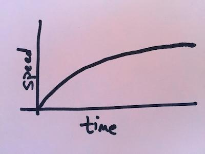
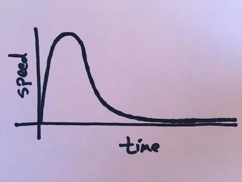
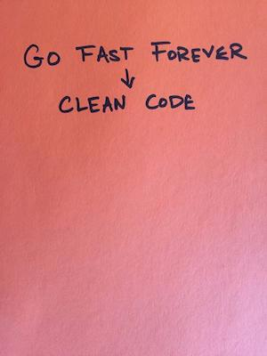
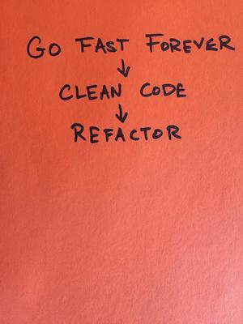
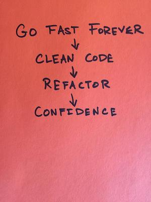
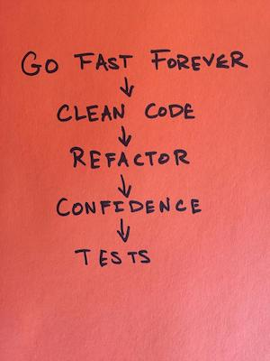
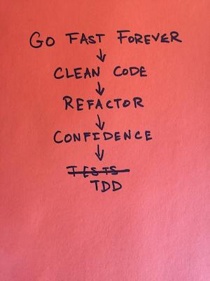

At VMware Tanzu Labs, we teach our clients, partners, and our peers [XP](https://en.wikipedia.org/wiki/Extreme_programming), [Lean](https://www.amazon.com/Lean-Startup-Eric-Ries/dp/B007YXSYTK), and [User Centered Design](https://tanzu.vmware.com/campaigns/design) (UCD) principles and practices for product and application development. We are constantly asked about our practices. This FAQ explains the "why's" behind many of our engineering practices, and the real problem they're attempting to solve. It also provides some guidelines for how to answer questions enterprises have around scaling these practices within their organization.

## Q: Why Pair Programming?
How many people on your team have to [get hit by a bus (or win the lottery and retire)](https://en.wikipedia.org/wiki/Bus_factor) before your team is unable to function? Most companies that come to us have teams with a "bus count" or "lottery count" of 1.

When you have solo engineers, you end up with knowledge silos. You have an engineer that owns a particular part of the system. No one else knows how that code works; in fact, most engineers are afraid to touch it. It only makes sense to the engineer that created it and maintains it. If the product managers prioritize features that only touch that one part of the codebase that only that one engineer knows, then the rest of the team is left twiddling their thumbs. If that engineer becomes unavailable, the team can't function anymore. The longer this situation goes on, the worse it gets.

Knowledge silos may create job security for engineers, but they create risk for companies. XP practitioners break down knowledge silos. Instead of making themselves "indispensable" by hording what they know, they make themselves knowledge and context-sharing machines through pair programming. They maintain collective ownership of the code; every engineer on the team can work on every part of the codebase. No one gets to specialize, and own one area -- or hold the team hostage with their singular expertise. They all agree to work on the **most important thing** – that means each pair pulls from the top of the backlog. No one owns a particular module. And it's everyone's job to keep the code clean. They never end up with code that only makes sense to one engineer, since they get instantaneous feedback on the readability of the code through pairing.

What about productivity? The first question most people ask is "So I have to hire twice as many engineers to get the same amount of work done?" For example, imagine a team of four engineers. When those engineers solo, there's four independent work streams happening in parallel. When they pair, there's only two independent workstreams happening in parallel.

The question is perfectly reasonable. On the surface, it appears that you've cut the volume of work in half. However, underlying the question is an assumption that there's no productivity difference between solo engineers and paired engineers. But that assumption is demonstrably false -- just ask anyone who's ever paired, or worked with a partner on nearly any task in work or life. Solo engineers spend much less time focused on the task at hand than paired engineers. It's easy to get distracted while soloing. Twitter, TikTok, Hacker News, email, Reddit, Slack, YouTube, texts -- you name it. It's much harder to check out while pairing. Your pair doesn't want to read your email, or answer your texts, or post a hilarious TikTok dance. And you probably wouldn't want them to anyways. Pairing is a state of hyper-productivity. That team of four engineers [is more productive](https://www.theregister.com/2016/10/18/pairing_programming_youll_never_guess_what_happens_next/) when they're pairing than when they're soloing.

That hyper-productivity caused by pairing comes at a cost: it's exhausting. And if you stay in that state too long, you'll start making bad decisions. [Science indicates](https://hbr.org/2017/05/your-brain-can-only-take-so-much-focus) that the human brain works best when it gets to alternate between states of focus and distraction. That's why pairing culture requires a culture of taking breaks. Every hour or so, the pairs need to stand up and do something completely different. Zone out, listen to music, play a game, etc.

Pairing also means we can spend less time on asynchronous code reviews. On teams that don't pair, developers spend a good portion of their time reading pull-requested code and writing comments. Then the original author of that code has to respond to those comments, revise their code, and resubmit it. The extra overhead of code review and code revision can easily take up ~50% of a team's working hours, so by substituting pairing for code review we lose nothing. In fact, we save time, because the real-time code review provided by pairing is more efficient than typing comments back and forth on Github.

In answer to the question "So I have to hire twice as many engineers to get the same amount of work done?": in an ideal scenario, you won't have to hire more engineers. Those four engineers will be more productive paired up than when they were solo. However, reality isn't ideal. Many companies may still need to hire more engineers because if they have a traditional IT culture, it's likely they have a fair number of engineers in their current workforce who will refuse pair. To achieve the level of effectiveness we expect from pairing, each person needs to value others' perspectives as much as their own, and be willing to be vulnerable, exposing what they don't know. Not everyone is willing to develop the empathy and relationship skills required to collaborate at this level. Pairing also exposes intellectual insecurities. To pair, you have to overcome your own ego – you have to be willing to make mistakes in front of your pair. Some engineers are terrified of this prospect, and would rather quit than face their fears.

## Q: Why do some teams struggle with switching from individual code ownership to team code ownership?

Some developers effortlessly make the transition to team code ownership. They immediately see the benefits of being able to modify any part of the code base and quickly shift from "I made this" (personal ownership) to "we made this" (collective ownership.)

Others may struggle with team code ownership for several reasons:

* Shifting psychological ownership may require a corresponding shift in an individual's identity. Psychological ownership refers to "the feeling of possessiveness and of being psychologically tied to an object." Psychological ownership occurs when the object becomes part of the psychological owner's identity. Psychological ownership answers the question, "What do I feel is mine?"
* Developers may struggle to transition to a caretaker mindset. An engineer struggled to describe the developer's relationship with the code on a very challenging project and settled on the caretaker metaphor: "Sometimes I feel like a janitor to [the code base]. Maybe "caretaker" would be better. Yeah, probably caretaker. I feel like a janitor just cleans up messes, but a caretaker makes things better."
* A developer may be distraught at "seeing my work slowly removed from the app."
* A developer may feel belittled when seeing their work changed or fixed "behind their back"
* Developers can no longer take pride in functionality that they exclusively develop.
* Existing knowledge silos, which hinder team code ownership, may be slow to break down.

New hires struggling with the transition slowly realize that "Someone else is going to take over and they're going to do fine. I can move onto something else and that's okay." They recognize the lack of long-term individual authorship, learn to expect their code to be transitory, develop trust in their teammates and thus loosely hold personal contributions. "The code that I write today may be in the code base for a little while, and it will evolve into something better." Eventually, they experience the benefits of a collaborative environment: "People are a lot more flexible all across the board, with changing things or accepting feedback or collaborating," and the team can say "Hey, this is our code!"

Shifting from individual to team code ownership may require multiple and complementary practices to actively remove knowledge silos. In this case, daily pair rotation helped combat knowledge silos. Moreover, for developers with strong individual ownership tendencies, sharing ownership first with a small group (where trust and communication come easier) may help. One engineer uses improvisation and collaboration games to help teams practice letting go of control, trusting the team, and learning to be pleasantly surprised by what emerges.

See:[ https://www.researchgate.net/publication/301612260_Practice_and_Perception_of_Team_Code_Ownership](https://www.researchgate.net/publication/301612260_Practice_and_Perception_of_Team_Code_Ownership)

## Q: Why Test Driven Development (TDD)? (Also, Why Do We Refactor?){id="tdd"}

Consider these two graphs of team speed over time, and ask yourself which team you want to be on:

Many people work for companies or on products that look like the first curve. They went really fast at first – but it didn't last. Their speed dropped precipitously, until reaching a depressing stagnation. That stagnation kills teams. It kills their spirit.

There are many reasons a team slows down. But one thing that will always slow a team down is **bad code.**

A team that looks like the first curve cut corners. You can go really fast if you cut all the corners – but only for a little while. It's false expedience. What made it easy to go super fast in the short term makes it impossible to go fast in the long term. The codebase very quickly resembles a [ball of mud](https://en.wikipedia.org/wiki/Big_ball_of_mud). Eventually, it reaches the point of no return, and those engineers will have no choice but to start over and try again.

If you want to **go fast forever**, you have to have **clean code**. But you don't just clean code once. Cleaning your code is like taking a bath. You have to bathe regularly if you want to stay clean. The longer you wait, the worse you get. It's the same with code.

So, to keep your code clean, you have to constantly [refactor](https://en.wikipedia.org/wiki/Code_refactoring) it. Every new feature you add to your codebase challenges the assumptions behind the code's design. You can either find a way to workaround the invalidated design in your code, or you can take the time right then to fix it -- to refactor it. The former leads to the first curve, to the death spiral. The latter leads to the second curve. Holding the behavior of the system constant while cleaning up the underlying design.

But most teams don't refactor – because they're afraid. They know the code is rotting, but they're not sure if everything will still work after they clean it up. To continuously refactor your code, you have to have **confidence** that the refactoring has still resulted in working software – that you haven't introduced regressions.

Unfortunately, there's no magic wand you can wave to prove that your system still works. You have to do the work yourself. If that work is too hard, or takes too long, you're unlikely to do it. It takes too long for the engineers to know if the changes they made resulted in working software. The only way to get that confidence quickly is to write tests. **Automated tests** give you the **confidence** you need to **refactor** your code to keep it **clean** so that you can **go fast forever**.

So the question becomes: when do you do it? When do you write tests? And the answer is obvious. Everything depends on them. They're the most important thing. So when do you do the most important thing? Obviously, you do that first. That's why we **test drive the code by writing the tests first**.

There are, of course, many more reasons why we write tests before, instead of after, we write the production code. Writing it first helps us tease out and think through our APIs. It forces us to clarify exactly what behavior we're trying to build, since we can't write a test without that clarity—and it also lets us know when we're done. It helps us triangulate on simple, maintainable implementations, by making each test pass one by one and writing just enough code to make each test pass. Furthermore, writing the test before the implementation gives us the confidence that our test suites aren't giving us false positives; we first watch the test fail for the reason we expect, and then do the simplest thing we can to make it pass.

## Q: What's a User Story?{id=stories}

"User stories", or simply "stories", are the primary unit of currency in an agile backlog, so it's important to have a crisp, clear understanding of them.

A story is a narrative description of a single task or activity being performed by a user of the system. Usually this is a human being, but in some systems the "user" could be another construct, like another software system. It represents the smallest piece of incremental value that you could deliver into the hands of your users and learn from observing their reaction to it.

We use stories to focus all software implementation work on delivering real value to real people as early and often as possible.

However, this leads to a lot of questions. One common question is "How big should a story be?", or to phrase it another way, "How much user-facing functionality should go into a single story?"

You can answer that by asking yourself, "Could I make this story smaller and still deliver value to the user?" If the answer is yes, then the story is too big.

Conversely, another common question "Is it possible for a story to be too small?" To answer that question, ask yourself this question: "If I complete this story, will it actually provide value to our users?" If the answer is no, then the story is too small.

For example, imagine your story is about authentication. At first, the story includes not only the ability to log in, but also to log out, to recover your password, change your password, and recover your username.

So you and your team ask yourselves the question, "Could we make this story smaller and still deliver value to the user?" After some discussion, you decide that much of the functionality in the story could actually be broken out into separate stories; for example, there could be a "Recover password" story, a "Log Out" story, a "Change Password" story, etc.

However, the team goes too far. They come up with a story called "Login Form", and another story called "Login Form Logs In". The first story, "Login Form", says that there should be a login form with a username and password field. And that's it! The form doesn't have to work. It just needs to look like a form. The second story, "Login Form Logs In" says that now that there's a login form, it should actually work.

So you and your team ask yourselves the question, "If we complete the story 'Login Form', will it actually provide value to our users?" And of course, the answer is "No!" Delivering a login form to production that doesn't actually do anything does not help your users; in fact, it's likely only to frustrate them, or even put the product into an unreleasable state. You've made the story too small. So you combine the "Login Form" and "Login Form Logs In" into a single story.

## Q: How Do We Decide Which Story Comes First?

At the beginning of a project, you may have a vision for a [minimum viable product](https://en.wikipedia.org/wiki/Minimum_viable_product#:~:text=%22The%20minimum%20viable%20product%20is,means%20it%20is%20not%20formulaic.), and several stories. For clarity, imagine that you're building an e-commerce shopping site for a boutique clothing store. Your vision of the MVP includes the ability for people to shop the store's entire catalog online, add multiple items to their shopping cart, pay with credit card or PayPal, view past transactions, save their credit cards, and apply discount codes.

That's a lot of software! Where do you start? How do you pick which story to begin with?

There's no one right answer here, but there's a few wrong answers that are worth pointing out.

For example, it might be tempting, after mapping out a user's flow through the application, to decide that the first story should be "User Can Log In".

But remember, the definition of a story is "the smallest piece of incremental value that you could deliver into the hands of your users and learn from their reaction to it." So when you're starting from nothing, does the story "User Can Log In" deliver value into the hands of your users? No! It wouldn't add any value to the user's life; no one wants to log in to an application that does nothing.

At the beginning of an engagement, you'll need to get creative with how you think about creating that first piece of user value for the users. You might decide that a simple page listing a "product of the week" and a phone number users can call to purchase it would test important assumptions you have about the problem you're trying to solve for your users. After delivering that, you might get feedback from users that they don't want to call anyone—or that they want the store to call them. And so you write and prioritize the next story accordingly.

Of course, this is a highly idealized scenario; real projects will require weighing many options for deciding on the first story—and you likely won't have the luxury of waiting to write and prioritize the second story until you've gotten feedback from that first story. You might also decide that it's more important to prioritize the first story based on technical risk instead of user value; perhaps there's a potentially risky technical integration that you want to make sure the team has a handle on before moving forward with too many features that will be impacted by it. At the end of the day, it's up to you and your balanced team to put your heads together to effectively weight the tradeoffs and find the first starting point.

## Q: Why Do We Estimate In Points, Not Time?

It doesn't matter if the organization is agile or [waterfall](https://en.wikipedia.org/wiki/Waterfall_model): it's generally valuable to know when something will be done. When will a feature be delivered? Will the release contain everything that we hoped to put in it? Delivery estimates help our product managers plan.

The mistake most companies make is that they ask their engineers to estimate software in chunks of time. They ask "How long will this feature take?", or "When will this feature be done?"

It's so tempting to answer their question directly by estimating how long you think something will take. Don't do it. We have literally decades of proof by this point that engineers are terrible at estimating in time.

We are, however, very good at estimating chunks of work relative to each other. This feature is harder than this feature. This story touches more moving pieces than that one. Teams can very quickly estimate stories in an iteration by comparing the stories in the iteration relative to each other (and relative to stories they've completed in the past). Line up the stories in an iteration, and sort them easy to hard.

But how does sorting stories relative to each other help us estimate when something will be done? Because of velocity. Assign points to each story that you've estimated. For example, your team may use a fibonacci pointing sequence: 1, 2, 3, 5, 8. That's five buckets to put stories in. The easiest stories go into the "1" bucket. The hardest stories go into the "8" bucket. Note that teams will also keep in mind estimates from previous iterations. Imagine a really complex story in a previous iteration got an 8, but the hardest story in this iteration isn't as complex. So maybe they put this iteration's hardest story in the "5" bucket.

Next, keep track of how many story points the team delivers week over week (or better yet, let Tracker keep track of it for you). Figure out how many points the team can deliver in a given week by maintaining a rolling average of the last three week's of points delivered each week. That rolling average—the number of points a team can deliver in a week—is velocity.

[Velocity](https://martinfowler.com/bliki/XpVelocity.html) is the key to planning on XP teams. Instead of asking a team to estimate when something will be done based on their gut, we predict when something will be done based on data. We know how many points the team can deliver week over week. And we know where the story is in the prioritized list of stories (i.e., the backlog).

However, it's also important to know that predictions made with velocity are still just that: predictions. They're not foolproof. That's because a team probably does not deliver the exact same amount of points week over week. There's variation each week in how many points they deliver. That variation we call "volatility." The more volatility, the higher the margin of error in velocity-based predictions.

That's why engineers have to keep a very close watch on volatility on their team; when they're experiencing high degrees of volatility, they have to figure out the cause of the volatility and eliminate it. Otherwise, they won't be able to predict when things will be done with confidence—and the PMs won't be able to plan.

## Q: Why Don't We Estimate Bugs and Chores?

Velocity predicts when stories will be done. So why don't we estimate bugs and chores? Because if you do, you won't be able to rely on your velocity to predict when stories will be done anymore.

Here's why: stories are planned, but bugs are an **unintended consequence of feature development** (and one that, as much as possible, we try to eliminate). A bug represents something that used to work, but now doesn't. You already got points for the work when it was a feature. You shouldn't get more points for breaking it and then fixing it again.

Likewise, chores are a necessary aid to feature development, but typically aren't possible to plan up front—rather, they become apparent in reaction to the needs of the product as it evolves. If you start pointing bugs and chores, you'll artificially inflate your velocity.

Imagine you've been pointing bugs and chores as they've cropped up and adding them into the backlog; also, imagine that process has led you to a current "velocity" of 20 points per week. Your backlog is now empty, and your product manager shows your team 10 new stories. You and the other engineers estimate those stories at 40 points. So you all say, "It will take us two weeks to complete these!" But you'll be wrong. Because you won't just work on those stories; as you develop those stories, you'll have to deal with bugs and chores that crop up. Since your velocity was artificially inflated, you weren't able to accurately predict how long the stories would truly take.

Here's another way to think about it: bugs in tracker are reserved for something that used to work before, but now doesn't. Therefore, a bug is something the team already got points for when it was originally developed. It wouldn't be fair to point the bug and get points all over again—we'd be "rewarding" ourselves for breaking features that used to work! Instead, by not pointing bugs, we force our velocity to get dragged down by the bugs, since now we're spending time during the week fixing things we broke instead of delivering new value.

Bugs and chores have to bring velocity down. That's why we don't point them. We want our velocity to tell us how long it will take to complete stories (i.e., user value). If you inflate it with bugs and chores, then you've lost your ability to predict how long it will actually take you to deliver new value.

## Q: What's the value of CI/CD?

There are two questions you have to ask when considering shipping software:
* Can we ship?
* Should we ship?

"Should we ship?" is ultimately a business decision. Is it valuable to the business to put the latest features in the hands of the users right now? The product manager (PM) represents the business interests on the team and must own this decision.

However, the question "Can we ship?" is fundamentally an engineering question. Is the software in a working state? Are we confident it won't fail in production? The goal of the XP engineers is to **always** have a "yes" answer to this question. A team that can't ship, can't learn. And the longer you're not learning, the greater the risk that you're wasting time and money building the wrong thing.

The combination of three XP practices make it possible for teams to always have a "yes" answer to the question "Can We Ship?":

* Stories
* TDD
* Continuous Integration/Continuous Delivery

If your backlog consists of stories that conform [the definition in this FAQ](#stories), and your engineers only commit implementations of those stories once the team (PM, Designers, and Engineers) agree the implementation completes the story, then you'll never have any half-implemented features in the build.

But does the software work? Well we've already talked about how XP engineers answer that question: they [TDD](#tdd) Any pair, at any time, can run the tests to determine if their copy of the code works – if all features of the product work correctly. But on a big team, you have lots of pairs working in parallel, and therefore the codebase exists in multiple states simultaneously; the tests might be passing on one pairing station, but failing on another. That's where we get to continuous integration (CI): the team needs a single source of truth that they can point to in order to answer the question "does it work?" If the CI build is green, it works. You can ship the software. Now the PM has to decide if the team should ship the software.

Of course, there are all kinds of other benefits to CI. [To paraphrase Martin Fowler](https://www.martinfowler.com/articles/continuousIntegration.html): CI reduces risk by letting you know at all times what works and what doesn't. It raises awareness of bugs drastically and allows you to find and remove them quickly and without fuss. Because of this, projects that integrate continuously generally have fewer bugs. Of course, this is all predicated on the quality of your automated test suite.

It's worth noting that some PMs automate their responsibility with respect to shipping. Some always have the default answer: "Ship on green." In effect, they've asked the engineers to add another step to their build pipeline to automatically promote code to production on a green build. That's called "continuous deployment." However, although the mechanics of it are facilitated by engineers, shipping is still a business responsibility. The default answer of "ship on green" doesn't abdicate the responsibility of the decision to the engineers. The PM still has the responsibility of understanding how the features are working in production and how users are responding to it – which means the PM has to prioritize all engineering work necessary to build automated production monitoring capabilities that make continuous deployment responsible.

## Q: Why do we have Retrospectives?

We seed engagements with a number of key practices that we've found valuable over an incredible number of engagements, like pairing, test driven development, IPMs, standup, CI/CD, etc.

However, there is no one set of practices that will work effectively for all engagements. All practices are intended to solve problems, but not all engagements suffer from the same set of problems. Furthermore, the problems a team faces change over time.

That's why we also seed engagements with the [practice of retrospectives](/practices/3-column-retro). It's the seed of improvement. Week after week, teams sit down and talk about what's working, what's not, and what they can do about it.

Without that reflection and constant adjustment, the team's practices will deteriorate. What worked on day one won't necessarily work on day 30, or day 100. You have to constantly improve the team's efforts, or risk failure.

## Q: Why Do We Rotate Engineers On and Off Engagements?{id="rotations"}

Within Tanzu Labs, it's common to have engineers rotate between projects or even clients periodically. In other words, we might not join a client project at the beginning of a project, and any given consultant might be on a project to the end of the engagement.

This can be difficult for everyone. Your team and product stakeholders might get attached to you, or other team members. They not want you to leave to join another project. They might even get scared, or angry. You might also feel emotionally attached to your project and team, and feel scared or angry about moving on to another project before this one is done.

However, in our experience, rotation is in everyone's best interest, and if you adopt this practice it's important that you communicate early and often with everyone on the idea of rotation early in a project. Here are the basic talking points.

Every team needs a core group of engineers that understand the codebase inside and out, have context on the architectural decisions that have been made, and can efficiently churn through a backlog.

However, if you leave that team together for too long, they'll start to become blind to their broken windows. They won't see annoying workarounds as annoying anymore; they'll have grown used to them. They'll become complacent about the warts in their codebase, or the intermittent failures in their CI build. Or the bureaucracy of their client's release process.

In other words, they'll become increasingly less effective at maintaining quality in the code base and in their engineering process.

That's why every team needs something else in addition to that core group of engineers: they need fresh perspectives. Rotation's don't really slow teams down; they really speed them up. Because a peer that rotates onto the team will point out all the [broken windows](https://en.wikipedia.org/wiki/Broken_windows_theory) (kindly, of course); they'll point out flaws in the codebase that have been slowing the team down. They'll fix the flaky CI build. They'll raise hell (again, kindly) about the team's insane release process.

If you rotate onto a team that's been together for a while, expect to find problems. But don't forget, your peers are humans, just like you. You can hurt their feelings if you're not careful. Be constructive; don't just complain—offer solutions! And don't assume you understand why things are the way they are—ask questions!

Conversely, if you're part of that core team that's been together for a while, and a peer is just rotating onto the team, set the example for soliciting feedback. Tell them you need them to point out what's broken. Be a role model for receiving feedback, and acting on it.

Rotation also eliminates the need for various kinds of organizational overhead:

* Personal assessment and feedback happens inline (part of pairing more than rotation, but rotation ensures a balanced aggregate view)
* The need for handbooks/playbooks/onboarding materials is greatly reduced as tribal knowledge moves with people
* Transferring of existing skills and the sharing of new technologies happens organically, rather than needing artificial efforts like classes and workshops
* It strengthens the connection between teams as friends rotate to other projects - increasing the likeliness of cross-team knowledge sharing and reducing duplicated efforts
* Reduces the strain on any one relationship knowing that there's an end

We talk about how pairing de-risks our project. By having solution knowledge and context shared by the team, rather than locked up in a few people (or, worse, in a single person), the downside to a single person leaving the team is dramatically lowered. Rotation is the real-life manifestation of that lowered risk. "We believe that you should rotate developers regularly after you disengage with us—let us show you how that's done."

Project stakeholders often object to rotating team members – not just developers! It's important to remember that organizations usually prioritize keeping (and sometimes hording) the best individual contributors that they can find. It takes time, trust, and proof to show them they can live in a better world that focuses on team dynamics rather than individual skills.

Rotations are also an opportunity for:

* Validating that the team has the right documentation to effectively onboard and/or handover to new people
* Giving new or junior engineers the chance to take responsibility for core engineering knowledge on the project
* Giving new or junior developers the opportunity to onboard new people onto the project

But what about keeping historical context? What about having a consistent face on the project? We do recommend having an **anchor** the project who rotates less frequently. See our section on [Anchors](#anchors) below.      

## Q: What is an engineering "Anchor" and what's the origin of the anchor role?{id="anchors"}

Please see our [**Anchor Playbook**](/learningpaths/anchor-playbook/) for an in-depth look into Anchors -- Tanzu Lab's answer to the tech-lead role.


#### Aside: why the heck is called an "anchor?"
Once upon a time, Tanzu Labs was called Pivotal Labs. The first Pivotal Labs office was in San Francisco. This was around 2005. We got our first few clients to come into the office with us. They were startups. And they were all using Ruby on Rails.

At the time, Ruby on Rails was pre 1.0. It had bugs, and the framework changed a lot between releases.

The engineers in the Pivotal Labs office weren't assigned to one specific client. Instead, they all rotated between clients frequently, even daily. This was partly necessitated by the volatile nature of Rails at the time; when an engineer got one codebase upgraded to the latest version of Rails, or figured out a workaround for some new bug, that engineer would then rotate onto other clients to help them do the same.

Clients weren't incredibly happy with this setup. They (rightly) asked, "who's on my team?" Furthermore, context on the decisions that had been made, both in the code and for the product, were sometimes lost.

To solve this problem, we **_"anchored"_** an engineer to each client. That person didn't rotate onto other clients until their current client was no longer working with Pivotal Labs. The anchor became the team historian, and consistent face for the client. But, the burden of success for the engagement was also placed on their shoulders.

We still consider [rotations very important](#rotations) -- just not daily!

## Q: What's the difference between XP and Scrum? And Why Do We Practice XP?

We are often asked "Why don't you do Scrum?", or "What's the difference between XP and Scrum?" 

So what is Scrum? And how is it different from XP? And why do we practice XP, not Scrum?

Before answering it, it's important to keep in mind: our goal in these situations is not to create a religious war of XP versus Scrum, or to tell anyone that practices Scrum that they're somehow "wrong" and that XP is "right."

Often, one of our primary goals when working with a client is to expose them to a different way of working and thinking. We are sometimes asked if we can "just do Scrum" instead of XP. In a way we already are. Our process takes a lot of hints from Scrum and layers on many missing aspects, such as engineering practices. XP adds new tools to the software development toolbox. 


**Consulting Tip:** If you are a consultant, be careful not to "remind" your client that they are there to learn from you and do exactly what you say -- only your clients can tell you why they are here, and one should not make assumptions about the circumstances by which they came to work with you.


Before we talk about how XP and Scrum are different, let's talk about how they're the **same**. 
* Both XP and Scrum strive to deliver useful software into the hands of users through short iterations via small teams employing continuous improvement. 
* Both Scrum and XP teams regularly reflect on what's working, what's not, and what they can do to iterate on the process.

The **fundamental difference** is this: Scrum is about project structure but not practices, while XP is about project structure **_and_** delivery practices. Let's break that down.

Scrum "by the book" was a reaction to inefficient, poisonous projects, where teams were dictated how to do their jobs by outsiders who didn't really know what they were doing, and often did not have any real "skin in the game" regarding the outcomes. Scrum defines a set of rules that say "the delivery team gets to decide _how they deliver_, while the business team gets to decide _what is delivered_." Both groups are on the hook for the outcomes. If you're not in either of those groups or are not impacted by the outcomes then you don't get a say. If you're a member of one group you don't get to tell the other group how to do their job, though you can, and should, collaborate. 

That's Scrum -- a protective "bubble" for projects to work within.

XP was also a reaction to inefficient projects and product delivery. It also set up a "bubble" around the product teams and rules about who gets to dictate what. But, XP came from software engineers who were frustrated with how poorly software was written and maintained, and how hard it was to change software in reaction to the needs of the business. Thus, XP suggested engineering practices within the project bubble, such as pair programming, test driven development, and refactoring.

By contrast, Scrum doesn't prescribe any specific engineering practices—instead, Scrum gives the team complete freedom to use any engineering practices that they see fit during a sprint, and to change them from Sprint to Sprint through continuous improvement (e.g., retrospectives).

XP teams also vary their practices week to week through continuous improvement (e.g. retrospectives... sounds familiar, right?). However, there are some practices that XP teams don't vary, but instead consider to be "core practices", and apply them always; namely, TDD and pair programming.

There are a few more differences. Iterations in Scrum, called "sprints", are a time-box of one month or less, during which a "Done", usable, potentially releasable product increment is created by the end of the sprint. XP teams, on the other hand, always have a "Done", usable, potentially releasable product—every single story (even every single commit to the primary branch) should result in a working, usable, releasable product. For an interesting perspective on sprints, please see Ron Jeffries' article [Hills to Die On: Sprints](https://ronjeffries.com/articles/018-01ff/ds-hill-sprints/)

Scrum teams also typically practice something called a sprint "commit." That is, the developers, at the outset of a sprint, will decide on a certain amount of work that they'll "commit" to completing during their sprint.[ SAFe](https://en.wikipedia.org/wiki/Scaled_agile_framework) has a [similar commitment model](https://www.scaledagileframework.com/pi-objectives/). There are Pros and Cons to this. There can be a lot of positive energy and motivation that can come from a shared team goal like the sprint "commit," and high-functioning Scrum teams do a lot to harness and leverage that positive energy. Furthermore, a high-functioning Scrum team will also consider re-negotiating a sprint's scope with their product manager during the sprint if they discover something that leads them to believe they should adjust things mid-sprint.

Of course, not all Scrum teams are "high-functioning" (nor are all XP teams!). With a sprint "commit", sometimes the product manager will tell the powers that be that they will **_definitely_** complete a certain scope by a certain date. Fixing time and scope in this way can have a very negative effect on the code and the team. If the team starts to slip they might be under pressure to "get things done", which often ends in sacrificing code quality and taking on tech debt. Because of that, it's not uncommon in organizations that practice firm sprint "commits" to see engineers "pad" their estimates, eroding trust between different roles and parts of the organization. Even worse, this sometimes results in management putting even more pressure on the team because they know that engineers padded the estimate and can probably do a few more things.

XP teams, on the other hand, don't have sprints as defined by Scrum. Time-spans in XP are called iterations, often one-week iterations. At the start of a week, they'll [review what's currently in the backlog and icebox](/practices/ipm), estimate (with points, not time) any stories that seem worthy of estimation at that time, and prioritize the next most important things to work on. Throughout the week, they'll work on stories and deliver them to production—but at any time, they may adjust the prioritized list in the backlog, or even slot in, estimate, and prioritize all new stories. That's because they believe that the best software is built through learning. They know that by **_embracing change_**, they can build better software. So they're always ready and willing to change priorities based on what they're learning as they put working software in the hands of users.

## Q: Do we think deadlines are bad?

No! Deadlines aren't bad. They're great! In our process, having a deadline is really a chance for our process to shine.

A lot of software development teams have had bad experiences with deadlines. They've been subjected to the dreaded [death march](https://en.wikipedia.org/wiki/Death_march_(project_management)). In other words, they've been given a fixed scope that they must complete by a certain date, and have been burned out working nights and weekends, compromising the quality of their work, trying to meet the deadline.

The problem they're dealing with is what is sometimes referred to as the
[Iron Triangle](https://en.wikipedia.org/wiki/Project_management_triangle). On any team, you have three qualities you're trying to achieve: fast, cheap, high quality. In other words, you want the team to deliver quality software as quickly as possible for as little cost as possible. But unfortunately, you can't have all three things at once. You can only have **two of the three dimensions:**

- You can get something **fast and cheap**, but the team will have to sacrifice quality to do it.
- You can get something **fast with high quality**, but you'll pay a lot of money for it. 
- You can get something **cheaply with high quality**, but you'll have to wait a long time to get it.

That's why fixed scope / fixed time is so problematic, and the death march inevitable. And the more the team sacrifices the quality of their work, the harder the work becomes. Though they might manage to meet the deadline, the software will be of such low quality that they won't be able to maintain it after that.

Of course, none of this is caused by a deadline itself. It's caused by waterfall incentive structures; the client's organization measures success as "on time, on budget". But at what quality?

We advocate for a very different way to measure success in software development. It doesn't matter if you build something "on time and on budget" if the software isn't valuable to the users or the business in the first place!

So when we are working towards a deadline, we don't focus on thinking about "how can we build _all of these features_ by this date"; instead, we think about "what are the _most valuable things_ we can build by this date?"

With a predictable velocity, the product manager can start to make hard decisions and weigh tradeoffs between features. They're forced to think more critically about their  list of features, and will start to value evidence-based approaches to deciding what to build. Deadlines are forcing functions for lean validation and constant re-prioritization based on learning, since it's really the only way they're going to ensure that they've created something valuable by the deadline.

## Q: How can we scale these practices in large, traditional enterprises?

See our white paper about [How to Scale Agile Software Development with Product Teams in the Enterprise](https://tanzu.vmware.com/content/white-papers/how-to-scale-agile-software-development-with-product-teams-in-the-enterprise)


Build teams around architecture, not architecture around teams.

With new products and startup companies it is common to start off with a handful of teams building new [greenfield applications](https://en.wikipedia.org/wiki/Greenfield_project). As those applications grow, you'll quickly discover that it's too much for one team to handle. So how do you scale it? And what about your existing product portfolio? When you start surgically applying lean, agile, and UCD teams to it, how will they integrate with the existing team structures?

We've learned quite a few lessons about how to successfully scale these practices ourselves while building [TAS - Tanzu Application Services](https://tanzu.vmware.com/application-service). We have hundreds of engineers, product managers, designers, program managers, and directors spread across the globe.

#### Rule #1: Scale slowly

Don't go from 20 to 200 overnight. Don't jump from 1 team in 1 location to 10 teams in 10 locations. Don't lower your hiring bar in order to scale. Start small, and build slowly. Go from one team to two teams – in the same location. Go from one location to two locations – in the same time zone. Retrospect on scaling all along the way, adding just enough leadership and inventing new practices and communication patterns to keep teams efficient and healthy.

#### Rule #2: Distribute teams based on architectural boundaries

This second rule is sometimes referred to as the "inverse Conway maneuver" in reference to [Mel Conway's "law"](https://en.wikipedia.org/wiki/Conway%27s_law):

> Organizations which design systems ... are constrained to produce designs which are copies of the communication structures of these organizations".

In other words, if you're not careful, your architecture will reflect the structure of your organization—which means you'll be creating architectural boundaries to suit your people, instead of organizing your people to suit the architecture demanded by the actual product.

Let's take one of our own products as an example. Tanzu Application Service, like many well-designed systems, has a plugin architecture -- a set of well-defined APIs and extension points. You can plug in Buildpacks, service brokers, logging utilities, performance monitoring systems, and more. But underneath the hood, TAS also has a core distributed system, built by distributed teams that must collaborate closely.

Based on our experiences, we recommend you keep closely collaborating teams like these in the same or close time zone, ideally in the same location, and only spread them out geographically once you've proven it works well "in one place." The teams building at the well-defined architectural boundaries are much easier to distribute to other locations. The plugin teams have minimal communication requirements with folks working on the core distributed system, since they're operating at a well-defined plugin point and working in largely independent problem domains.

"That's all well and good for the new products I scale," you might be saying to yourself, "but what all of my existing teams and products? When I want to apply lean, UCD, and agile engineering practices to them in order to optimize my existing business, how do I do it?"

Let's set aside the funding and management adjustments you'll need to make to support these folks for a second, and talk specifically about the engineering challenges here.

1. As you start to optimize the underlying application codebases and infrastructure, you'll need to carefully retrofit automated tests on top of it so that your teams can refactor or rewrite portions of it in order to solve for the engineering pains present in the legacy architecture or meet the new business objectives. This isn't [TDD 101](/learningpaths/application-development/test-driven-development/); it's advanced testing. You'll need highly skilled practitioners in order to do this effectively. Work with your engineering leadership to find these practitioners, and to grow more of them.
2. You'll need to align certain teams vertically, instead of slicing them up horizontally. You have all kinds of cross-cutting domains in your legacy architecture (take authentication as the universal example—a domain that cuts across most, if not all, of your applications). You'll need to organize teams around business capabilities, not technologies. As Martin Fowler[ points out](https://youtu.be/wgdBVIX9ifA?t=6m30s), the common misconception that companies have when it comes to microservices is that microservice architectures means that you have a team that only owns the microservice API and nothing else. But if you look at Amazon, the archetype for the microservice architecture playing out at scale in a company,[ they instead organized their teams around business capabilities.](https://aws.amazon.com/modern-apps/faqs/) They have an order team, a shipping team, a catalog team, etc. Each of these build services, true. But they also own their business capability end to end, all the way to the end user. They own the experience, and how that experience plays out in the various software products their particular business capability is present in.

## (TBD) Q: What's our opinion of SAFe?
Coming Soon!

## (TBD) Q: Why do XP teams need a PaaS? Why do our clients need a PaaS even if they don't have XP teams?
Coming Soon!

## (TBD) Q: When is it okay to bend "the rules"?
Coming Soon!