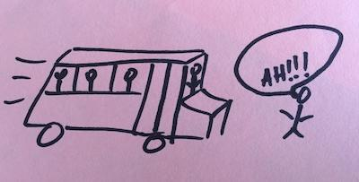
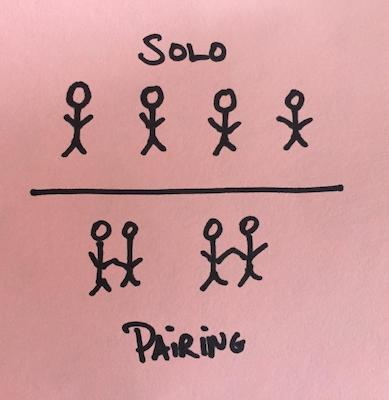

VMware Tanzu Labs teaches clients, partners, and peers [XP](https://en.wikipedia.org/wiki/Extreme_programming), [Lean](https://www.amazon.com/Lean-Startup-Eric-Ries/dp/B007YXSYTK), and [User Centered Design](https://tanzu.vmware.com/campaigns/design) (UCD) principles and practices for product and application development. 

This FAQ explains the "whys" behind many of Tanzu Labs engineering practices, and includes examples of real problems the team worked together to solve. It also provides guidelines on how to answer questions from enterprises about ways to scale these practices within their organization.

## Q: Why Pair Programming?

{}
There is an overview of Pair Programming in [**Fundamentals of Modern Application Development learning path**](/learningpaths/application-development/pair-programming/). The following is a deeper dive into the topic.
{}

How many people from your team have to [get hit by a bus (or win the lottery and retire)](https://en.wikipedia.org/wiki/Bus_factor) before it is unable to function? Most companies that come to Tanzu Labs have teams with a "bus count" or "lottery count" of 1.

When you have solo engineers, you end up with knowledge silos. For example, suppose there is an engineer in your organization that owns a particular part of the system. Because no one else knows how the code works most engineers are afraid to touch it. The engineer who created and maintains the system is the only one who understands how the system works. If a decision is made to prioritize features in the part of the codebase that only one engineer knows, the rest of the team is left twiddling their thumbs. If the same engineer becomes unavailable, the team cannot function anymore. The longer this situation continues, the worse it gets.

Knowledge silos may create job security for engineers, but they also create risk for companies. XP practitioners break down knowledge silos. Instead of making themselves "indispensable" by not sharing what they know, they share knowledge through pair programming. XP practitioners maintain collective ownership of the code so that every engineer on the team can work on any part of the codebase. No one gets to specialize, own one area, or hold the team hostage with their singular expertise. Everyone agrees to work on the **most important thing**. That means each pair pulls from the top of the backlog. No one owns a particular module, and it's everyone's job to keep the code clean. They never end up with code that only makes sense to one engineer, because they get instantaneous feedback on the readability of the code through pairing.

What about productivity? It leaves people to wonder "Should I hire twice as many engineers to get the same amount of work done?" For example, imagine a team of four engineers. When those engineers solo, there's four independent work streams happening in parallel. When they pair, there's only two independent workstreams happening in parallel.

The answer to the question is you won't have to hire more engineers. In an ideal scenario, the four engineers are going to [be more productive](https://www.theregister.com/2016/10/18/pairing_programming_youll_never_guess_what_happens_next/) when working paired than when working solo. However, reality isn't ideal. Many companies may still need to hire more engineers if they have a traditional IT culture. This is because it is also likely that they have a fair number of engineers in their current workforce who prefer not to pair. 

On the surface, it appears that the volume of work is cut in half. Yet, underlying the question is an assumption that there's no difference in productivity between solo engineers and paired engineers. The assumption is demonstrably false. Solo engineers spend less time focused on a task than paired engineers. It's also easy to get distracted while soloing with apps such as Twitter, TikTok, Hacker News, email, Reddit, Slack, YouTube, texts. They are much harder to check out while pairing. Your pair doesn't want to read your email, or answer your texts, or post a hilarious TikTok dance. And, you probably wouldn't want them to anyways. Pairing is a state of hyper-productivity. 

Hyper-productivity caused by pairing is exhausting. If you stay exhausted too long, you'll start to make bad decisions. [Science indicates](https://hbr.org/2017/05/your-brain-can-only-take-so-much-focus) that the human brain works best when it gets to alternate between states of focus and distraction. That's why there is a culture of taking breaks in pair programming. Every hour or so, the pair needs to stand up and do something completely different and it doesn't have to be work-related. You can relax, listen to music, read emails, or play a game.

Pairing also reduces the amount of time that you spend on asynchronous code reviews. A developer who doesn't pair is likely to spend a good portion of each day reading pull-requested code and writing comments. The extra overhead of code review and code revision can easily take up ~50% of a team's working hours, so there is nothing to lose by substituting pairing for code review. Instead, the developer saves time because the real-time code review provided by pairing is more efficient than going back and forth typing and submitting comments on Github.

To achieve the level of effectiveness from pairing, everyone needs to value each other's perspectives, be willing to be vulnerable, and express what they do not know. Pairing can reveal intellectual insecurities in people. Not everyone is going to develop the empathy and relationship skills required to collaborate at this level. To be successful at pairing, let go of any ego, and understand that it's OK to make mistakes in front of your pair. Some engineers are terrified of this prospect, and would prefer to leave the company than overcome their fears.

## Q: Why Do Some Teams Struggle with Switching from Individual Code Ownership to Team Code Ownership?

Some developers effortlessly make the transition to team code ownership. They immediately see the benefits of being able to modify any part of the code base and quickly shift from personal ownership (i.e., "I made this.") to collective ownership (i.e., "The team made this.").

Yet, others struggle with team code ownership for several reasons:

* Shifting psychological ownership may require a corresponding shift in your identity. Psychological ownership refers to "the feeling of possessiveness and of being psychologically tied to an object". Psychological ownership occurs when the object becomes part of the psychological owner's identity. Psychological ownership answers the question, "What do I feel is mine?".
* Developers may struggle to transition to a caretaker mindset. For example, an engineer may struggle to describe the developer's relationship with the code on a very challenging project and settle on the caretaker metaphor, "Sometimes I feel like a caretaker to [the code base].". A caretaker cleans up messes and makes things better.
* A developer may be distraught at seeing their work slowly removed from the app.
* A developer may feel belittled when seeing their work changed or fixed without them.
* Developers can no longer take pride in functionality that they exclusively develop.
* Existing knowledge silos may be slow to break down. This can hinder team code ownership, 

New hires who are also struggling with the transition eventually realize that someone else is going to take over. They know that it's OK to move on to something else. They recognize the lack of long-term individual authorship, learn to expect their code to be transitory, develop trust in their teammates, and loosely hold personal contributions. They understand that even if the code that is written today is in the code base for a little while, it is going to evolve into something better. Eventually, new hires experience the benefits of a collaborative environment. People are more flexible with changing things, accepting feedback, or collaborating. A collaborative environment is a place where the team can say, "Hey, this is **_our_** code!"

Shifting from individual ownership to team code ownership may require multiple, complementary practices to actively remove knowledge silos. In this case, daily pair rotation helped combat knowledge silos. Moreover, for developers with strong individual ownership tendencies, sharing ownership first with a small group where trust and communication build quickly may help.

See: [**Practice and Perception of Team Code Ownership**](https://www.researchgate.net/publication/301612260_Practice_and_Perception_of_Team_Code_Ownership)

## Q: Why Test Driven Development? {id="tdd"}

Test Driven Development (TDD) is a crucial engineering practice. Review the article, [**Test Driven Development**](/learningpaths/application-development/test-driven-development/) as part of the Fundamentals of Modern Application Development learning path.

## Q: Why Refactor? {id="tdd"}

[Refactoring](https://en.wikipedia.org/wiki/Code_refactoring) is a crucial engineering practice. In [**Why TDD?**](https://tanzu.vmware.com/content/blog/why-tdd), Matthew Parker elaborates why you shouldn't be afraid of refactoring, and how refactoring on how TDD and refactoring are related.

## Q: What is a User Story?{id=stories}

A *user story*, or *story*, is the primary unit of currency in an Agile backlog. It is a narrative description of a single task or activity being performed by a user of a system. A user story represents the smallest piece of incremental value that you can deliver into the hands of a user. 

Stories focus all software implementation work on delivering real value to real people as early and often as possible. This leads to a lot of questions, beginning with "How big should a story be?". To know the answer, shorten the story. Does the shortened story still provide real value to the user? If you can make the story smaller and still deliver real value to the customer, then your story is too big.

Conversely, "Is it possible for a story to be too small?". To answer the question, ask yourself: "If I complete this story, will it provide real value to our users?" If the answer is no, then your story is too small.

For example, suppose your story is about authentication: 
- _"User can sign in, **_and_** sign out, **_and_** recover their password, **_and_** change their password, **_and_** recover their username"_

Your team collaborates, "How do we make this story smaller and still deliver value to the user?". Together, everyone decides to make smaller stories about authentication. So, now instead of having one large story, you have several smaller ones, including the following: 
- _"User can sign in"_ 
- _"User can sign out"_ 
- _"User can recover their password"_ 
- _"User can change their password"_ 
- _"User can recover their username"_

{}
**Tip:** If a user story contains an **_"and"_**, try splitting the story at that point and evaluate whether the two (or more) stories provide value on their own.
{}

However, the team goes too far in making smaller stories out of bigger ones. They decide to break down _"User can sign in"_ into the following tiny stories: 
- _"User can view the Username field on the Sign In form"_
- _"User can view the Password field on the Sign In form"_
- _"User can view the 'Sign In' button on the Sign In form"_
- _"User can view the entire Sign In form"_
- _"User can sign-in using the Sign In form"_

Your team collaborates, "If we complete the two or three stories, is the Sign In form going to provide real value to our users?" The answer is no. Delivering a sign-in form to production that doesn't work does is not going to help your users. If anything, it's more likely to frustrate them, or put the product into an unreleasable state. In this case, _"User can sign in"_ was an appropriately-sized story. 

## Q: Which Story Comes First?

There's no right answer here, but there's a few wrong answers to discuss.

At the beginning of a project, you may have a vision for a [minimum viable product (MVP)](https://en.wikipedia.org/wiki/Minimum_viable_product#:~:text=%22The%20minimum%20viable%20product%20is,means%20it%20is%20not%20formulaic), and several stories. 

For example, you're building an e-commerce shopping site for a boutique clothing store. Your vision of the MVP gives people the ability to shop the store's online catalog, add multiple items to a shopping cart, pay with a credit card or using an online payment app, view past transactions, save credit cards, and apply discount codes.

You map out a user's flow through the application, then decide that the first story is going to be: "User Can Sign In".

But, then you remember that the definition of a story is "the smallest piece of incremental value that you can deliver into the hands of your users". So, when you're starting from nothing, ask yourself, does the story, "User Can Sign In" deliver value into the hands of your users? The answer is No! It doesn't add any value to the user because it's pointless to sign into an application that does nothing.

So, at the beginning of an engagement, creatively think about how you want to introduce the first piece of user value to users. For example, you might want to provide a page listing the product of the week and a phone number for people to call who want to purchase it to test important assumptions about the problem you're trying to solve for your users. It's possible to get feedback from users who do not to call back anyone, or who prefers to have someone from the store to call them. When your first story is written, move onto the next one, remembering to write and prioritize, accordingly.

Of course, this is an idealized scenario. Real projects require weighing and deciding many options on the first story. You won't have the luxury of waiting to write and prioritize the second story until you've gotten feedback from that first story. You might also decide that it's more important to prioritize the first story based on technical risk instead of user value. Perhaps, there's a potentially risky technical integration that you want to make sure the team has a handle on before moving forward with too many features that could impact it. At the end of the day, it's up to you and your balanced team to put your heads together to effectively weigh the tradeoffs and find the first starting point.

## Q: Why Estimate In Points, Not Time?

It doesn't matter if the organization is Agile or [Waterfall](https://en.wikipedia.org/wiki/Waterfall_model), it's generally valuable to know when something is going to be done. "When a feature is going to be delivered?", "Is the release going to contain everything that the team agreed to add?", Delivery estimates help product managers plan.

The mistake most often made by companies is the ongoing request for engineers to estimate software in chunks of time. For example, "How long will this feature take?", or "When will this feature be done?"

You could answer the question by estimating how long you think something will take. Don't do it! There are decades of proof to indicate engineers are terrible when estimating in time.

Engineers are very good at estimating chunks of work relative to each other. For example, this feature is harder than that feature. Teams can quickly estimate stories in an iteration by comparing them relative to each other (and relative to stories they've completed in the past). Line up the stories in an iteration, and sort them by levels of difficulty.

"Does sorting stories relative to each other help a team estimate when something is going to be done?" Yes, because of velocity. 

For example, Your team is going to assign points to each story that is estimated. Your team is also going to use a Fibonacci pointing sequence: 1, 2, 3, 5, 8. That gives you five buckets for you to add your stories. The easiest stories go into the "1" bucket and the hardest stories go into the "8" bucket. 

Note that teams also keep in mind estimates from previous iterations. A complex story in a previous iteration might be given an "8", but the hardest story in this iteration isn't as complex so it could go in the "5" bucket.

Next, keep track of how many story points the team delivers weekly. Consider using a tool like [Pivotal Tracker](https://www.pivotaltracker.com/) to automatically keep track of it for you. You can figure out how many points the team can deliver in a given week by maintaining a rolling average of points for the last three weeks. The rolling average for the number of points a team can deliver in a week is *velocity*.

[Velocity](https://martinfowler.com/bliki/XpVelocity.html) is the key to planning on XP teams. Instead of asking a team to estimate a completion date based on their gut, the team predicts the completion date based on data. This makes it possible to know how many points the team can deliver weekly. It also helps prioritize a story in the backlog.

It's also important to know that predictions made with velocity are not foolproof. Your team is probably not going to deliver the same amount of points each week. There is always going to be variation in the number of points your team delivers each week. The variation is also known as *volatility*. The more volatility, the higher the margin of error in velocity-based predictions.

It's important for your team to monitor volatility, especially when there are high degrees of it. Together, your team has to figure out the cause of the volatility and eliminate it. Otherwise, your team won't be able to predict completion dates with confidence, and the product managers won't be able to plan.

## Q: Why Not Estimate Bugs and Chores?

You don't want to estimate bugs and chores because you cannot rely on velocity to predict when stories are going to be done.

Here's why. Stories are planned, but bugs are an **unintended consequence of feature development**. A bug represents something that used to work, but no longer does. The completion of the original story is already accounted for in your team's velocity and forward progress. It would be inaccurate to get a second "velocity boost", or to show additional forward progress from fixing what is accidentally broken, given that the bug can be thought of as a step backwards in progress. If the team fixes the same bug twenty times, they did not make twenty steps of progress. Instead, the team is bogged down by the bug, and its velocity might slow down to reflect the situation.

Likewise, non-feature or bug-related tasks known as "chores" are a necessary aid to feature development. It is usually not possible to plan for these up front. They become apparent in reaction to the needs of the product as it evolves. If you start pointing bugs and chores, your velocity will artificially inflate.

For example, You are pointing bugs and chores as they crop up, then adding them to the backlog. This process has led you to a current "velocity" of twenty points per week. The team backlog is finally empty, but now a product manager shows 10 new stories to your team. Together, your team estimates forty points for the stories, and informs the product manager that it is going to take two weeks to complete the 10 stories. 

The information that your team provided to the product manager is inaccurate.

Here's why. Your team is not just going to work on the 10 stories. As you develop the stories, you'll encounter bugs and chores. Because your velocity was artificially inflated, you are unable to accurately predict how long the stories would take to complete.

Bugs and chores have to bring velocity down. It's the reason why engineers don't point them. Velocity helps you determine how long it will take to complete stories (i.e., user value). If you inflate velocity with bugs and chores, then you've lost your ability to predict how long it will actually take to deliver new value.

## Q: What is the Value of Continuous Integration/Continuous Delivery?

There are two questions to consider when planning to ship software:
* Should the product ship?
* Can the product ship?

* "Should the product ship?" is a business decision. Is it valuable for the business to put the latest features in the hands of the users right now? The product manager (PM) represents the business interests on the team and must own this decision.
* "Can the product ship?" is an engineering question. Does the software work? Is the team confident it is going to pass in production? The goal of the XP engineers is to always answer "Yes" to this question. A team that is unable to ship, is unable to learn, and unable to immediately address bugs or critical security vulnerabilities. The longer a team spends not learning, the greater the risk that it is wasting time and money building the wrong thing.

The combination of three XP practices make it possible for teams to always have a "Yes" answer to the question "Can the Product Ship?". These include:

* Stories
* TDD
* Continuous Integration/Continuous Delivery (CI/CD)

If the stories in your backlog conform to the [definition of stories in this FAQ](#stories), and your team only commits implementations of the stories once the product manager, designers, and engineers agree the implementation completes the story, then you'll never have half-implemented features in the build.

A pair can run tests to determine if all the features in their copy of the code works correctly. On a large team, there are many pairs working in parallel. This results in the codebase simultaneously existing in multiple states where the tests might be passing on one pairing station, but failing on another. The team needs a single source of truth to point to in order to answer the question "Does it work?". If the CI build is green, it works. You can ship the software. Now the product manager has to decide if the team should ship the software.

Of course, there are all kinds of other benefits to CI. [To paraphrase Martin Fowler](https://www.martinfowler.com/articles/continuousIntegration.html), CI reduces risk by letting you know what works and what does not work at all times. It drastically raises awareness of bugs, allowing you to find and remove them quickly, and without fuss. As a result, projects that continuously integrate generally have fewer bugs. Of course, this is all predicated on the quality of your automated test suite.

It's worth noting that some product managers automate their responsibility with respect to shipping. Some have the default answer to "Ship on Green". In effect, they've asked the engineers to add another step to their build pipeline to automatically promote code to production on a green build. That's called "continuous deployment." Shipping is still a business responsibility, although the mechanics of it are facilitated by engineers. The default answer to "Ship on Green." doesn't abdicate the responsibility of the decision to the engineers. The product manager remains responsible for understanding how the features work in production, and how users are responding to it. This means the project has to prioritize all engineering work necessary to build automated production monitoring capabilities that make continuous deployment responsible.

## Q: Why Are There Retrospectives?

There are a number of key practices that are valuable over all types of software development projects, including pairing, test driven development, IPMs, standup, and CI/CD. However, there is not one set of practices that work effectively with all projects. Practices are intended to solve problems, but not all projects have the same set of problems. Furthermore, the problems a team faces change over time.

That's why it is important to seed engagements with the [practice of retrospectives](/practices/3-column-retro). It's the seed of improvement. Each week, teams meet to discuss what is working, what is not working, and what they can do about it.

Without this reflection and constant adjustment, the team's practices will deteriorate. What worked on the first day is not necessarily going to work on the 30th day, or the 100th day. You have to constantly improve the team's efforts, or risk failure.

## Q: Why Rotate Engineers to Other Projects?{id="rotations"}

At Tanzu Labs, it is common to have engineers periodically **_rotate_** between projects. For example, an engineer might not join a project at its beginning, while another team member might not be on a project to its conclusion. This is a good pattern for all team members to follow, including [engineering anchors](/learningpaths/anchor-playbook/).

Engineer rotation can be difficult for everyone that it impacts. For example, your team and product stakeholders might get attached to you, and may not want you to leave to join another project. They might even get scared, or angry. You might also be emotionally attached to your project and team, and feel scared or angry about moving on to another project before this one is finished.

Always remember, rotation is in the best interest of the project and everyone involved with it. 

Here's why. If a team is unchanged for too long, they start to become blind to the [broken windows](https://en.wikipedia.org/wiki/Broken_windows_theory). They won't see annoying workarounds as annoying anymore because they have grown used to them. They also become complacent over hacks in their codebase, intermittent failures in their CI build, and the inefficiency of the release process. 

In other words, you and your team will increasingly become less effective at maintaining quality in the code base and in their engineering process.

It's true that every team needs a core group of engineers that understand the codebase inside and out, who have context on the architectural decisions that have been made, and can efficiently churn through a backlog. But, every team also needs something else. They need fresh perspectives.

"It is not uncommon for some team members to say, "Onboarding new team members slows everyone down!". This is not true. Rotations speed up a team's productivity. This is because the peer's fresh perspective allows them to immediately notice the team's "broken windows." They'll point out flaws in the codebase that have been slowing the team down. They'll fix the CI build. They'll raise a red flag about the team's unrealistic release process.

If you rotate onto a team that's been together for a while, expect to find problems. But, remember, your peers are humans, just like you. You can hurt their feelings if you're not careful. Be constructive. Don't just complain, bugs offer solutions. Finally, don't assume you understand why thin. Ask questions!

Conversely, if you're part of that core team that's been together for a while, and a peer is just rotating onto the team, set the example for soliciting feedback. Tell them to point out what's broken. Be a role model for receiving feedback, and acting on it.

Rotation eliminates the need for various kinds of organizational overhead:

* Personal assessment and feedback happens inline (part of pairing more than rotation, but rotation ensures a balanced aggregate view).
* The need for excessive handbooks/playbooks/onboarding materials is greatly reduced as knowledge silos are broken down.
* Transferring of existing skills and the sharing of new technologies happens organically, rather than needing artificial efforts like required classes and workshops.
* It strengthens the connection between teams as friends rotate to other projects, increasing the likeliness of cross-team knowledge sharing and reducing duplicated efforts.
* Reduces the strain on any one relationship, understanding that no one is "trapped" on a project forever.

Pair programming helps lower risk in projects. Rotation is the real-life manifestation of that lowered risk, by having solution knowledge and context shared by the team rather than locked up in a few people, or worse, in a single person. The downside to a single person rotating onto another team is greatly lowered.

Project stakeholders often object to rotating any team member, not just developers. It's important to note that organizations usually prioritize keeping the best individual contributors that they can find. It takes time, trust, and proof to show them they can live in a better world that focuses on team dynamics rather than individual skills.

Rotations are also an opportunity for:

* Validating that the team has the right documentation to effectively onboard and/or handover to new people.
* Giving new or junior engineers the chance to take responsibility for core engineering knowledge on the project.
* Giving new or junior developers the opportunity to onboard new people onto the project.

What about keeping historical context? What about having a consistent face on the project? Consider having an **anchor** for the project who rotates less frequently. See the section, [Anchors](#anchors).      

## Q: What is an Engineering "Anchor"?{id="anchors"}

{}
Read the [**Anchor Playbook**](/learningpaths/anchor-playbook/) for an in-depth look into Anchors. It is Tanzu Lab's answer to the tech-lead role.
{}

## Q: What is the Difference Between Scrum and XP? 

Before discussing how XP and Scrum are different, it's to understand how they are similar. 
* XP and Scrum strive to deliver useful software into the hands of users through short iterations via small teams employing continuous improvement. 
* XP and Scrum teams regularly reflect on what is working, what is not working, and what a team can do to iterate on the process.

The fundamental difference between Scrum and XP is that Scrum is based on project structure, whereas XP is based on delivery practices and project structure.
- Scrum is a reaction to inefficient, poisonous projects, where teams are instructed how to do their jobs by inexperienced outsiders, who often have no real "skin in the game" regarding the outcomes. Scrum defines a set of rules that say "the delivery team decides _how they deliver_, while the business team decides _what is delivered_." Both groups are responsible for the outcomes. If you're not in either group, or are not impacted by the outcomes then you don't get a say. If you're a member of one group, you do not instruct the other group on how to do their job. Although, you can, and should collaborate.

  That's Scrum, a protective "bubble" for projects to work within.

- Scrum teams practice sprint commits. At the outset of a sprint, the developers decide on a certain amount of work that they'll "commit" to completing in a sprint.[ SAFe](https://en.wikipedia.org/wiki/Scaled_agile_framework) has a [similar commitment model](https://www.scaledagileframework.com/pi-objectives/). There are pros and cons to this. There is a lot of positive energy and motivation that comes from a shared team goal like the sprint commit, and high-functioning Scrum teams do a lot to harness and leverage that positive energy. Furthermore, a high-functioning Scrum team always discusses renegotiating a sprint's scope during the sprint with the product manager, if they discover something to adjust mid-sprint.

  Of course, not all Scrum teams are "high-functioning" (nor are all XP teams!). With a sprint commit, the product manager might tell the powers-that-be that a certain scope of work is **_definitely_** going to be done by a certain date. Fixing time and scope in this way can have a very negative effect on the code and the team. If the team starts to slip, they might be under pressure to "get things done", which often ends in sacrificing code quality and taking on technical debt. It's also not uncommon in organizations that practice firm sprint commits to see engineers pad their estimates, eroding trust between different roles and parts of the organization. Even worse, this sometimes results in management putting even more pressure on the team because they know that engineers padded the estimate and can probably do a few more things.

- Iterations in Scrum are called sprints. The time-box for a sprint is one month or less, during which a done, usable, potentially releasable product increment is created by the end of the sprint.
- Scrum doesn't prescribe to any specific engineering practices. Instead, Scrum gives a team complete freedom to use any engineering practices during a Sprint, and to change them from sprint to sprint, through continuous improvement (e.g., retrospectives).   
-  XP is also a reaction to inefficient projects and product delivery and has a "bubble" set up around the product teams and rules about who manages the work. The difference is XP came from software engineers who were frustrated with how poorly software was written and maintained, and how hard it was to change software in reaction to the needs of the business. Thus, XP suggested engineering practices within the project bubble, such as pair programming, test driven development, and refactoring.
-  XP teams also vary their practices week to week through continuous improvement (e.g. Retrospectives... Sounds familiar, right?). However, there are some core practices that XP teams always apply, such as TDD and pair programming.
- XP teams always have a done, usable, potentially releasable product for every single story. Even the single commits to the primary branch should result in a working, usable, releasable product. For an interesting perspective on sprints, read Ron Jeffries' article [Hills to Die On: Sprints](https://ronjeffries.com/articles/018-01ff/ds-hill-sprints/)
- XP teams do not have sprints defined by Scrum and time-spans are referred to as iterations. At the start of a week, a team will [review what's currently in the backlog and icebox](/practices/ipm), estimate with points (not time), all stories that are worthy of estimation at that time, and prioritize the next most important things to work on. Throughout the week, the team will work on stories and deliver them to production. It's important to note that at any time, the team may adjust the prioritized list in the backlog, or slot in, estimate, and prioritize all new stories. This is because they believe that the best software is built through learning and they know that by **_embracing change_**, they can build better software. This means the team is always ready and willing to change priorities based on what they are learning as they put working software in the hands of users.

It's important to keep in mind that the goal in these situations is not to start a war of XP versus Scrum, or to tell anyone that practices Scrum that they shouldn't use it because XP is the better choice.

As consultants, often one of our client's goals is for Tanzu Labs to introduce them to a different way of working and thinking. It's not uncommon for a client to prefer to "just do Scrum" instead of XP. In a way, you already are. The process takes a lot of hints from Scrum and layers on many missing aspects, such as engineering practices. XP adds new tools to the software development toolbox. 

{}
**Consulting Tip:** If you are a consultant, you never want to remind the client that they are there to learn from you and do exactly as you say. Only your clients can tell you why they are here. It is never a good idea to make assumptions about the circumstances by which they came to work with you.
{}

## Q: Are Deadlines Bad?

No! Deadlines aren't bad. They're great! A deadline is a chance for your process to shine.

A lot of software development teams have had bad experiences with deadlines. They've been subjected to the dreaded [death march](https://en.wikipedia.org/wiki/Death_march_(project_management)). In other words, they've been given a fixed scope that they must complete by a certain date, and are already burned out working nights and weekends, potentially compromising the quality of their work, trying to meet the deadline.

This problem is sometimes referred to as the [Iron Triangle](https://en.wikipedia.org/wiki/Project_management_triangle). On any team, you have three qualities you're trying to achieve: fast, inexpensive, and high quality. In other words, you want the team to deliver quality software as quickly as possible, for as little cost as possible. Unfortunately, you can't have all three qualities at once. You can only have **two of the three dimensions:**

- You can get something **fast and inexpensive**, but the team will have to sacrifice quality to do it.
- You can get something **fast with high quality**, but you will pay a lot of money for it. 
- You can get something **inexpensive with high quality**, but you will have to wait a long time to get it.

That is why fixed scope and fixed time is so problematic, and the death march inevitable. And, the more the team sacrifices the quality of their work, the harder the work is to do. Though they might meet the deadline, the software will be of such low quality that maintaining it is going to be challenging.

Of course, none of this is caused by the actual deadline. It's caused by Waterfall incentive structures, and how company's organization measures success as "on time, and on budget". But, at what quality?

There is another way to measure success in software development. It doesn't matter if you build something "on time and on budget" if the software isn't valuable to the users or the business in the first place.

So, when you are working towards a deadline, do not focus on how you are going to build all the features on time. Instead, think about what the most valuable things to build are, and have them ready to go by the deadline.

With a predictable velocity, the product manager can start to make hard decisions and weigh tradeoffs between features. It causes them to think more critically about their list of features, and to determine value evidence-based approaches when deciding what to build. Deadlines are forcing functions for lean validation and constant reprioritization based on learning. It really is the only way to ensure that they have created something valuable by the deadline.

## Q: How Do You Scale Practices into Large, Traditional Enterprises?
{}
Build teams around architecture, not architecture around teams.

With new products and startup companies it is common to start off with a handful of teams building new [Greenfield applications](https://en.wikipedia.org/wiki/Greenfield_project). As those applications grow, you'll quickly discover that it's too much for one team to handle. So, how do you scale it? And, what about your existing product portfolio? When you start surgically applying Lean, Agile, and UCD teams to it, how are they going to integrate with the existing team structures?

There are quite a few lessons about how to successfully scale these practices while building [TAS - Tanzu Application Services](https://tanzu.vmware.com/application-service). There are hundreds of engineers, product managers, designers, program managers, and directors spread across the globe.

Read the white paper, [How to Scale Agile Software Development with Product Teams in the Enterprise](https://tanzu.vmware.com/content/white-papers/how-to-scale-agile-software-development-with-product-teams-in-the-enterprise).

{}

#### Rule #1: Scale Slowly

Consider the following "Dont's:

- Don't go from a team of 20 to a team of 200 overnight. 
- Don't jump from one team in one location to 10 teams in 10 locations. 
- Don't lower your hiring bar in order to scale. Start small, and build slowly. 
  - Go from one team to two teams in the same location. 
  - Go from one location to two locations in the same time zone. 
  - Retrospect on scaling all along the way, adding just enough leadership and inventing new practices and communication patterns to keep teams efficient and healthy.

#### Rule #2: Distribute Teams Based on Architectural Boundaries

This rule is sometimes referred to as the "inverse Conway maneuver" in reference to [Mel Conway's "Law"](https://en.wikipedia.org/wiki/Conway%27s_law):

> Organizations which design systems ... are constrained to produce designs which are copies of the communication structures of these organizations".

In other words, if you're not careful, your architecture will reflect the structure of your organization. This means you will be creating architectural boundaries to suit your people, instead of organizing your people to suit the architecture demanded of the product.

Consider the Tanzu Application Service (TAS). Like many well-designed systems, TAS has a plugin architecture, a set of well-defined APIs and extension points. You can plug in Buildpacks, service brokers, logging utilities, performance monitoring systems, and more. But, underneath the hood TAS also has a core distributed system, built by distributed teams that must collaborate closely.

Always keep closely collaborating teams in the same time zone, or a close time zone ideally in the same location. Only spread them out geographically once you have proven it works well "in one place." The teams building at the well-defined architectural boundaries are much easier to distribute to other locations. The plugin teams have minimal communication requirements with folks working on the core distributed system, since they're operating at a well-defined plugin point and working in largely independent problem domains.

"That's all well and good for the new products that the team scales," you might think, "but, what about all the existing teams and products? When the team wants to apply Lean, UCD, and Agile engineering practices to them to optimize the existing business, how does the team do it?"

There are a couple of different engineering challenges to consider:

1. As you start to optimize the underlying application codebases and infrastructure, you'll need to carefully retrofit automated tests on top of it so that your teams can refactor or rewrite portions of it in order to solve the engineering pains present in the legacy architecture or meet the new business objectives. This isn't [TDD 101](/learningpaths/application-development/test-driven-development/). It is advanced testing. You are going to need highly skilled practitioners to do this effectively. Work with your engineering leadership to find these practitioners, and to grow more of them.
2. You'll need to align certain teams vertically, instead of slicing them up horizontally. You have all kinds of cross-cutting domains in your legacy architecture (take authentication as the universal Example A domain that cuts across most, if not all, of your applications). You'll need to organize teams around business capabilities, not technologies. As [Martin Fowler points out](https://youtu.be/wgdBVIX9ifA?t=6m30s), the common misconception that companies have when it comes to microservices is that microservice architectures means that you have a team that only owns the microservice API and nothing else. However, if you look at Amazon, the archetype for the microservice architecture playing out at scale in a company,[Amazon organizes its teams around business capabilities.](https://aws.amazon.com/modern-apps/faqs/) They have an order team, a shipping team, a catalog team, etc. While it is true that each of these build services own their business capability end to end, all the way to the end user, they also own the experience, and how that experience plays out in the various software products their particular business capability is present in.

## (TBD) Q: What Do You Think About SAFe?
Coming Soon!

## (TBD) Q: Is It Ever Okay to Bend "the Rules"?
Coming Soon!
