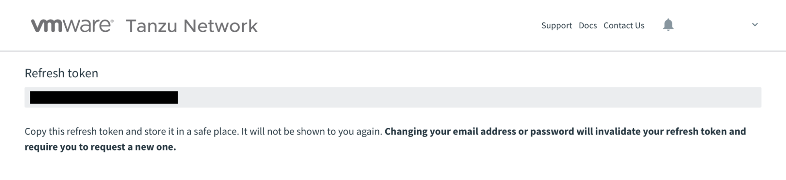

The [VMware Tanzu Network](https://network.pivotal.io) is where most of the VMware Tanzu suite of products are hosted and made available for download. If you want to access these tools, you first need to set up an account. 

Basically, it's your entry point to all things Tanzu. 

In this guide, you will learn how to create an account for the Tanzu Network. Additionally, you will install the `pivnet` command line interface (CLI) tool for downloading these packages to your environment. 

By the end of this guide, you will be able to download Tanzu products from the Tanzu Network and retrieve metadata about those product packages, using the API via the `pivnet` CLI tool. 

## Assumptions

These are some assumptions you should be aware of before proceeding with this guide:

* This guide was written for `pivnet` v3.0.1.
* This guide assumes you are running MacOS. Specifically, the `v12.0` "Monterey" line. Commands provided in this guide make these assumptions.
* This guide will be updated regularly, but updates might not be timed exactly to new releases of these products or platforms. You may need to modify commands if versions do not line up.
* Many of the products on the Tanzu Network require end-user licensing agreements (EULA), as well as a purchase agreement. While in some cases it may be possible to use these products on a trial basis, this guide assumes you have some kind of agreement in place. Please read all agreements thoroughly.

## Prerequisites

A list of things you may need to do before getting started with this guide:

* **A few things you probably already have** - This guide is primarily for setting up an online account and downloading and installing a CLI tool. There is not much you will need. However, an **email address**, a **web browser**, and other basic tools will be necessary.
 
## Creating a Tanzu Network account

In this section, you will go to the website and create a simple account. 

You may notice some references to Pivotal throughout this section. Things like the URL of the Tanzu Network, or the `pivnet` CLI. These could be confusing if you are new to this space. These are artifacts from VMware's acquisition of Pivotal, completed in 2020.

1. Open your web browser to the [Tanzu Network](https://network.pivotal.io).

    ```sh
    open https://network.pivotal.io
    ```
2. Click `Sign In`.

    

3. Click `Create account`.

    

4. Fill in the required fields to create the account. Make sure you read VMware's privacy policy.
   
    

5. Click `Sign Up`.

    

6. **Optional**: Depending on your involvement with VMware, you may be taken to a page to select which site you want to go to. If this happens to you, just click on the **Tanzu Network**.

    

You should now be taken back to the Tanzu Network homepage. However, you will notice that it still says “Sign In” in the upper right of the screen. There are just a couple more steps to complete your account setup. You will do those in the next section. 

## Finish creating your Tanzu Network account

Here you will fill out one more form, and complete the registration process. 

1. Click `Sign In` again.

    

2. There is another form to fill out. Some of the information will be the same as in the previous section. Other fields require information not yet provided. Fill this out completely. Also make sure you read through VMware's **Terms of Use** and **Privacy Policy** completely before you agree to them. 

    

3. Click `Join`.

    

You will now be taken back to the Tanzu Network front page with your full name in the upper right. Next, to download packages using the API via the CLI tool, you need to create an API token. 

## Creating an API token for your user account

While it is certainly possible to just start using and downloading products from the Tanzu Network from this point, you might decide that you prefer working with these types of systems via an API as opposed to a GUI. 

If this is the case, you will want to start using the `pivnet` CLI tool. But this tool requires the use of an API token to authenticate. Here, you will set that up. 

1. In the upper right corner, click your username. From the dropdown, select `Edit Profile`.

    

2. From your profile page, you will see a `Legacy API Token`, which is tagged as `Deprecated`. You don't want to use deprecated authentication mechanisms, so click `Request New Refresh Token` under `UAA API Token`.

    

3. As the instructions on the page note, copy this token somewhere safe, like a password manager. 

    

Now you will be able to authenticate your `pivnet` CLI tool to your account in the next section.

## Downloading the `pivnet` CLI tool

Here is where things get interesting—or at least as interesting as downloading packages can reasonably get. The `pivnet` tool will allow you to download packages directly from the Tanzu repository to your environment. Not only is this helpful for guides, but also for scripting!

1. Use `brew` to install the `pivnet` CLI. If you need other install methods, see the [GitHub repository](https://github.com/pivotal-cf/pivnet-cli).

  ```sh
  brew install pivotal/tap/pivnet-cli
  ```

2. Verify the install.

  ```sh
  pivnet version
  ```
  
  Example output:
  
  ```sh
  pivnet version
  3.0.1
  ```

3. Login `pivnet` to your Tanzu Network account using your API token created in the previous section.

  ```sh
  pivnet login --api-token='my-api-token'
  ```

4. Try to download a product. This will fail, since you have not accepted any EULAs yet. However, helpfully, the failure message will guide you to the URL for the EULA you need to accept. 

  ```sh
  pivnet download-product-files --product-slug='tanzu-application-platform' --release-version='0.3.0' --product-file-id=1080177
  ```

  Example Output:

  ```sh
  2021/11/29 15:05:20 Downloading 'tanzu-framework-darwin-amd64.tar' to 'tanzu-framework-darwin-amd64.tar'
  Downloader.Get: could not create new download link in get: user with email 'testymctestface@example.com' has not accepted the current EULA for release with 'id'=992949. The EULA for this release can be accepted at https://network.tanzu.vmware.com/products/410/releases/992949/eulas/204.
  ```
  
  {} These download commands can be found on the Tanzu Network site. Clicking on any product, then the `i` button associated with any package, will give you the API URL, as well as the `pivnet` command to download. {}

5. Go to the provided URL. Read the EULA and click `Agree` if you accept the agreement. In further guides that use `pivnet`, you may need to repeat these steps.

    

6. **Optional**: There are a few other common commands you can use to start to familiarize yourself with `pivnet`. For example, you can list all of the products and packages available on the Tanzu Network. Notice the `SLUG` and `ID` number.

  ```sh
  pivnet products
  ```

7. **Optional**: List some information about one of the product releases listed.

  ```sh
  pivnet r -p build-service -r 1.3.4 --format json \
  | jq '{"id": .id, "release_date": .release_date, "release_type": .release_type}'
  ```

8. **Optional**: List all EULAs available for acceptance. There is no way to accept EULAs via `pivnet` (unless you are a VMware employee), so that part will still need to be done manually. 

  ```sh
  pivnet eulas
  ```

That's it! You now have a VMware Tanzu Network account as well as a way to download and list information about VMware Tanzu products and packages via an API. 

## Next steps

This is just the start of getting involved in the Tanzu ecosystem. If you are interested in getting started with Tanzu further, including setting up one of the various flavors of Tanzu Kubernetes environments, check out some of the following guides!

* [Getting Started with the VMware `tanzu` CLI](/guides/tanzu-cli-gs) - Working with the VMware Tanzu suite of tools starts with tooling to deploy and manage those products. Learn how to install the `tanzu` CLI, and explore some of the basic functionality.
* [Getting Started with VMware Tanzu Application Platform light Profile](/guides/tanzu-application-platform-gs) - This guide will walk you through setting up a basic VMware Tanzu Kubernetes Grid workload cluster. This cluster will be useful for setting up an inner loop development workflow using Tanzu tooling. 
* [Deploying an Application to VMware Tanzu Application Platform](/guides/tanzu-application-platform-deploying-a-workload)
description: This guide will walk you through deploying a demo application on to VMware Tanzu Application Platform.  
* [Inner Loop Development with VMware Tanzu Application Platform](/guides/tanzu-application-platform-inner-loop) - Local application development is a critical workflow for application developers. Getting fast feedback on each code change iteration is an important capability of this workflow. This guide will walk you through setting up a local development workflow which will enable live, local updates with each code save.  