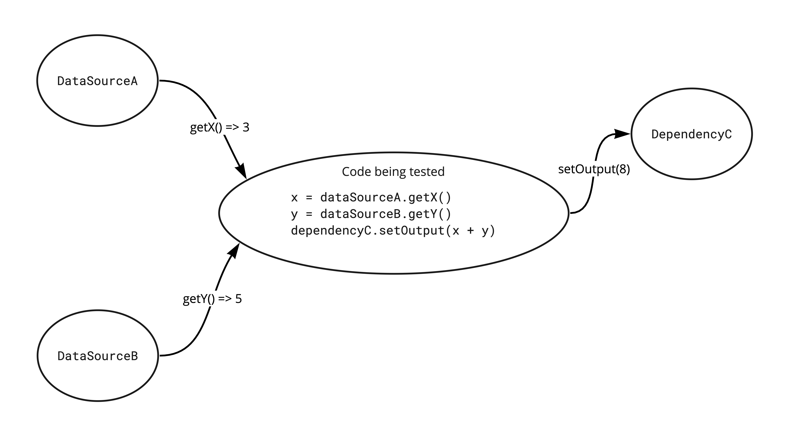

## Why use test doubles?

**Test doubles** help you write better unit tests. They do this by helping you isolate the behavior of the code you're testing from the behavior of the components that code depends on.

Much of the time, the code you want to test will depend on other code—it has *dependencies*. Perhaps it gets some inputs from some data sources; perhaps it sends its outputs to some destinations. No matter how your code interacts with its dependencies, however, you want to make sure that its tests reflect only its behavior and not the behavior of its dependencies. And you want to avoid getting false positives or false negatives from your tests.

In other words, you want the code's tests to pass or fail based only on the behavior of the code you're testing, and not on the behavior of the other components it depends on.

This means you want **test doubles**. Test doubles are stand-ins—they get their name from the "stunt doubles" who stand in for the big-name actors in movies—and they allow you to control the inputs into your code and to inspect how your code interacts with them.

Consider the diagram below. Here, the code being tested gets data from two data sources, adds them together, and sends the output to another dependency.



When writing the tests for this code, we want to be able to control the inputs, so that we have predictable, known conditions under which we can test the code. For example, we might want to set things up such that when our code calls `getX()`, `dataSourceA` returns `3`, and when our code calls `getY()`, `dataSourceB` returns `5`. And we want to know that when our code calls `setOutput()`, it passes the value `8` to `dependencyC`.

Creating and injecting test doubles for `dataSourceA`, `dataSourceB`, and `dependencyC` allow us to do just this.

## The five types of test doubles

There are five kinds of test doubles:

- [Dummy](#dummy)
- [Stub](#stub)
- [Spy](#spy)
- [Mock](#mock)
- [Fake](#fake)

We'll describe each one below and include an example to show how it might be used.

## Dummy

### What is it?

A **dummy** is a test double that throws an exception when a method on it is invoked.

### When do I use it?

A dummy is used to ensure that a particular piece of code **is not** executed under the conditions of the test. You might use this to test some branching logic.

### Example

Suppose you were testing the following code:

```typescript
function someFunction() {
  if (someCondition) {
    this.dependencyA.methodA();
  } else {
    this.dependencyB.methodB();
  }
}
```

As you can see, if `someCondition` is true, `dependencyA.methodA()` should get called, and also `dependencyB.methodB()` *should not get called*. So when writing the test for when `someCondition` is true, you might inject a dummy for `dependencyB`, on the grounds that if it gets called, it will throw an exception and the test will fail.

## Stub

### What is it?

A **stub** is a test double that returns pre-configured, hard-coded data when its methods are called.

### When do I use it?

You use a stub to ensure that the code you're testing has known, predictable data on which to operate.

### Example

Consider this scenario: You want to write a test for a function called `compute401KContribution()`. It gets the monthly income from the `payroll` dependency and the employee's contribution percentage from their settings, and it multiplies those two numbers to return that month's 401K contribution.

So you write this test:

```typescript
describe("compute401KContribution", () => {
  it("returns the monthly 401K contribution", () => {
    const benefitManager = new BenefitManager(payroll, settings);

    expect(benefitManager.compute401KContribution()).toEqual(480);
  });
});
```

Why do you expect the function to return `480`? That number only makes sense if you know *in advance* what the monthly payroll and employee settings are.

So you might stub each of those dependencies:

```typescript
describe("compute401KContribution", () => {
  it("returns the monthly 401K contribution", () => {
    stubPayrollToReturnMonthlyIncome(4000);
    stubSettingsToReturn401ContributionPercentage(0.12);

    const benefitManager = new BenefitManager(payroll, settings);

    expect(benefitManager.compute401KContribution()).toEqual(480);
  });
});
```

Now you know that the `payroll` dependency will return `4000` for the monthly income and the `settings` will return `0.12` for the contribution percentage. So now you can be assured that the `compute401KContribution()` function should multiply those two values together and return `480`.

### Notes

- In order for a stub to be useful, you have to set it up with the hard-coded data it will return *before* the code being tested executes. This is because the code being tested has to be able to retrieve the hard-coded data from the stub when it executes, so the stub needs to have that data ready.

## Spy

### What is it?

A **spy** is a test double that records the invocations of its methods, along with any parameters passed in, so that you can find out afterward whether and how its methods were called.

### When do I use it?

You use a spy when you want to be sure that, under the conditions of your test, a certain dependency got called, and with certain parameters.

### Example

Suppose you're writing a test for a user onboarding flow, and when the user successfully completes their onboarding, they should receive a welcome email. You have a separate dependency `EmailManager` that has a method `send()` on it, and you'll use this to send the email.

You might write a test like this:

```typescript
describe("when the user completes onboarding", () => {
  it("sends a welcome email to their address", () => {
    const emailManagerSpy = new EmailManagerSpy();
    const onboardingFlow = new OnboardingFlow(emailManagerSpy);

    onboardingFlow.complete();

    expect(emailManagerSpy.send).toHaveBeenCalledWith("user@example.com", "Welcome!");
  });
})
```

### Notes:

- In order to be useful, you have to wait to ask a spy if its methods got called until *after* the code being tested has executed. This is because the code being tested is the code that calls the methods on the spy in the first place, so until that code executes, the methods haven't yet been called.
- Some testing frameworks and/or testing tools have built-in support for spies, in which case you don't have to write them yourself. But writing a spy isn't that difficult, and you might prefer to write your own.

## Mock

### What is it?

A **mock** is a combination of stub and spy, i.e., a test double that allows you to control the data it returns while also recording the calls made to it so that you can check that it was called with the correct parameters.

### When do I use it?

You use a mock for situations where you want to both control the data returned by a method and also confirm that the method was called with the correct values as arguments.

### Example

Take the user onboarding flow above, and suppose the `send` method on the `emailManager` returns a Boolean value that lets you know the email was sent successfully. When you test the onboarding flow, you want to know that `send()` got called with the correct email address and subject header, and you also want to control its return value so that you can write a predictable test for the rest of your onboarding flow.

You might use a mock like this:

```typescript
describe("when the user completes onboarding", () => {
  it("an welcome email is sent to their address", () => {
    const emailManagerMock = new EmailManagerMock();

    // jest does not support this syntax; I'm using it here for illustration purposes only
    when(emailManagerMock).isCalledWith("user@example.com", "Welcome!").thenReturn("true");

    const onboardingFlow = new OnboardingFlow(emailManagerSpy);

    onboardingFlow.complete();

    emailManagerMock.verify();
  });
})
```

In this example, `emailManagerMock` is doing a bunch of things. It's acting as a spy, recording its invocations so that you can know that it receives `send()` with the correct email address and subject header. It also acts as a stub, returning hard-coded `true` value, so that in your test, you can assume that your onboarding function can proceed.

Notice the `verify()` method. It checks to make sure that the `send()` method not only got called, but got called with the parameters you expect.

Remember that in order to be useful, you have to stub `send()` to return `true` before the `onboardingFlow.complete()` executes, but you have to wait until after it executes to check whether `send()` received the correct email and subject header. A mock allows you to stub the hard-coded return value in advance, while giving you a method—`verify()`—to call afterward to confirm that it received the expected method invocations.


## Fake

### What is it?

A **fake** is a test double that has the same business-logic behavior as the real component it's doubling, but using a simplified implementation. Because it has behavior, *fakes must themselves be tested*, and ideally, tested using the same test cases as those used for the real component.

### When do I use it?

Most commonly, you'll use a fake for stateful components. A typical example is a database-backed service.

### Example

Let's say you're writing a test for an `Accountant` class:

```typescript
class Accountant {
  private bankAccount: BankAccount;
  private taxCalculator: TaxCalculator;
  private clientNotifier: ClientNotifier

  constructor(bankAccount: BankAccount, taxCalculator: TaxCalculator, clientNofifier: ClientNotifier) {
    this.bankAccount = bankAccount;
    this.taxCalculator = taxCalculator;
    this.clientNotifier = clientNotifier;
  }

  public fileTaxes() {
    const accountBalance = this.bankAccount.getBalance();
    
    const refund = this.taxCalculator.getRefund();
    if (refund > 0) {
      this.bankAccount.deposit(refund);
    } else {
      const amountClientOwes = this.taxCalculator.amountClientOwes();
      if (accountBalance > amountClientOwes) {
        this.bankAccount.withdraw(amountClientOwes);
      } else {
        // uh-oh
      }
    }
    const updatedBalance = this.bankAccount.getBalance();
    this.clientNotifier.notifyClientOfUpdatedAccountBalance(updatedBalance);
  }
}
```

This class `Accountant` takes an instance of `BankAccount` as a dependency. `BankAccount` is an interface that looks like this:

```typescript
interface BankAccount {
  getBalance(): number;
  deposit(amount: number): void;
  withdraw(amount: number): void;
}
```

When you write the tests for `Accountant`, obviously you won't want to inject an instance of a client's real bank account. So you'll want to use a test double. You might write a test like this:

```typescript
describe("doing the taxes", () => {
  let accountant: Accountant;
  
  let bankAccount: BankAccountTestDouble;
  let taxCalculatorStub: TaxCalculatorStub;
  let clientNotifierSpy: ClientNotifierSpy;
  
  beforeEach(() => {
    bankAccount = new BankAccountTestDouble();
    taxCalculatorStub = new TaxCalculatorStub();
    clientNotifierSpy = new ClientNotifierSpy();
    
    accountant = new Accountant(bankAccount, taxCalculatorStub, clientNotifierSpy);
  });
  
  describe("when the client gets a refund", () => {
    beforeEach(() => {
      expect(bankAccount.getBalance()).toEqual(1000);
      
      taxCalculatorStub.stubRefund(500);
    
      accountant.fileTaxes();
    });
    
    it("deposits the refund in the bank account", () => {
      expect(bankAccount.getBalance()).toEqual(1500);
    });
    
    it("notifies the client of their updated account balance", () => {
      expect(clientNotifierSpy.notifyClientOfUpdatedAccountBalance).toHaveBeenCalledWith(1500);
    });
  });
  
  describe("when the client owes taxes", () => {
    beforeEach(() => {
      expect(bankAccount.getBalance()).toEqual(1000);
      
      taxCalculatorStub.stubRefund(0);
      taxCalculatorStub.stubAmountClientOwes(300);
    });
    
    it("withdraws the amount the client owes from the bank account", () => {
      expect(bankAccount.getBalance()).toEqual(700);
    });
    
    it("notifies the client of their updated account balance", () => {
      expect(clientNotifierSpy.notifyClientOfUpdatedAccountBalance).toHaveBeenCalledWith(700);
    });
  });
});
```


Which test double should you use for `BankAccount`?

- Not a dummy, of course. No matter which code path you're testing, you'll want to be able to call `getBalance()` without throwing an exception.
- The problem with using a stub is that `getBalance()` will return a different value at the beginning of the method than at the end. A stub only allows you to configure it to return a hard-coded piece of data, not one that can change along the way.
- You could use a spy to ensure that `deposit()` or `withdraw()` are called with the correct amount, but that doesn't resolve the problem with stubbing `getBalance()`.
- The problem with a mock is the same as the problem with a stub.

In fact, the problem with using any of these test doubles with `BankAccount` is that `BankAccount` has *stateful behavior*, i.e., that `getBalance()` will return different amounts depending on the other methods—`deposit()` and/or `withdraw()`—that get called. We need to make sure that whatever test double we use for `BankAccount` in our `Accountant` tests, that test double *behaves like a `BankAccount`*.

#### What does it mean to behave like a `BankAccount`?


For a moment, let's turn our attention away from testing `Accountant` and instead focus on the behavior we want for `BankAccount`. We expect a bank account to behave like this:

- It has a way to get the current balance.
- If an amount is deposited, then the balance increases to reflect the deposited amount.
- If an amount is withdrawn, then the balance decreases to reflect the withdrawn amount.

We can encapsulate this behavior in a test:

```typescript
function testBankAccount(createBankAccount: () => BankAccount) {
  describe("BankAccount", () => {
    let bankAccount: BankAccount;
    
    describe("when a new bank account is created", () => {
      beforeEach(() => {
        bankAccount = createBankAccount();
      });
  
      it("starts with a zero balance", () => {
        expect(bankAccount.getBalance()).toEqual(0);    
      });
  
      describe("when money is deposited", () => {
        it("updates the account balance to reflect the amount deposited", () => {
          bankAccount.deposit(1000);
    
          expect(bankAccount.getBalance()).toEqual(1000);
        });
    
        describe("when money is withdrawn", () => {
          it("updates the account balance to reflect the amount withdrawn", () => {
            bankAccount.withdraw(250);
        
            expect(bankAccount.getBalance()).toEqual(750);
          });
        });
      });
    });
  });
}
```

Notice that `testBankAccount` has no opinions as to what kind of `BankAccount` it is testing, only that the `BankAccount` it receives implements the `BankAccount` interface. As far as `Accountant` is concerned, *any* instance of `BankAccount` that has the behavior described in the `BankAccount` test will serve its purposes. If we can create a `BankAccount` implementation that has the stateful behavior described by `testBankAccount`, we can use it in our `Accountant` tests.

It's worth emphasizing this point: **"To behave like a `BankAccount`" means precisely "to pass the `BankAccount` tests".**

Any class, in other words, that passes the tests described in `testBankAccount` can be said to behave like a `BankAccount`. This means we can have two different implementations of `BankAccount`, one real and one fake:

#### RealBankAccount

```typescript
class RealBankAccount implements BankAccount {
  private dbConnection: DBConnection;
  
  constructor(dbConnection: DBConnection) {
    this.dbConnection = dbConnection;
  }
  
  public getBalance(): number {
    // use dbConnection to connect to database
    // perform SQL query to get balance
    // close dbConnection
    // return balance
  }
  
  public deposit(amount: number): void {
    // use dbConnection to connect to database
    // perform SQL query to update balance
    // close dbConnection
  }
  
  public withdraw(amount: number): void {
    // use dbConnection to connect to database
    // perform SQL query to update balance
    // close dbConnection
  }
}
```

#### FakeBankAccount

```typescript
class FakeBankAccount implements BankAccount {
  private balance: number = 0;
    
  public getBalance(): number {
    return this.balance;
  }
  
  public deposit(amount: number): void {
    balance += amount;
  }
  
  public withdraw(amount: number): void {
    balance -= amount;
  }
}
```

`FakeBankAccount` obviously doesn't behave *exactly* the same as `RealBankAccount`. In particular, `RealBankAccount` opens and closes database connections and performs SQL queries, while `FakeBankAccount` merely holds a balance in memory.

But remember: As far as `Accountant` is concerned, "behaves like a BankAccount" means precisely "passes the BankAccount tests". By this definition, how can we be assured that `FakeBankAccount` behaves the same as `RealBankAccount`?

Like this:

```typescript
testBankAccount(() => new RealBankAccount());
testBankAccount(() => new FakeBankAccount());
```

`FakeBankAccount` will pass these tests, even though it uses only an in-memory `balance` variable. But `Accountant` doesn't care about that—as far as `Accountant` is concerned, `FakeBankAccount` is every bit as real as `RealBankAccount`. And so we can use `FakeBankAccount` in place of `RealBankAccount` in the tests for `Accountant`.

#### Why do we need to test `FakeBankAccount` at all?

Because it's all too easy for us to create a poorly behaving fake. Consider this one:

```typescript
class BadBankAccount implements BankAccount {
  public getBalance() {
    return 0;
  }
  
  public deposit(amount: number) {
  }
  
  public withdraw(amount: number) {
  }
}
```

Clearly, we wouldn't want to use `BadBankAccount` in our `Accountant` tests. If we did, those tests would never pass, because `getBalance()` would always return 0, every time.

`BadBankAccount` correctly implements the `BankAccount` interface, but implementing the interface isn't enough to make it usable in our `Accountant` tests. For the `BankAccount` test double to be useful, it needs to have the *stateful behavior* that we expect of a `BankAccount`. We don't actually care *how* it implements that stateful behavior, only that it does so correctly. So we write a test for the stateful behavior, and we expect that even our test doubles can pass those tests.
