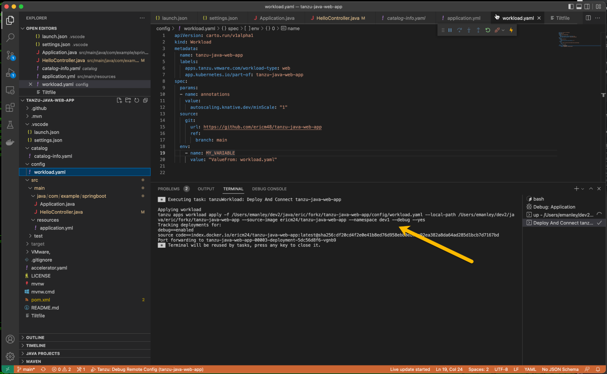

## Description

This document will take you through debugging a sample Spring-Boot Java application on the VMware Tanzu Application Platform running on an Amazon Elastic Kubernetes Service (EKS) cluster in AWS, using VSCode.


## Prerequisites


* Tanzu Application Platform 1.1.0 installed to a cluster you are familiar with and logged into
* Git repositories: 
    * Main:https://github.com/sample-accelerators/tanzu-java-web-app
    * Fork: https://github.com/ericm48/tanzu-java-web-app
* VSCode with VMware Tanzu Developer Tools Extension Installed
* Docker repository to store images – hub.docker.com
* Access and Docker logged in to – hub.docker.com
* Access and Docker logged in to – registry.tanzu.vmware.com
* Access and Docker logged in to – registry.pivotal.io
* tanzu-java-web app fully configured and deployed on your Tanzu Application Platform cluster
* Ingress established to tanzu-java-web from www
* Domain Name System (DNS) configured with the above


## 


## Example settings

For the purposes of this demo, I am using the following settings:


* Cluster Name – eks-eric-tap-cluster01
* AWS Region – us-west-1 
* DNS Route 

In regards to the screenshots, I am running this from a MAC, using iTerm2/bash with tmux, along with kubectx and kubens installed. Furthermore, I’ve set up the alias in the .bash_profile.


```
alias k=kubectl
```


For my setup in AWS, I’m using a five node cluster of t3.large:


<p id="gdcalert1" ><span style="color: red; font-weight: bold">>>>>>  gd2md-html alert: inline image link here (to images/image1.png). Store image on your image server and adjust path/filename/extension if necessary. </span><br>(<a href="#">Back to top</a>)(<a href="#gdcalert2">Next alert</a>)<br><span style="color: red; font-weight: bold">>>>>> </span></p>


The command prompt will show the current Kubernetes context and namespace (left and right arrows, respectively):


<p id="gdcalert2" ><span style="color: red; font-weight: bold">>>>>>  gd2md-html alert: inline image link here (to images/image2.png). Store image on your image server and adjust path/filename/extension if necessary. </span><br>(<a href="#">Back to top</a>)(<a href="#gdcalert3">Next alert</a>)<br><span style="color: red; font-weight: bold">>>>>> </span></p>


## Debugging locally


1. Start up VSCode with the project loaded.
2. In **launch.json**, confirm the following:
* Tanzu Debug Remote Config
* Launch Current File
* Launch Application (Note that lines #28 thru #31 are optional)

    

<p id="gdcalert3" ><span style="color: red; font-weight: bold">>>>>>  gd2md-html alert: inline image link here (to images/image12.png). Store image on your image server and adjust path/filename/extension if necessary. </span><br>(<a href="#">Back to top</a>)(<a href="#gdcalert4">Next alert</a>)<br><span style="color: red; font-weight: bold">>>>>> </span></p>


    

3. In **settings.json**, confirm “java.server.launchMode”.

    

<p id="gdcalert4" ><span style="color: red; font-weight: bold">>>>>>  gd2md-html alert: inline image link here (to images/image3.png). Store image on your image server and adjust path/filename/extension if necessary. </span><br>(<a href="#">Back to top</a>)(<a href="#gdcalert5">Next alert</a>)<br><span style="color: red; font-weight: bold">>>>>> </span></p>


4. Set a breakpoint in the HelloController index() method. 

    

<p id="gdcalert5" ><span style="color: red; font-weight: bold">>>>>>  gd2md-html alert: inline image link here (to images/image1.png). Store image on your image server and adjust path/filename/extension if necessary. </span><br>(<a href="#">Back to top</a>)(<a href="#gdcalert6">Next alert</a>)<br><span style="color: red; font-weight: bold">>>>>> </span></p>


    

5. As an initial test, run the debugger locally only. Right-click Application.java and select “Debug Java”.

    

<p id="gdcalert6" ><span style="color: red; font-weight: bold">>>>>>  gd2md-html alert: inline image link here (to images/image14.png). Store image on your image server and adjust path/filename/extension if necessary. </span><br>(<a href="#">Back to top</a>)(<a href="#gdcalert7">Next alert</a>)<br><span style="color: red; font-weight: bold">>>>>> </span></p>


6. You should now see VSCode go into debug mode. Scroll the start-up logs in the console.

    

<p id="gdcalert7" ><span style="color: red; font-weight: bold">>>>>>  gd2md-html alert: inline image link here (to images/image23.png). Store image on your image server and adjust path/filename/extension if necessary. </span><br>(<a href="#">Back to top</a>)(<a href="#gdcalert8">Next alert</a>)<br><span style="color: red; font-weight: bold">>>>>> </span></p>


7. Once start-up is complete, the console will look similar to the following, and you will be presented with the debugging pallet (top arrow):

    

<p id="gdcalert8" ><span style="color: red; font-weight: bold">>>>>>  gd2md-html alert: inline image link here (to images/image30.png). Store image on your image server and adjust path/filename/extension if necessary. </span><br>(<a href="#">Back to top</a>)(<a href="#gdcalert9">Next alert</a>)<br><span style="color: red; font-weight: bold">>>>>> </span></p>


8. Point your browser to `http://localhost:8080/`.

    

<p id="gdcalert9" ><span style="color: red; font-weight: bold">>>>>>  gd2md-html alert: inline image link here (to images/image32.png). Store image on your image server and adjust path/filename/extension if necessary. </span><br>(<a href="#">Back to top</a>)(<a href="#gdcalert10">Next alert</a>)<br><span style="color: red; font-weight: bold">>>>>> </span></p>


    

9. You should see the integrated development environment (IDE) respond by hitting the breakpoint (bottom arrow) and stopping. Click the Run button (top arrow).

    

<p id="gdcalert10" ><span style="color: red; font-weight: bold">>>>>>  gd2md-html alert: inline image link here (to images/image6.png). Store image on your image server and adjust path/filename/extension if necessary. </span><br>(<a href="#">Back to top</a>)(<a href="#gdcalert11">Next alert</a>)<br><span style="color: red; font-weight: bold">>>>>> </span></p>


10. Switching back to the browser, you should see the page render successfully!

    

<p id="gdcalert11" ><span style="color: red; font-weight: bold">>>>>>  gd2md-html alert: inline image link here (to images/image26.png). Store image on your image server and adjust path/filename/extension if necessary. </span><br>(<a href="#">Back to top</a>)(<a href="#gdcalert12">Next alert</a>)<br><span style="color: red; font-weight: bold">>>>>> </span></p>


## Setup for Tanzu Application Platform debugging

There is a lot going on here, period. Make sure you complete the following before you attempt to debug using Tanzu Application Platform. 

At the time of this writing, to get VSCode access (via Tilt) to our AWS Cluster, you must complete multiple redundant logins. This will hopefully be fixed/improved in the future, and at this time, this is what works consistently.


1. Log in to your AWS cluster as an admin/superuser

Get the following keys:


* AWS_ACCESS_KEY_ID
* AWS_SECRET_ACCESS_KEY
* AWS_SESSION_TOKEN

Save these to a text file for easy future reference, exporting them as enviro variables. For the following examples I will use X, Y, and Z for the values of the keys above, respectively.

Take note of your cluster name and the availability zone your cluster is in.

Issue the following command from a command prompt:


```
export AWS_ACCESS_KEY_ID=X; 
export AWS_SECRET_ACCESS_KEY=Y; 
export AWS_SESSION_TOKEN=Z; 
aws sts get-caller-identity;
aws eks update-kubeconfig --name eks-eric-tap-cluster01 --region us-west-1 
```


2. Verify command-line AWS cluster access

From a command line, issue the following code to permit access and confirm it is working with your cluster: 


```
k get nodes
```


You should see something like this:


<p id="gdcalert12" ><span style="color: red; font-weight: bold">>>>>>  gd2md-html alert: inline image link here (to images/image7.png). Store image on your image server and adjust path/filename/extension if necessary. </span><br>(<a href="#">Back to top</a>)(<a href="#gdcalert13">Next alert</a>)<br><span style="color: red; font-weight: bold">>>>>> </span></p>


3. Complete log in to AWS cluster in VSCode-bash

From the bash-shell in VSCode, enter the command provided previously under Step 1.This will be the same code that you entered with the regular command line.


```
export AWS_ACCESS_KEY_ID=X; 
export AWS_SECRET_ACCESS_KEY=Y; 
export AWS_SESSION_TOKEN=Z; 
aws sts get-caller-identity;
aws eks update-kubeconfig --name eks-eric-tap-cluster01 --region us-west-1 
```


It should look something like the following:


<p id="gdcalert13" ><span style="color: red; font-weight: bold">>>>>>  gd2md-html alert: inline image link here (to images/image19.png). Store image on your image server and adjust path/filename/extension if necessary. </span><br>(<a href="#">Back to top</a>)(<a href="#gdcalert14">Next alert</a>)<br><span style="color: red; font-weight: bold">>>>>> </span></p>


4. Verify VSCode-bash command-line AWS cluster access 

From the VSCode-bash, enter:


```
k get nodes
```


The output should be similar to that previously.


<p id="gdcalert14" ><span style="color: red; font-weight: bold">>>>>>  gd2md-html alert: inline image link here (to images/image25.png). Store image on your image server and adjust path/filename/extension if necessary. </span><br>(<a href="#">Back to top</a>)(<a href="#gdcalert15">Next alert</a>)<br><span style="color: red; font-weight: bold">>>>>> </span></p>


5. Complete AWS configuration in VSCode-bash

From the VSCode-bash, enter:


```
aws configure
```


Next, verify the following four items:


* AWS_ACCESS_KEY_ID
* AWS_SECRET_ACCESS_KEY
* Default region name
* Default output

That should look like the following:


<p id="gdcalert15" ><span style="color: red; font-weight: bold">>>>>>  gd2md-html alert: inline image link here (to images/image8.png). Store image on your image server and adjust path/filename/extension if necessary. </span><br>(<a href="#">Back to top</a>)(<a href="#gdcalert16">Next alert</a>)<br><span style="color: red; font-weight: bold">>>>>> </span></p>


6. Again, verify the AWS credentials are available to VSCode

Make sure the AWS keys (all three) match what is also in in the file:

$HOME/Users/x-user/.aws/credentials

Please note that AWS configure only handles


* AWS_ACCESS_KEY_ID
* AWS_SECRET_ACCESS_KEY

It DOES NOT handle the AWS_SESSION_TOKEN.

At the time of this writing, the system will require you will to manually copy/paste: AWS_SESSION_TOKEN

It will look something like the following:


<p id="gdcalert16" ><span style="color: red; font-weight: bold">>>>>>  gd2md-html alert: inline image link here (to images/image21.png). Store image on your image server and adjust path/filename/extension if necessary. </span><br>(<a href="#">Back to top</a>)(<a href="#gdcalert17">Next alert</a>)<br><span style="color: red; font-weight: bold">>>>>> </span></p>


7. Complete Docker logins

Complete a Docker login for each of the following:


* registry.tanzu.vmware.com
* vmware.com registry.pivotal.io
* docker login --username=x-user -p x-password

This example uses hub.docker.io as the image registry to contain the image produced by Tanzu Application Platform. (You may use a different option.) 


```
docker login -u x-user@vmware.com registry.tanzu.vmware.com
```


```
docker login -u x-user@vmware.com registry.pivotal.io
```


```
docker login --username=x-user -p x-password
```


## Set up Tanzu Application Platform watch commands (optional)

The following commands are not required to debug your code running in Tanzu Application Platform. However, they are very helpful with troubleshooting should problems occur, as well as being able to see the status of the Tanzu Application Platform components.

Use several terminal windows (I use six with tmux), with each logged into your AWS cluster, as well as the three Docker logins. Enter the following four “watch-style” commands, leaving two terminals open commands as needed.

In this example, the tanzu-java-webapp is running in the “dev1” namespace.


* Watch all application workloads in the dev1 namespace.

    ```
watch tanzu -n dev1 app workload list
```


* Watch kpack builds in the dev1 namespace.

    ```
watch kp -n dev1 builds list tanzu-java-web-app
```


* Watch all pods in the dev1 namespace.

    ```
watch kubectl -n dev1 get pods
```


* Tail the log for tanzu-java-web-app in the dev1 namespace.

    ```
tanzu -n dev1 apps workload tail tanzu-java-web-app
```


It should look like the following:


<p id="gdcalert17" ><span style="color: red; font-weight: bold">>>>>>  gd2md-html alert: inline image link here (to images/image18.png). Store image on your image server and adjust path/filename/extension if necessary. </span><br>(<a href="#">Back to top</a>)(<a href="#gdcalert18">Next alert</a>)<br><span style="color: red; font-weight: bold">>>>>> </span></p>


## 


## Debug in Tanzu Application Platform

Now that we’ve completed the setup, we can begin debugging with dynamic build and deploy with Tanzu Application Platform.


### Activate VMware Tanzu Live Update

Select the Tiltfile for the project, right-click and choose Tanzu Live Update: Start.


<p id="gdcalert18" ><span style="color: red; font-weight: bold">>>>>>  gd2md-html alert: inline image link here (to images/image5.png). Store image on your image server and adjust path/filename/extension if necessary. </span><br>(<a href="#">Back to top</a>)(<a href="#gdcalert19">Next alert</a>)<br><span style="color: red; font-weight: bold">>>>>> </span></p>


### Verify that Tanzu Live Update started/connected properly

Tanzu Live Update should start and connect to your Tanzu Application Platform cluster. You can see this in two places.

Viai the VSCode console:


<p id="gdcalert19" ><span style="color: red; font-weight: bold">>>>>>  gd2md-html alert: inline image link here (to images/image13.png). Store image on your image server and adjust path/filename/extension if necessary. </span><br>(<a href="#">Back to top</a>)(<a href="#gdcalert20">Next alert</a>)<br><span style="color: red; font-weight: bold">>>>>> </span></p>


Or the Tilt browser page ([http://localhost:10350/r/tanzu-java-web-app/overview](http://localhost:10350/r/tanzu-java-web-app/overview)):


<p id="gdcalert20" ><span style="color: red; font-weight: bold">>>>>>  gd2md-html alert: inline image link here (to images/image2.png). Store image on your image server and adjust path/filename/extension if necessary. </span><br>(<a href="#">Back to top</a>)(<a href="#gdcalert21">Next alert</a>)<br><span style="color: red; font-weight: bold">>>>>> </span></p>


### Start debug mode

Select the workload.yml, then click Tanzu Live Debug: Start.


<p id="gdcalert21" ><span style="color: red; font-weight: bold">>>>>>  gd2md-html alert: inline image link here (to images/image21.png). Store image on your image server and adjust path/filename/extension if necessary. </span><br>(<a href="#">Back to top</a>)(<a href="#gdcalert22">Next alert</a>)<br><span style="color: red; font-weight: bold">>>>>> </span></p>


You should see the following:


<p id="gdcalert22" ><span style="color: red; font-weight: bold">>>>>>  gd2md-html alert: inline image link here (to images/image10.png). Store image on your image server and adjust path/filename/extension if necessary. </span><br>(<a href="#">Back to top</a>)(<a href="#gdcalert23">Next alert</a>)<br><span style="color: red; font-weight: bold">>>>>> </span></p>





### 


### Trigger tanzu-java-web-app deployed for debugging

Browse to the target URL (this example: [http://tanzu-java-web-app.dev1.apps.tap.ericm48.net/](http://tanzu-java-web-app.dev1.apps.tap.ericm48.net/)). Assuming you have the same breakpoint set as in the earlier step of debugging locally, your browser should simply “spin.”

Looks like:


<p id="gdcalert23" ><span style="color: red; font-weight: bold">>>>>>  gd2md-html alert: inline image link here (to images/image9.png). Store image on your image server and adjust path/filename/extension if necessary. </span><br>(<a href="#">Back to top</a>)(<a href="#gdcalert24">Next alert</a>)<br><span style="color: red; font-weight: bold">>>>>> </span></p>


### 


### VSCode responds at breakpoint set:

Again, assuming you have the previous breakpoint set, VSCode should respond with control on that breakpoint, and you will have access to the debugging menu.


<p id="gdcalert24" ><span style="color: red; font-weight: bold">>>>>>  gd2md-html alert: inline image link here (to images/image16.png). Store image on your image server and adjust path/filename/extension if necessary. </span><br>(<a href="#">Back to top</a>)(<a href="#gdcalert25">Next alert</a>)<br><span style="color: red; font-weight: bold">>>>>> </span></p>


Click Continue in VSCode debugging:


<p id="gdcalert25" ><span style="color: red; font-weight: bold">>>>>>  gd2md-html alert: inline image link here (to images/image11.png). Store image on your image server and adjust path/filename/extension if necessary. </span><br>(<a href="#">Back to top</a>)(<a href="#gdcalert26">Next alert</a>)<br><span style="color: red; font-weight: bold">>>>>> </span></p>


Switch back to the browser, and you should see the page respond with the following message.

<p id="gdcalert26" ><span style="color: red; font-weight: bold">>>>>>  gd2md-html alert: inline image link here (to images/image31.png). Store image on your image server and adjust path/filename/extension if necessary. </span><br>(<a href="#">Back to top</a>)(<a href="#gdcalert27">Next alert</a>)<br><span style="color: red; font-weight: bold">>>>>> </span></p>


## Redeploy upon code change (optional)

Now let’s make a change to the code, watch it get rebuilt, and redeployed.


### Make a code change

In HelloController.java, select part of the message and delete it.

It should look like the following (before):


<p id="gdcalert27" ><span style="color: red; font-weight: bold">>>>>>  gd2md-html alert: inline image link here (to images/image4.png). Store image on your image server and adjust path/filename/extension if necessary. </span><br>(<a href="#">Back to top</a>)(<a href="#gdcalert28">Next alert</a>)<br><span style="color: red; font-weight: bold">>>>>> </span></p>


Then (after):


<p id="gdcalert28" ><span style="color: red; font-weight: bold">>>>>>  gd2md-html alert: inline image link here (to images/image20.png). Store image on your image server and adjust path/filename/extension if necessary. </span><br>(<a href="#">Back to top</a>)(<a href="#gdcalert29">Next alert</a>)<br><span style="color: red; font-weight: bold">>>>>> </span></p>


Next, click Save, or simply key Ctrl-S.


## Monitor, build, redeploy (optional)

Shortly after you save the file, the change will be detected and you can monitor the redeploy.


### Change detected, build initiated

Below, you can see where an image build has kicked off (teal arrow). Our current application deployment (#3) is still running with an old version of the image (red arrow). The build pod (#4) has been created and is running (gold arrow) on the Tanzu Build Service with build packs (purple arrow).


<p id="gdcalert29" ><span style="color: red; font-weight: bold">>>>>>  gd2md-html alert: inline image link here (to images/image15.png). Store image on your image server and adjust path/filename/extension if necessary. </span><br>(<a href="#">Back to top</a>)(<a href="#gdcalert30">Next alert</a>)<br><span style="color: red; font-weight: bold">>>>>> </span></p>


Above, we can see where an image build is kicked off (teal arrow). Our current application deployment (#3) is still running with an old version of image (red arrow). The build pod (#4) has been created, and is running (gold arrow), using the Tanzu Build Service with Build Packs (purple arrow).


### New deployment created

Next, we can see where the next deployment (#4) is created with the new image, and is now running alongside the previous deployment (#3).


<p id="gdcalert30" ><span style="color: red; font-weight: bold">>>>>>  gd2md-html alert: inline image link here (to images/image29.png). Store image on your image server and adjust path/filename/extension if necessary. </span><br>(<a href="#">Back to top</a>)(<a href="#gdcalert31">Next alert</a>)<br><span style="color: red; font-weight: bold">>>>>> </span></p>


### Old deployment terminated

Finally, once the new deployment (#4) gets going, the old (#3) is terminated.


<p id="gdcalert31" ><span style="color: red; font-weight: bold">>>>>>  gd2md-html alert: inline image link here (to images/image22.png). Store image on your image server and adjust path/filename/extension if necessary. </span><br>(<a href="#">Back to top</a>)(<a href="#gdcalert32">Next alert</a>)<br><span style="color: red; font-weight: bold">>>>>> </span></p>


Finally once the new deployment (#4) gets going, the old (#3) is terminated.


### New deployment active

Lastly, when we hit refresh on our browser, we see the new version of the code is running in the latest deployment.


<p id="gdcalert32" ><span style="color: red; font-weight: bold">>>>>>  gd2md-html alert: inline image link here (to images/image28.png). Store image on your image server and adjust path/filename/extension if necessary. </span><br>(<a href="#">Back to top</a>)(<a href="#gdcalert33">Next alert</a>)<br><span style="color: red; font-weight: bold">>>>>> </span></p>


Lastly, when we hit refresh on our browser, we see the new version of the code running in the latest deployment.


## 


## References

Main Git Repo

https://github.com/sample-accelerators/tanzu-java-web-app

My Fork of Above

https://github.com/ericm48/tanzu-java-web-app
