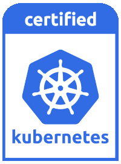

# What is Sonobuoy
[Sonobuoy](https://sonobuoy.io/) is used to certify that your cluster is CNCF Kubernetes conformant ([Certified Kubernetes](https://www.cncf.io/certification/software-conformance/)).



This software conformance is a minimum standard that the industry expects. There is an expectation that every conformant cluster supports the required APIs. For instance, all of your `kubectl` commands should work. You should be able to take YAML from one place to another and, if the cluster is conformant, it will work. Conformance is important, which is why we have included Sonobuoy testing as part of VMware Tanzu Community Edition.

Sonobuoy has three main features:
- Conformance testing
- Workload debugging
- Custom tests and collection via plug-ins

In this guide we will focus on conformance testing.

To see an in-depth description of Sonobuoy, check out our guide on [automated cluster acceptance testing](/guides/kubernetes/workload-tenancy-conformance-test/) or check out the Sonobuoy [page](https://sonobuoy.io/).

# Prerequisites
- [Tanzu Community Edition–managed cluster](https://tanzucommunityedition.io/docs/latest/getting-started/)
- [`jq`](https://stedolan.github.io/jq/) for JSON formatting

# Setting up the cluster
**If you already have two untainted nodes, skip this section.**

Untainted nodes are nodes that you can schedule pods on, such as worker nodes. Check out the [taints and tolerations](https://kubernetes.io/docs/concepts/scheduling-eviction/taint-and-toleration/) docs to learn more.

As of Kubernetes 1.23, [Sonobuoy requires at least two untainted nodes](https://github.com/kubernetes/kubernetes/commit/9723fbf3f1548372d95b67a24199601291e46442).

Until Tanzu Community Edition v0.11.0 comes out, only managed clusters can support more than one node.

If you have an existing development (instead of production) cluster, it may only have one worker node since that’s the default.

Check how many worker nodes you have with the `tanzu` CLI:
```
tanzu cluster get <workload-cluster-name>
```

If you have only one worker node, Sonobuoy will throw the following error:
```
[sig-apps] Daemon set [Serial] should rollback without unnecessary restarts [Conformance]
```
We will take a look at how to see what is causing your errors a little later.

If it has only one worker node, we can scale up:
```
tanzu cluster scale <workload-cluster-name> --worker-machine-count <2 or some larger number>
```

To see more about cluster scaling, check out the [Tanzu Community Edition documentation](https://tanzucommunityedition.io/docs/latest/scale-cluster/).

# Sonobuoy in action
With a Tanzu Community Edition cluster, Sonobuoy is built into the `tanzu` CLI, so you don’t need to worry about installing it.

1. Take a look at the options:
    ```
    tanzu conformance -h
    ```

2. You can take a look at both the Tanzu Community Edition version and the Sonobuoy version here:
    ```
    tanzu conformance version
    ```

    Here’s mine:
    ```
    tanzu conformance version
    Sonobuoy Version: v0.53.2
    TCE Version: v0.10.0
    TCE SHA 57d28405
    ```

3. Now, run a conformance test:
    ```
    tanzu conformance run
    ```
    ```
    INFO[0001] created object                                name=sonobuoy namespace= resource=namespaces
    INFO[0001] created object                                name=sonobuoy-serviceaccount namespace=sonobuoy resource=serviceaccounts
    INFO[0001] created object                                name=sonobuoy-serviceaccount-sonobuoy namespace= resource=clusterrolebindings
    INFO[0001] created object                                name=sonobuoy-serviceaccount-sonobuoy namespace= resource=clusterroles
    INFO[0001] created object                                name=sonobuoy-config-cm namespace=sonobuoy resource=configmaps
    INFO[0001] created object                                name=sonobuoy-plugins-cm namespace=sonobuoy resource=configmaps
    INFO[0001] created object                                name=sonobuoy namespace=sonobuoy resource=pods
    INFO[0001] created object                                name=sonobuoy-aggregator namespace=sonobuoy resource=services
    ```

4. Check the status:
    ```
    tanzu conformance status
          PLUGIN     STATUS   RESULT   COUNT             PROGRESS
             e2e    running                1   1/337 (0 failures)
    systemd-logs   complete                3

    Sonobuoy is still running. Runs can take 60 minutes or more depending on cluster and plugin configuration.
    ```
      
    If you check early enough, there may not be any progress listed.

    Come back in about an hour and check again :).
    ```
    tanzu conformance status
          PLUGIN     STATUS   RESULT   COUNT               PROGRESS
             e2e   complete                1   337/337 (0 failures)
    systemd-logs   complete                4
    ```

5. Retrieve results:
    ```
    tanzu conformance retrieve
    ```
    ```
    <file-name>.tar.gz
    ```

6. Inspect results:
    ```
    tanzu conformance results $(tanzu conformance retrieve)
    ```
    Here’s what mine looks like:
    ```
    Plugin: e2e
    Status: passed
    Total: 5771
    Passed: 337
    Failed: 0
    Skipped: 5434

    Plugin: systemd-logs
    Status: passed
    Total: 4
    Passed: 4
    Failed: 0
    Skipped: 0
    ```

7. If you have an error, you can take a look at the logs to figure out what caused it.
    ```
    tanzu conformance results --mode detailed --plugin e2e $(tanzu conformance retrieve) \
      | jq -r '.  | select(.status == "failed") | .details' \
      | sed 's/\\n/\n/g' | sed 's/\\t/\t/g'
    ```
    The `sed` commands are to change new line and tab characters to their actual form. 

    You can also find all of this in the zipped tarball.
    ```
    mkdir <directory-name>
    tar -xvf <tar.gz> -C <directory-name>
    cd <directory-name>
    ```

    You can look for `FAIL` in `plugins/e2e/results/global/e2e.log`. This should look very familiar.

    You could also look inside of `plugins/e2e/results/global/junit_01.xml`.
    ```
    grep -B 1 "failure type" plugins/e2e/results/global/junit_01.xml
    ```
    There is also more information in there, such as in the `system-out` section, which you can see if you look in the file.

    To check out more ways to determine the cause of test failures, check out the [Sonobuoy docs](https://sonobuoy.io/docs/latest/faq/#how-do-i-determine-why-my-tests-failed).

# Learn more

If you didn’t follow along, try [downloading](https://tanzucommunityedition.io/docs/latest/getting-started/) Tanzu Community Edition. You can also try Tanzu Community Edition locally with [unmanaged clusters](https://tanzucommunityedition.io/docs/latest/getting-started-unmanaged/), or you can try it out without spinning up your own clusters via free workshops on the [Tanzu Developer Center](https://tanzu.vmware.com/developer/workshops/).

To learn more about Sonobuoy and Kubernetes conformance testing, check out the following: 
- [Certified Kubernetes page](https://www.cncf.io/certification/software-conformance/)
- [Sonobuoy docs](https://sonobuoy.io/docs/)
- [Sonobuoy blogs](https://sonobuoy.io/blog/)
- [SIG Architecture: Conformance testing](https://github.com/kubernetes/community/blob/master/contributors/devel/sig-architecture/conformance-tests.md)
