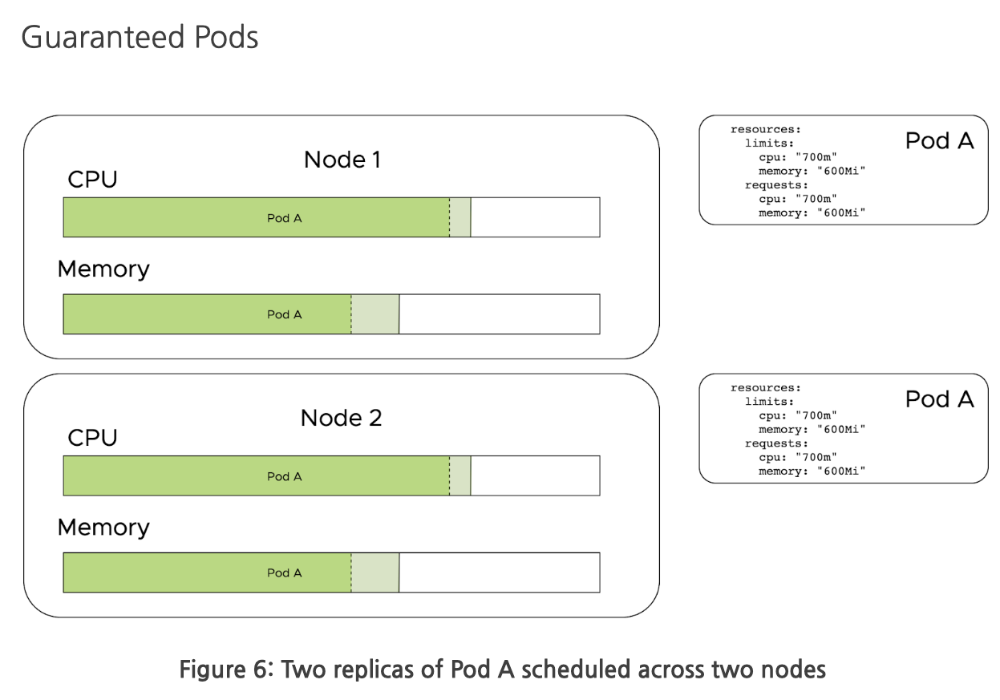
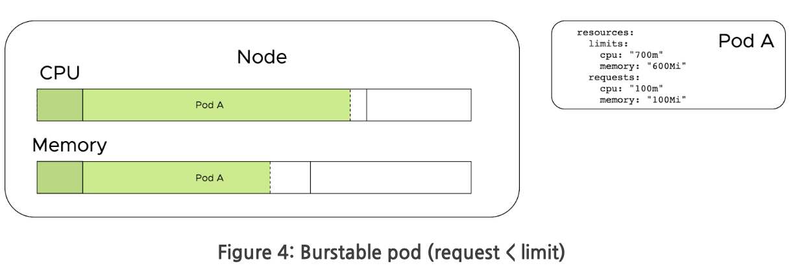

Kubernetes is an inherently multi-tenant system. The term tenant can
have many meanings. For the purpose of this page, we consider a workload (e.g.
Kubernetes pod) to be a tenant. In most Kubernetes environments, pods are
scheduled alongside other pods on the same hosts. Kubernetes has features that
provide the illusion of workload boundaries such as namespaces. However, odds
are pods in different namespaces will run together on the same host.


With multiple tenants running on hosts, there are several concerns to account
for.

- Resource isolation between pods.
- Workload scheduling decisions based on resource requests.
- Workload scheduling decisions based on host properties.
- Priority of workloads (e.g. removing workloads for more important ones).
- Preventing cross-workload access to memory or data.

Kubernetes provides constructs to ensure workloads run well side-by-side. These
configuration options have significant depth and can be especially challenging
in environments where multiple teams are consumers. Additionally, platform teams
often want to reduce cost by overcommitting resources on nodes. Without these
constructs in place, workloads will run over each other and incur platform
instability.

## Resource Limits and Requests

For resource contention, limits and requests are the most important concepts to
understand. An example snippet of a pod setting a resource limit and request is
as follows.

```yaml
apiVersion: v1
kind: Pod
metadata:
  name: frontend
spec:
  containers:
    - name: db
      image: mysql
      resources:
        requests:
          memory: "64Mi"
          cpu: "250m"
        limits:
          memory: "128Mi"
          cpu: "500m"
```

### Limits

Limits are enforced on the host level. This means that a container can not use
more than its allotted resource limit. For CPU, throttling occurs when a process
exceeds its limit. For memory, a workload is killed when it exceeds its limit.

### Request

Requests are used by the scheduler to make scheduling decisions based on desired
resources and availability. Requests are generally not enforced on the host. For
memory, a pod can use more than its requested amount. If the node comes under
contention, the pod may be killed. For CPU, requests are translated into CPU
shares. This means the pod can use more than its requested CPU, but if the node
comes under contention, CPU may be throttled to only what was requested.

### Quality of Service

Based on what is configured above, pods automatically get marked with a specific
quality of service.


| QoS | Condition | Description |  
|---|---|---|
| Best Effort | No request or limit set | Pod is scheduled and uses any available resources to the host. |  
| Guaranteed | Limits == Requests | The amount of resources a pod is scheduled for equals what its able to consume on the host. If the host comes under contention, the pod could be throttled or killed. |
| Burstable | Limits > Requests | A pod can "burst" beyond its resource request but not above its limit. If the host comes under contention, the pod could be throttled or killed. |


## Popular Tooling and Approaches

This section covers a multitude of configuration and our recommendations for
each. For an in-depth guide on tuning these parameters, see the [Cluster Tuning
Guide](../workload-tenancy-cluster-tuning).

### Guaranteed Pods

Guaranteed pods are created when only [Resource
limits](https://kubernetes.io/docs/concepts/configuration/manage-compute-resources-container/#how-pods-with-resource-limits-are-run)
are set. Resource limits are enforced on the host level. CPU limits enforce
throttling when the limit is reached. Memory limits kill the workload when the
limit is exceeded. In the absence of resource requests, the request is
automatically set to that of the limit. This can be a good model as it ensures
the amount of resources the workload is scheduled for is exactly the amount that
will be available on the host (i.e. no overcommitting). This decreases the
complexity of workloads. The downside to only using limits is you cannot
overcommit resources. An example of overcommitting is where you set a limit
higher than a request, which means the container can use more than is requested,
unless the host comes under contention.



**Pros:**

- Improved stability
  - Eliminates resource contention between workloads

**Cons:**

- Reduced infra utilization
  - May result in underutilized compute resources
- Can lead to CPU throttling and OOM kills
  - Important to understand resource consumption profile of workloads

### Burstable Pods

An advanced use case of cluster resource allocation is to allow pods to burst
beyond their resource requests and provide a high upper bounds. This enables
nodes to be overcommitted, where more workloads are scheduled than could be
handled should they all consume 100% of their CPU and memory resource requests.
This model can be complex to implement correctly, but also can be the most cost
effective.



When a host comes under contention, CPU is throttled back to the CPU shares
allocated via the resource request. Once resources free up, containers are able
to consume the unused resources again.

We recommend you **do not** overcommit memory. Overcommitting memory can cause
instability in workloads as they are killed when the host comes under resource
contention.

**Pros:**

- Possibly improved infra resource utilization

**Cons:**

- Potential for resource contention

### Pod Disruption Budgets

During the life of a Kubernetes cluster, there are many voluntary events, which
can impact workloads. An example would be draining specific nodes to perform
maintenance. `PodDisruptionBudget`s (PDB) allow you to set a minimum number of
instances available for your application to ensure Kubernetes blocks before
continuing with an operation that would break that PDB.

For any workload that requires a minimum number of instances running, this is
recommended.

**Pros:**

- Improved stability through availability guarantees

**Cons:**

- Potential to stall upgrades
  - If cluster resources are under contention, an upgrade may stall to respect
    the disruption budget

### Limit Ranges

A `LimitRange` sets the maximum or minimum resource limits and requests a pod
can be declared to use. It also allows for configuring default values, should a
pod be submitted without these setting in place. The `LimitRange` is namespace
scoped and recommended for administrators to enforce a sensible default and
limit per-pod.

**Pros:**

- Provides "guardrails" for development teams

**Cons:**

- Possibly confusing for tenants that don't know how resource values are being set

### Resource Quotas

A `ResourceQuota` enables an administrator to set the aggregate resources
available to a given namespace. It also enables the administrator to limit the
number of objects that can be created within the namespace, which is referred to
as object count quota.

Below are some of the resources that can be placed under object count quota:

- count/persistentvolumeclaims
- count/services
- count/secrets
- count/configmaps
- count/replicationcontrollers
- count/deployments.apps
- count/replicasets.apps
- count/statefulsets.apps
- count/jobs.batch
- count/cronjobs.batch
- count/deployments.extensions

For multi-team environments, these constraints can be beneficial to enforce.

**Pros:**

- Provides controls over resource consumption

**Cons:**

- Can be over-restrictive in single-tenant environments