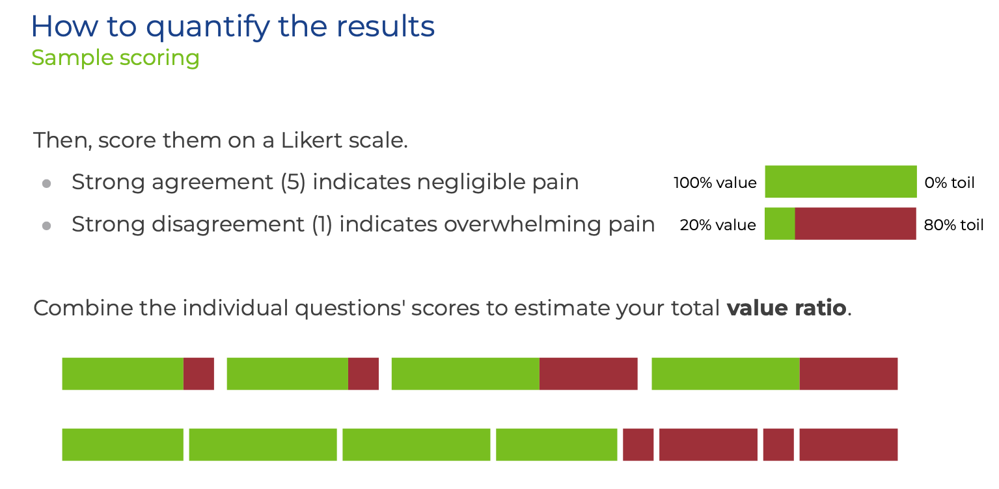

The first step to uncovering developer toil is to ask about people's struggles, frustrations, and even boredom. The Developer Toil Audit uses a survey to do this. As you'll see, the survey questions span the end-to-end process of building and running software. That focus lets us get beyond the "it'll just take 15 minutes" myopia in the above story. Except for a few free-form questions, respondents answer each question on the Likert scale of 1 to 5, with 1 being "disagree strongly" and 5 "agree strongly." Without further adieu, let's look at the survey prompts:

1. What are we making?	
2. We have a strong vision for our product, and we're doing important work together every day to fulfill that vision.	
3. I have the context I need to confidently make changes while I'm working.	
4. I’m proud of the work I have delivered so far for our product.	
5. I’m learning things that I look forward to applying to future products.	
6. My workstation seems to disappear from under me while I'm working.	
7. It's easy to get my workstation into the state I need to develop our product.
8. What aspect of our workstation setup is painful? 
9. What could we do to make it less painful?	
10. It's easy to run our software on my workstation while I'm developing it.	
11. I can boot our software up into the state I need with minimal effort.	
12. What aspect of running our software locally is painful? What could we do to make it less painful?	
13. It's easy to run our test suites and to author new ones.	 
14. Tests are a stable, reliable, seamless part of my workflow.	
15. Test failures give me the feedback I need on the code I’m writing.	
16. What aspect of writing, reading, and navigating tests is painful? 
17. What could we do to make it less painful?	
18. Our code does pretty much what I expect it to do upon reading it. I can track down code I want to modify with minimal guesswork.	
19. Our code has good modularity; I can make targeted, contained changes.
20. What aspect of writing, reading, and navigating code is painful? 
21. What could we do to make it less painful?	
22. We collaborate well with the teams whose software we integrate with.	
23. When necessary, it’s within my power to request timely changes from other teams.	
24. I have the resources I need to test and code confidently against other teams' integration points.	
25. What aspect of integrating with other teams is painful? What could we do to make integrating with other teams less painful?	
26. I'm rarely impacted by breaking changes from other tracks of work.
27. We almost always catch broken tests and code before they're merged.
28. What aspect of committing changes is painful? What could we do to make it less painful?	
29. Our release process (CI/CD) from source control to our story acceptance environment is fully automated.	
30. If the release process (CI/CD) fails, I'm confident something is truly wrong, and I know I'll be able to track down the problem.	
31. What aspect of our release process (CI/CD) is painful? 
32. What could we do to make it less painful?	
33. Our team releases new versions of our software as often as the business needs us to.	
34. We’re meeting our service-level agreements with minimal unplanned work.	
35. When something is wrong in production, we reproduce and solve the problem in a lower environment.	
36. What aspect of production support is painful? What could we do to make it less painful?

These are general questions that are a good start and will likely fit for most organizations. We advise spending time to come up with some questions that are specific to your organization, and even remove questions that don’t apply. For example, highly regulated organizations should ask about tasks involving compliance. 

## Quantifying the results

Once the survey is completed, you can do some quick analysis to locate and prioritize developer toil. Because we used a [Likert scale](https://en.wikipedia.org/wiki/Likert_scale), relative agreement or disagreement with the question will represent the degree of toil present. In broad strokes, full agreement (5) means we're close to the ideal: you're toil free. A zero would mean complete blockage: 100% toil, nothing ever gets done. Everything else is somewhere in between.

For example, let's look at the question, "I have the resources I need to test and code confidently against other teams' integration points." Integrating with other teams is critical because it means, for example, that multiple teams can use APIs like the skateboard injury information in the Warm Smiles story. Developer toil is just as often about infrastructure integration, often integrating with security systems. Indeed, in [one of our surveys on Kubernetes usage](https://tanzu.vmware.com/content/blog/state-of-kubernetes-survey-2021-benefits-challenges?utm_source=cote&utm_medium=whitepaper&utm_content=techdebt&utm_campaign=devrel), 42% of respondents said that integrating new technologies with existing systems is an impediment to developer productivity.

To find, quantify, and, thus, rank developer toil, add up the Likert answers for each question. In our example below, we have answers of 4, 4, 3, and 3. You can sum these or average them to find out the degree of toil per question. With that, you have an estimate of total value to total effort expended. This all can be, of course, automated in the form tool you use: it's really just simple spreadsheet work.

Creating, running, and analyzing this survey should not become a new type of toil. You can create and run this survey easily with Google Forms, Microsoft Forms in Office 365, whatever internal survey tool you use, or even paper if you like the smell of crisp copy paper. Choose a survey tool that's quick and easy to use. We have [links to a starter survey and spreadsheet form tool that you can clone in the Appendix](/learningpaths/developer-toil/removing-developer-toil/).

Once the survey and quick analysis is done, you now have a single metric for each type of developer toil. And by combining all the questions, you now have metrics to track overall developer toil. If you're the type of person who likes dashboards and gauges, you can go wild with some new visualizations.

By quantifying each type of your developer toil, you're now closer to making decisions about which toil to address. 

## Mapping to business value

A simple ranking of developer toil is better than nothing. However, before deciding which developer toil to address, we recommend linking each type of developer toil to the business value created by fixing the toil. Put briefly, the value you get will be related to the time saved, and, thus, the ability to ship more features in the future. By addressing developer toil, you're fainting business agility. 

For example, it may only take developers a day to fill out the spreadsheet for compliance, two days waiting for a response, and then maybe another day to make changes for failed audits, then half a day to complete the spreadsheet again, and…well, let's just say you should budget two developer days for compliance audits. It may take five developer days to meet with auditors and automate this process, reducing the amount of time it takes to pass audits to just half a day. In any given release, two days instead of five days is an obvious choice: you'll choose to keep the manual audit process to gain three extra days each release to ship more features.

Once you think about fixing toil as increasing business agility and potential, you can see that fixing developer toil creates business value! Another outcome of addressing developer toil is plain old productivity increases, which can be tracked as time saved, and thus, time-as-money saved. Fixing developer toil will help you grow your business and also reduce costs.[^5] 

## Strategically fixing developer toil

To start deciding which types of developer toil will have similar payoffs, find the top ten types of developer toil from your surveys, and spend some time to estimate the business agility gains you'll get if each is fixed. You'll also need to get a rough estimate of the time it takes to fix each one. Don't worry about this being perfect. Between developers and product managers, you'll get a _perfect_ _enough_ sense to start making decisions.

At this point, you should have a pretty good idea of which developer toil to fix. The last step is to do the usual product management prioritizing to weigh fixing these items with other tasks you could do. These are strategic decisions that product managers need to make. To fix toil, you need to stop shipping features. You need to slow down the business. At the start, before product managers have been empowered to make these kinds of decisions, higher level management will also need to be involved.

This a high-level overview of how to value and then select developer toil to work on. This mindset is important for addressing the short-term thinking that created developer toil in the first place. Next, let's look at one way we've worked with organizations to implement and run this process: chore stories. 

## Chore stories

We have a special name for stories that do not deliver business value: chores. Chores don’t have observable consequences for the user, and therefore cannot be accepted by a product manager that does not value fixing developer toil as increasing business agility. Some common examples of chores you might find on a product team include fixing flaky tests, setting up workstations, and planned refactoring. These are exactly the kind of things that might come out of a developer toil audit. Because we've assigned value to many types of developer toil based on increased capacity and improved productivity, we can start to weigh fixing the toil against shipping a feature. The product manager can now make strategic decisions about fixing developer toil.

To create stories for developer toil, we recommend the following format:

    **To improve** &lt;tech debt categories>

    **We should** &lt;do activity>

    **So that** &lt;impact>

Here are two examples of this format:

    **To improve** our release process and committing changes

    **We should** add linting to our CI pipeline

    **So that** we catch code style errors before they're integrated

    **To improve** production support

    **We should** run multiple instances of our app in acceptance

    **So that** we can discover session persistence problems earlier

Product managers may also find it helpful to identify who the direct "customer" is for each story. If you think of the customer as the beneficiary of the story, in many cases, the customers are developers. The customers for chore stories may also be security and compliance staff, or even operations staff. Or, you could just leave it in the passive voice and assume the customer is something akin to "the greater good."

This story format helps product managers understand:

* Which specific type of developer toil we think will be improved by completing this chore (whether it’s a cluster of toils, or just one)
* The specific activity that needs to be achieved to have the expected improvement 
* The impact we think this activity will have on our product

As a product, this provides the necessary information to prioritize chore stories against feature stories and bugs. This format and the analysis from the developer toil audit will also justify the importance of this work to business stakeholders.

To get you thinking about more chore stories, here are some common examples we've encountered:

**Automating code hygiene:** If your analysis determines that the most painful part of your development practice is your release process, you might hypothesize that adding linting to your CI pipeline will help you catch code style errors before they’re integrated. 

**Implement a secure software supply chain:** A more involved, but higher value hypothesis might be that you could automate many of the manual and time-consuming security and compliance checks by [creating a secure software supply chain with a tool like Cartographer](https://blogs.vmware.com/opensource/2021/07/27/first-steps-for-securing-the-software-supply-chain-part-1/?utm_source=cote&utm_medium=whitepaper&utm_content=techdebt&utm_campaign=devrel) and [the Accelerators in VMware Tanzu Application Platform](https://tanzu.vmware.com/application-platform?utm_source=cote&utm_medium=whitepaper&utm_content=techdebt&utm_campaign=devrel).

**Matching developer labs to production environments:** If you have low scores in production support, you might expect that running multiple instances of your app in acceptance will allow you to discover session persistence problems earlier.

## Strategic considerations for chore stories

As with most strategic thinking, your organization and context will drive how you strategically create and consider each chore story. The insufferable old maxim, "it depends…," applies here. Nonetheless, here are some approaches product managers can use when thinking through which chore stories to work on. 

**Consider the product lifecycle:** You should balance addressing tech debt and delivering features in each iteration. But the balance depends on where you are in your product lifecycle and the outcomes you’re trying to achieve. If you want to get fast feedback and learn if there’s a market for your product idea, you might decide to tackle tech debt later on, once you establish product/market fit. For later stage products, production support becomes all the more critical, and so you might want to prioritize robustness in this category.

**Empathize with your developers:** Ask to sit side by side with your developers for part of the day to better understand their workflow. Think of it like customer research: what are their pain points? How can you help solve them while still addressing the business need?

**Emphasize outcomes over implementation:** One of the strongest tools in a product manager’s toolkit is their ability to focus a team around an outcome rather than a solution. Product managers already do this when nudging the team away from discussing implementation details while pointing feature stories. Similarly, we can leverage this skill when writing chores to help the team focus on fixing the problem at hand rather than implementing “cool technology X.”

**Keep chores small in scope:** Another [product manager superpower](https://tanzu.vmware.com/content/white-papers/vmware-tanzu-labs-product-manager-playbook?utm_source=cote&utm_medium=whitepaper&utm_content=devtoil&utm_campaign=devrel) is keeping stories small in scope: writing the smallest feature that delivers a complete piece of value. This helps you prioritize more nimbly and validate assumptions sooner. The same line of thinking should be applied to chores. What’s the smallest activity your team can do to impact your development practice? You’ll learn if you’re going in the right direction before dedicating more time to addressing this tech debt category. If priorities change, you’ll be able to shift direction more easily.

[^5]:
     Although it’s a "soft benefit," another important outcome is increased staff morale. Stronger employee hiring ability and retention are, or should be, a strategic imperative for any organization that depends on software. Morale also increases software quality: happier people make better software.
