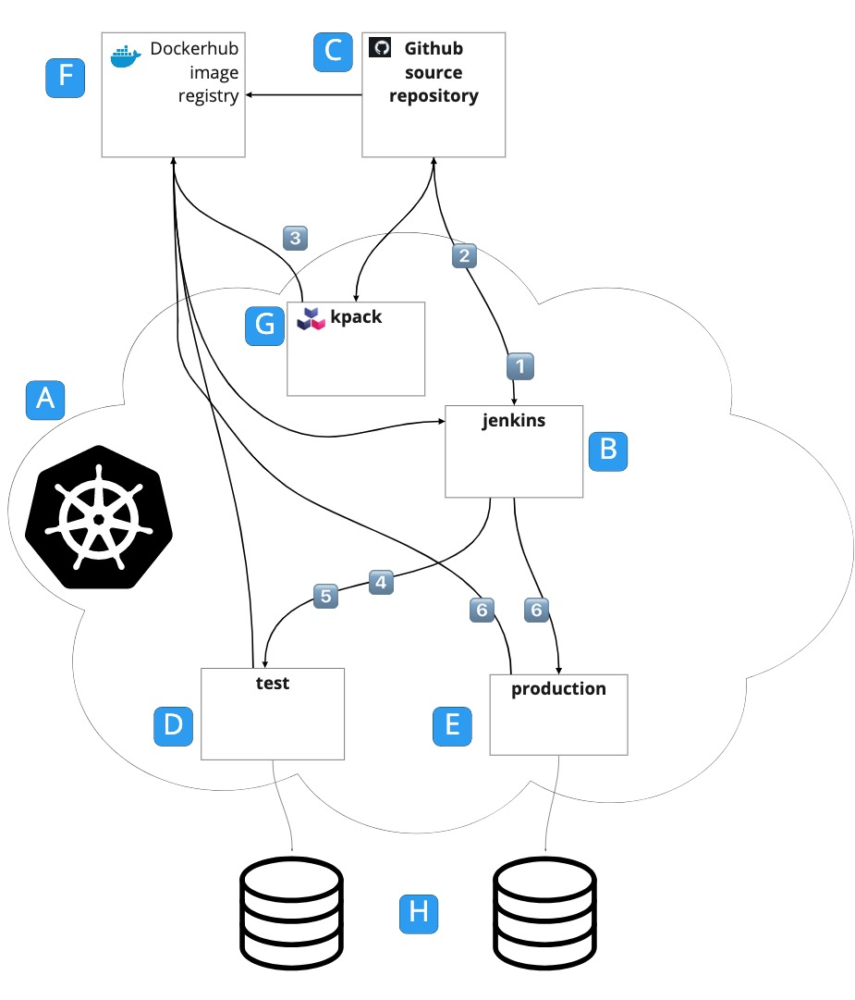

Automation, testing, and pipelines are the golden trinity for productive development teams. By building and testing your code in an automated pipeline you get the following benefits: 

* Reduced time between committing a code change to seeing it running in an environment
* Fast feedback on any regressions
* Minimized possibility for human error in carrying out deployment steps

This learning path works through building an example continuous integration and delivery (CI/CD) pipeline step-by-step using the setup shown in the diagram below. Following cloud native principles, this pipeline builds a single binary image, which is the one deployed to test as well as production environments. This way, you know you are running the same thing in production that you have already tested. The other goal for this pipeline is to have a setup that could be easily reproduced on another cluster, so as much configuration as possible is stored in the source code repository. 

Although this learning path is presented as a tutorial to follow along, the pipeline here is intended to be a starting point for you to build something appropriate for your environment. There are lots of ways this simple example can be refined, and there are suggestions for items that you might do differently as you go through the process. Some of the technology choices (for example, minikube) were driven by what you might reasonably expect to be able to run on a developer laptop. 

The diagram below shows the overall picture of this example, which consists of a single Kubernetes cluster running Jenkins, kpack, and the application test and production environments, each in separate namespaces. Docker Hub, Github, and the application databases are all outside the cluster. 

These are the items in the diagram above: 

1. Kubernetes cluster: For simplicity, you can use a minikube cluster running on your local machine. The only thing that doesn’t work in this scenario is connecting a webhook from Docker Hub to Jenkins. We’ll show you a workaround to get the example working, but it isn’t suitable for production use. 
2. Jenkins namespace hosting a Jenkins instance 
3. Source code for the application stored in the Github repository 
4. Namespace for the test environment 
5. Namespace for the production environment 
6. Image repository where your container images are stored. You can use a free account on [Docker Hub](http://hub.docker.com) for your repository, but we’ll discuss alternatives later in this article. 
7. Kpack installation: kpack builds the container images for your application 
8. Database instances for test and production environments 

Each time code is committed to the main branch on the source repository, the following happens: 

1. Jenkins builds the source and runs unit tests (job 01-toybank-build). 
2. If the unit tests pass, Jenkins updates the Git branch image-build-branch from main (job 01-toybank-build). 
3. Kpack builds an image from the image-build-branch and pushes it to the image repository. 
4. The image repository calls a webhook on Jenkins to trigger the next job in the pipeline.
5. Jenkins updates the test application definition and the cluster starts pods based on the latest image (job 02-toybank-test-e2e).
6. Jenkins runs the end-to-end test (job 02-toybank-test-e2e). 
7. If the end-to-end tests pass, Jenkins updates the application definition on the production environment and the cluster starts pods based on the latest image (job 03-toybank-deploy).

The pipeline shown above is built with Jenkins as it is the most well-known CI tool, is very flexible, and works well in heterogeneous environments. However, Jenkins can be complex to set up and administer, and unless you are careful you can create “snowflake” Jenkins environments that are difficult to reconstruct when something goes wrong. Here, you will deploy Jenkins using a container image and configuration that can mostly be reconstructed from configuration files that can be stored in source control.

## Prerequisites

This article assumes that you have some basic Kubernetes knowledge, and that you are familiar with editing YAML files. The following is a list of the software you need to have set up on your machine before starting: 

* Java 11 for building and running the example locally. You can use an Open JDK or an Oracle JDK. 
* A [GitHub](http://github.com) account. Storing your sources on GitHub is the simplest way to make them accessible to kpack, which is going to build your container images. You can use private repositories with kpack, but this is outside the scope of this article. See the [kpack documentation](https://buildpacks.io/docs/tools/kpack/) for more information. 
* A Kubernetes cluster on which you have credentials to create Namespaces, Deployments, Secrets, ConfigMaps, and Services. You’ll also need kubectl installed on your local machine. Minikube is the simplest way to get started with Kubernetes on your local machine, although it lacks some of the features you need for production deployments (mainly external networking and multi-cluster support). As an alternative, you could use [Tanzu Community Edition](https://tanzucommunityedition.io/), which has more features than minikube and is also free to use but will take a little longer to set up. 
* A Docker Hub account for pushing and pulling images. Alternatively, you can set up your own registry (for example, using [Harbor](https://goharbor.io/)). If you set up your own registry, you will need an SSL certificate signed by a recognized Certificate Authority, as kpack will only connect over https. Using a self-signed certificate is possible but not easy with kpack, and it is beyond the scope of this article. 
* You’ll need to create a kubeconfig file for Jenkins running on your cluster so that it can deploy the application. This is explained in more detail in the section [Create a Jenkins Kubeconfig](/learningpaths/worked-example-of-continuous-integration-and-delivery/03-install-jenkins/#install-jenkins-with-helm). 
* Docker (or Docker Desktop) for running the PostgreSQL database. This is optional. You can install PostgreSQL directly onto your host machine, but the instructions here are for running it in containers. You can also use an alternative container runtime like Podman, as long as it can process Docker Compose files. 
* The [Helm command line interface (CLI)](https://helm.sh/docs/intro/quickstart/) 
* The curl command line utility 
* [Postman](https://www.postman.com/downloads/) 
