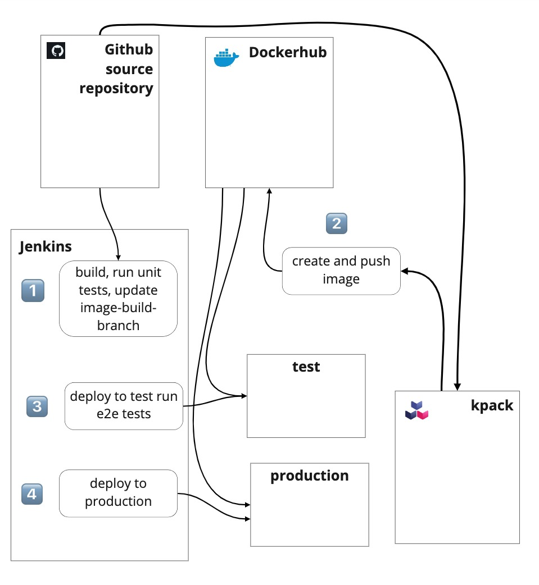

The diagram below shows the flow of jobs in the pipeline. The first job is triggered by a source code commit. Each subsequent job only runs if the preceding one succeeds. We will use Jenkins pipeline jobs so that the configuration can be stored as source code. The Jenkins files for all of the jobs are stored in the application repository, under the Jenkins directory.



In the next few sections, you will create the following pipeline:

* Set up a Docker Hub repository
* Add job 1 - 01-toybank-build
* Configure kpack
* Add job 2 - 02-toybank-test-e2e
* Add job 3 - 03-toybank-deploy

Each job consists of the configuration metadata and pipeline steps. The configuration metadata can be set through the Jenkins UI, or imported by POSTing XML configuration files to the createItem endpoint. The configuration files are included in the toybank repository under the jenkins-jobs directory. The pipeline steps describe the actual tasks to run the job, and are included in files under the toybank/pipeline-steps directory. 


## Set up a Docker Hub repository

Add a repository to your Docker Hub account for storing the toybank images built by kpack. You will also add a webhook notification to the repository, which POSTs to a specified endpoint each time an image is pushed to a repository, provides information about the image, and when it was pushed. This is useful for triggering the next step in a pipeline, although this means your pipeline needs to expose an endpoint on the public internet for Docker Hub to be able to access it. 

That’s not a very easy thing to do if you are running (as we are) a minikube cluster on a local machine. If your production pipeline is hosted on the public cloud, it is something you might be able to do. However, CI/CD pipelines are quite often hosted on internal networks and aren’t going to have any publicly accessible endpoints. Of course, you don’t have to use Docker Hub as your image repository; you could set up something like [Harbor](https://goharbor.io/) on your internal network. Harbor also provides webhooks, so you could still use that to trigger the next stage of your pipeline. 

Let’s set up the repository, then look at a workaround for the webhook so that we can see all parts of the pipeline working. 


1. Log in to your Docker Hub account. 
2. Click the Create Repository button. 
3. Name the repository `toybank` and click the Create button. 


### Viewing webhook calls

Provided you have a way of running an application accessible on the public internet (for example an AWS, Azure, or GCP account), you can build the webhook-listener utility and deploy it. This is a simple Spring Boot application with two endpoints: 


* The **<code>/</code></strong> endpoint that accepts GET requests and displays the JSON history of POST calls
* The<code> <strong>/hook </strong></code>endpoint that accepts POST requests with the header <code>content-type:application/json</code> This endpoint stores the JSON payload for display by the<strong><code> / </code></strong>endpoint. 

There is no automatic refresh of the UI, so refresh the page to see the latest posts. Newest posts are displayed at the top, and each post is displayed with the date and time. 

You can get the webhook-listener from [here](https://github.com/cyberycon/webhook-listener.git) and build it with Maven. If you are able to deploy it to a public location, then add the webhook to your toybank repository. 


1. From Docker Hub, select the toybank repository. 
2. Select the webhooks tag near the top of the repository page. 
3. Name the webhook `toybank` and set the URL to <code>[http://your-public-url/hook](http://your-public-url/hook)</code>

If you don’t have an option to deploy it publicly, we’ll provide some sample data you can use for triggering the pipeline instead. 


## Job 1: Build and run unit tests

The first job in the pipeline builds the code and runs the unit tests. You can import the job from the toybank/jenkins-jobs/01-toybank-build.xml:


1. Edit the toybank/jenkins-jobs/01-toybank-build.xml file and change the contents of the `<remote>` element to point to your fork of the toybank repository.  
2. From the command line:  \
<code>curl -X POST      \
 'http://admin:<em>api-token</em>@<em>jenkins-url</em>/createItem?name=01-toybank-build' \
  --header "Content-Type: application/xml" -d @01-toybank-build.xml \
</code> \
where <em>api-token</em> is the API token you created when configuring Jenkins, and <em>jenkins-url </em>is the URL and port-number to connect to your local Jenkins. 
3. Go to the Jenkins dashboard and you should see a new job, 01-toybank-build.

The job you have added: 


* Is a multibranch pipeline job
* Filters so that it is only monitoring the main branch
* Scans for changes every two minutes
* Has its pipeline steps in a Jenkinsfile stored in pipeline-steps/01-toybank-build 

You can check the configuration details through the Jenkins dashboard. 

The contents of pipeline-steps/01-toybank-build are shown below: 


```
pipeline {
     agent any
     stages {
         stage ('build') {
            steps {
                    withMaven ( 
                        maven: 'maven-3-8',
                        mavenLocalRepo: '.repository'
                        ) {
                        sh "mvn package"
                     }
                     withCredentials(
                           [sshUserPrivateKey(credentialsId: 'git_automation', 
                           keyFileVariable: 'SSH_FILE')]) {
                        sh '''
                        git config --global user.email "jenkins-ci@example.com"
                        git config --global user.name "jenkins-ci"
                        export 
             GIT_SSH_COMMAND="ssh -i $SSH_FILE -o StrictHostKeyChecking=no"
                        git checkout image-build-branch
                        git merge origin/main
                        git push
                        '''
                     }
            }
         }
     }
  }
```


The first step runs the `mvn package` command that builds and then runs the unit tests. If this is successful, the latest changes are merged to the image-build-branch and pushed back to GitHub. This is the trigger for kpack to create an image. Test the pipeline by clicking the Build Now button. It might take two or three minutes to build.


## Set up kpack builder and image 

For kpack to create your application container images, it needs: 


* Access to a registry—you’ll give it access to your Docker Hub registry
* A store—a place to store stacks
* A builder—this specifies a store, stack, and the buildpacks to use
* An image—this ties together the source repository with a builder 

First, you set up the secrets, accounts, and ClusterStore needed by builder and image: 


1. Set up a secret to enable the builder to access your Docker Hub registry. 

    ```
    kubectl create secret docker-registry dockerhub-registry-credentials \
        --docker-username=your-username \
        --docker-password=your-password \
        --docker-server=https://index.docker.io/v1/ \
        --namespace default
    ```


2. Optionally, set up a secret to read from GitHub (only needed for private repositories). If you need to do this, you need to add an SSH key to your GitHub account that does not have a passphrase as you did when setting up Jenkins earlier. 

    ```
    kp secret create git-ssh-cred --git-url git@github.com \ 
   --git-ssh-key ~/.ssh/your-ssh-key
    ```


3. Set up a service account that references the secrets. Use the kpack/kpack-service-account.yaml file in the toybank repository. In doing so, you’ll need to edit the file to include your GitHub secret if you created one in Step 2). 

    ```
    kubectl apply -f kpack/kpack-service-account.yaml
    ```


4. Set up a ClusterStore for kpack to store buildpacks in your Kubernetes cluster. The Cluster Store type is a Custom Resource Definition added to your cluster when kpack is installed. Use the kpack/kpack-service-account.yaml in the toybank repository: 

    ```
    kubectl apply -f kpack/cluster-store.yaml
    ```


5. Check that the store is ready:  \
 \
`kp clusterstore status default`

    This particular ClusterStore only references the Paketo Java buildpack, so you will only be able to build Java applications from this store, however,  you can add buildpacks for other languages. Paketo is an open source project which supplies buildpacks for several popular languages (see [https://paketo.io](https://paketo.io) for more information). 

6. Set up a ClusterStack. The stack is a pair of images—a build image and a run image. The build image is the base image for a build environment. The run image is the base image for your application image. Use the kpack/kpack-service-account.yaml in the toybank repository: 

    ```
    kubectl apply -f kpack/cluster-stack.yaml 
    ```


7. Check that the stack is ready:  \
 \
`kp clusterstack status base`

Once your ClusterStack is ready, we can create the builder. When you set up a builder, kpack creates a builder image and stores it in the repository specified by your docker-registry secret. 


1. Edit the kpack/builder.yaml file in the toybank repository to specify an image tag for your builder image.  \
 \
s<code>pec: \
  tag: <em>your-account-name</em>/image-builder</code>  \

2. <code>kubectl apply -f kpack/builder.yaml </code>
3. Check that the builder is ready:  \
 \
<code>kp builder status toybank-builder</code>

If the builder status isn’t ready, you will need to do some debugging to work out why. For example, was kpack able to access your image repository? 

Set up the kpack image. The image specifies the sources for your application, the builder to use, and a tag to give the image.  


1. Edit the kpack/image.yaml file in the toybank repository to specify an image tag for your application image.  \
 \
s<code>pec: \
  tag: <em>your-account-name</em>/toybank:latest</code>  \

2. Also, edit this file to specify your source repository:  \
<code>source: \
  git: \
    url: <em>github-url for your repository</em></code> 
3. <code>kubectl apply -f kpack/image.yaml </code>
4. It can take a few minutes for the image to build, so try:  \
 \
<code>watch kp image status toybank-image </code>

Once kpack has built the image log into your image repository, you should see two new tags for your image; one will be latest, and the other will be in the form b<em>nn</em>.<em>yyyymmdd</em>.<em>hhmmss </em>where <em>nn</em> is the build number, <em>yyyymmdd</em> is the date, and <em>hhmmss</em> is the time. 

If the status of your image remains Not Ready, you will need to do some investigation to find out why. You can see a build log by running: 

`kp build logs toybank-image` 

or to see the logs for build number _n_.  


```
kp build logs toybank-image -b n
```


You can also get extra information about the state of an image by viewing the information Kubernetes has about the image object: 

`kubectl get image toybank-image -o yaml` 


## Job 2: Deploy to test 

The second job in this pipeline pulls an image from Docker Hub, deploys it into a test namespace, and runs the end-to-end tests. This job is triggered by a webhook. In a production environment, your image repository would be able to call the Jenkins endpoint for the trigger directly, but as explained earlier in "Set up a Docker Hub repository" that isn’t very practical if you are building the pipeline on your laptop. To set up the job: 


1. Edit the toybank/jenkins-jobs/02-toybank-e2e.xml file and change the following:
    1. Find the `&lt;hudson.model.ParametersDefinitionProperty>` element and change the `&lt;defaultValue>` element to point to your Docker Hub account and toybank repository:  \
 \
<code>&lt;defaultValue><em>account</em>/toybank:latest&lt;/defaultValue> \
</code>
    2.  Find the <code>&lt;url></code> element and change it to point to your GitHub repository (SSH URL): \
 \
<code>&lt;url>[git@github.com](mailto:git@github.com):git-username/toybank.git&lt;/url> \
</code>
2. From the command line:  \
<code>curl -X POST      \
 'http://admin:<em>api-token</em>@<em>jenkins-url</em>/createItem?name=02-toybank-e2e \
  --header "Content-Type: application/xml" -d @02-toybank-e2e.xml</code>
3. Go to the Jenkins dashboard and you should see a new job, 02-toybank-e2e.

The job you have added is configured as: 


* A pipeline job, with its steps in toybank/pipeline-steps/02-toybank-test-e2e
* A generic webhook build trigger that uses JSONPath to extract the value push_data.tag from a JSON body and put it into variable DH_IMAGE_TAG for use by the pipeline itself
* With a webhook trigger that has a token set to 1231—this token must be passed as a query parameter when the webhook endpoint is called. This trigger also has a regexp filter against the DH_IMAGE_TAG variable. This will stop the build being triggered if the tag in the JSON body sent to the webhook is `latest`. 
* The pipeline steps are in toybank/pipeline-steps/02-toybank-test-e2e.
* A job that includes a post-stage after the main build steps. The success branch is only run if the build succeeded (i.e., the tests pass). This will trigger the final job that deploys to production. However, this job will succeed whether or not the final triggered job succeeds. This job will always show success as long as the tests pass. Decoupling the success of the final deployment from this job makes it easier to see where the pipeline failed.  

Before triggering this build, edit the pipeline steps for this job. 


1. Open toybank/pipeline-steps/02-toybank-test-e2e, and in the very first `withCredentials `step, edit the `git clone` statement to point to your forked toybank repository. 
2. The `withEnv` statement in the final `withCredentials` step provides a `DATABASE_URL` which is correct for a minikube cluster with the PostgreSQL server running on port 5432 on the host machine. If you set up the database as explained in "Set up local database" earlier, and you are using minikube, this URL should be correct, otherwise you will need to change it. 

The pipeline has three separate steps under the run-tests stage. The first step clones the toybank repository. The second step deploys an image to your cluster. It has one `withCredentials` block nested inside another. The first block puts the database credentials into environment variables, and the second block makes the Kubernetes configuration you set up in "Create a Jenkins Kubeconfig" available. 

In this step, the following command sets up yaml files ready to deploy the application to the test namespace: 


```
ytt -f toybank-config-template.yaml -f toybank-deploy-template.yaml 
  -f toybank-service-template.yaml -f db-secret-template.yaml -f schema.yaml 
  -v data.databasePassword=$DB_USER_B64 -v data.databaseUser=$DB_PASSWORD_B64 
  -v image=$DH_IMAGE -v metadata.namespace=test 
  -v data.databaseUrl=jdbc:postgresql://host.minikube.internal:5432/dev
  --output-files test
```


This uses the ytt templating utility (see [https://carvel.dev/ytt/](https://carvel.dev/ytt/)) to create a set of Kubernetes yaml files in a test subdirectory, substituting in the correct data to create the database secrets, set the image, set the database URL, and set the namespace. The next command, which deploys the application into the test namespace, is: 


```
kubectl apply -f test/.
```


 

The final step uses Maven to run the tests in class ToyBankApplicationE2E. This runs a test program in the Jenkins agent container, which makes REST calls to the application deployed in Test. The test program requires the database credentials to clear the test database before running tests. 


## Job 3: Deploy to production

The final job deploys the tested image to production. This job is also parameterized so that Job 2 can pass it the tag for the image that has been tested; that way you know that the image deployed to production is the one that passed the end-to-end tests. 

To set up the job: 


1. Edit the toybank/jenkins-jobs/02-toybank-e2e.xml file, find the `&lt;url>` element and change it to point to your GitHub repository (SSH URL): \
 \
<code>&lt;url>[git@github.com](mailto:git@github.com):git-username/toybank.git&lt;/url> \
</code>
2. From the command line:  \
<code>curl -X POST      \
 'http://admin:<em>api-token</em>@<em>jenkins-url</em>/createItem?name=03-toybank-deploy' \
  --header "Content-Type: application/xml" -d @03-toybank-deploy.xml</code>
3. Go to the Jenkins dashboard and you should now see a new job, 03-toybank-deploy. 

The job you have added is configured as: 


* A pipeline job, with its steps in toybank/pipeline-steps/03-toybank-deploy
* A job parameterised with a single string parameter, DH_IMAGE which gives the tag of the image to deploy
* No explicit trigger set up—this job is triggered by the previous job whenever it successfully runs the end-to-end tests
