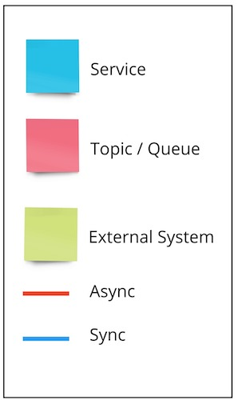
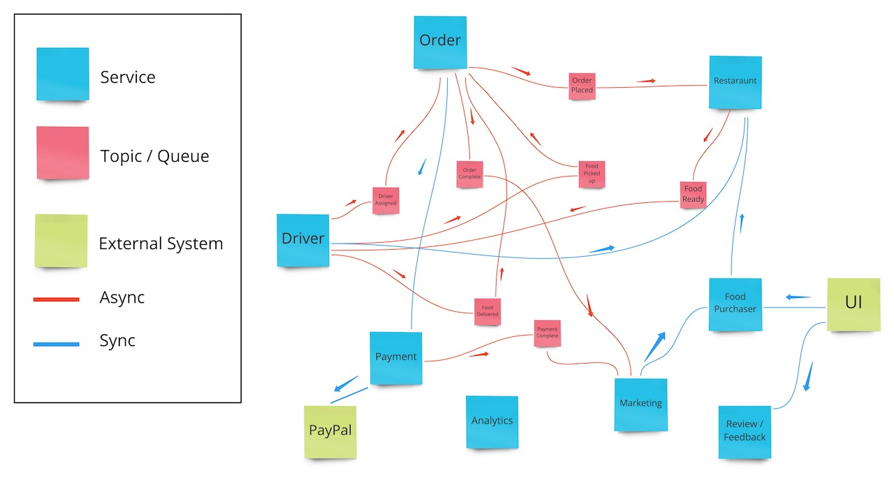
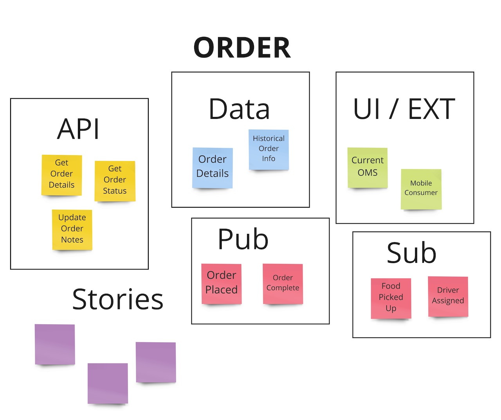

## How to Use this Method

{}
### Sample Agenda & Prompts
1. After [Event Storming](/practices/event-storming), using one color of sticky notes create one for each bounded context. Place on the board in a blob.

   
   **Tip**: Create a legend identifying the bounded context, topic/queue, external system, UI.
   

   

1. Discuss a thin slice of the flow and map out how each of the bounded contexts communicate with one another to complete the flow. Start with the happy path then move to unhappy paths.

   
   **Tip**: If mapping more than one slice through the system, use different colored arrows for each. From a happy path perspective, how should the “to be” bounded contexts communicate with each other? From a non-happy path perspective, how should the “to be” system communicate with each other during a failure?
   

   If the event message payload is discussed, push to use the smallest message possible with the least number of unique keys to identify a unique bounded context through a synchronous web service lookup (“lean events, rich APIs”)
1. Draw a line from system to system as they talk, using different colors for **synchronous** and **asynchronous** communication. Add arrows to indicate if it is pushing or pulling.

   Questions to think about:
   - What are the inputs and outputs for this bounded context?
   - Should the communication be through events or web services?
   - What are some of the cross cutting integrations that need to be included (e.g. notifications, monitoring, balancing, accounting, etc)?

   

1. Indicate if a queue is needed by adding them in a new sticky note of the same color for a queue/topic. Add in the lines for what systems are talking to it.

1. Using a new sticky note of a different color, indicate if there are external systems as part of the flow. Add in the lines for how it is communicated with in the flow.

1. Create SNAP lists on large sheets.

   SNAP takes the understanding from the Boris diagram to understand the specific needs of every bounded context under the new proposed architecture. The SNAP exercise should be done for each bounded context and call out APIs, data needed, UIs, and risks that would apply to that bounded context. The backlog for the product will be created based upon the items identified.

   Questions to think about:
   - What APIs need to be built for the Bounded context?
   - What External Systems integrate with the bounded context?
   - What data elements should the bounded context include?
   - Is there a UI for the bounded context?
   - What are the major risks for the bounded context?
   - What backlog stories need to be created to account for the work?
   - It helps to identify someone to be in charge of recording things on the SNAP sheets so that they can grow as things come out in general conversation during Boris.

   

1. As you discuss the flow and the interactions with the system you can add information to each bounded context's sheet

1. Move on to the next flow indicating this in a new color

1. Add info on the new flow to the larger bounded context sheet on a new sticky note color

1. Call out specific areas that are missing on the bounded context sheets that are missing.
{}

{}
### Success/Expected Outcomes
At the end of a Boris exercise, Services, APIs, Data and Event Choreography and a backlog of work starts becoming obvious.

SNAP is used to quickly document the outcomes of a Boris in real-time. Information is often grouped into APIs, Data, Pub/Sub, External Systems/UI, Stories, and Risks. The key artifact is a poster-sized sticky paper on a conference room wall or similar from a digital workspace, with one SNAP per node or service depicted on Boris. Typically there will be one SNAP per node or service depicted on Boris. Each SNAP consists of documentation about six categories: APIs, Data, External Systems/UI, Pub/Sub, Stories and Risks.
{}

{}
### Facilitator Notes & Tips

Boris, [Event Storming](/practices/event-storming) and other techniques are part of the [Swift Method](/practices/swift-method) that we use for identifying the “real” problems in a large scale system and discover the North Star direction for your modernized system. Let the solution present itself through rhetorical questions. Practice a fine balance between driving to a solution vs organic evolution of the target architecture. Do not pre-optimize during the Boris exercise.
{}

{}
### Challenges Playbook

***Challenge: It isn’t clear when to move from [Event Storming](/practices/event-storming) to Boris to SNAP.***

Once the room has slowed down putting business events up and have had at least one round of explicitly putting up pain points, you can try identifying the aggregate boundaries. If this proves difficult, you can step back and see if there are more events that might inform things.

Boris and SNAP are often done in parallel, with SNAP as a form of cataloging the conversation that’s happening organically around the Boris diagram.

***Challenge: Sometimes we don’t have a clear bounded context at the end of an [Event Storming](/practices/event-storming) session.***

This might mean you’re too zoomed in (you’re only looking at one process or part of a process inside a bounded context) or too zoomed out (you’ve mapped all or a large part of your whole company). Ask the room if this is true, and you can usually zoom in with the room you have at the moment. If you feel like you’re too zoomed in, you may need to come back for a second session with more stakeholders of the surrounding events.

***Challenge: We don’t always end up with consensus on the ubiquitous language after a session.***

This might be ok as long as the bounded context’s internal engineering and business teams agree on the vocabulary. If there is still fuzziness, you can look for points to collect up all of the nouns and/or verbs and workshop them together (either as a round during the session or with a dedicated session afterwards with the core team).

***Challenge: Many folks in the room aren’t engaged, or the conversation is only happening between one or two people.***

Ask folks to put away their laptops and phones. Set expectations on involvement early. Run rounds of the [Event Storming](/practices/event-storming) or Boris where you’re calling specific segments of your audience to layer on their particular perspective if whole-group mobbing is causing some voices to get lost. Remember, if you did the prep work to specifically identify why each person is in the room, you need something from each of them. You can use those identified reasons as a way to call on folks that aren’t participating to add a specific kind of information.

***Challenge: It’s difficult to know who all we need for each phase of the process.***

See the section on who to invite in the prep work section. Aim for a real or temporarily-imagined balanced team plus folks to represent your stakeholders and consumers.

***Challenge: It’s difficult to find someone with facilitation experience to help run a session as the organization scales.***

In many ways this is true about any practice, so similar wisdom and optimization can be applied here. See the prep step on identifying facilitators and being deliberate in this process rather than expecting everyone to show up without a specific role.

Also acknowledge that it will take several sessions to go through the “I do, we do, you do” process - more opportunities to facilitate can help mitigate this.
{}

{}
## Related Practices

Boris is an activity within the [Swift Method](/practices/swift-method).
{}

{}
### Preceding

[Event Storming](/practices/event-storming)
{}

{}
### Real World Examples

See the <a href="https://miro.com/app/board/o9J_kzaSk0E=/" target="_blank">Event Storming and Boris Training Miro board</a> for a detailed description of Boris and the [Swift Method](/practices/swift-method) of modernization for an Uber Eats-style application
{}

{}
### Recommended Reading

<a href="https://www.youtube.com/watch?v=7-fRtd8LUwA" target="_blank">Swift Method: Event Storming, Boris the Spider and Other Techniques</a> (YouTube video) talk at ExploreDDD 2019 by Shaun Anderson

<a href="https://www.youtube.com/watch?v=s5qeE4qii6M" target="_blank">A Deep Dive into Modernization Patterns to Get Your Mission Critical Applications to the Cloud</a> (YouTube video)

<a href="https://tanzu.vmware.com/content/slides/the-modern-family-modernizing-applications-to-pivotal-cloud-foundry-getting-out-of-the-big-ball-of-mud" target="_blank">Tools to Slay the Fire Breathing Monoliths in Your Enterprise</a> (blog post)
{}