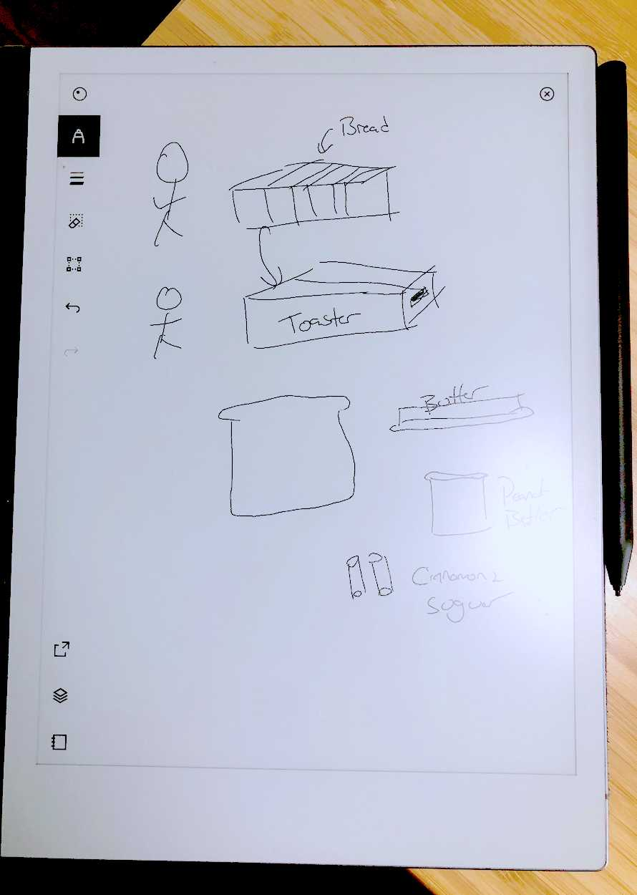
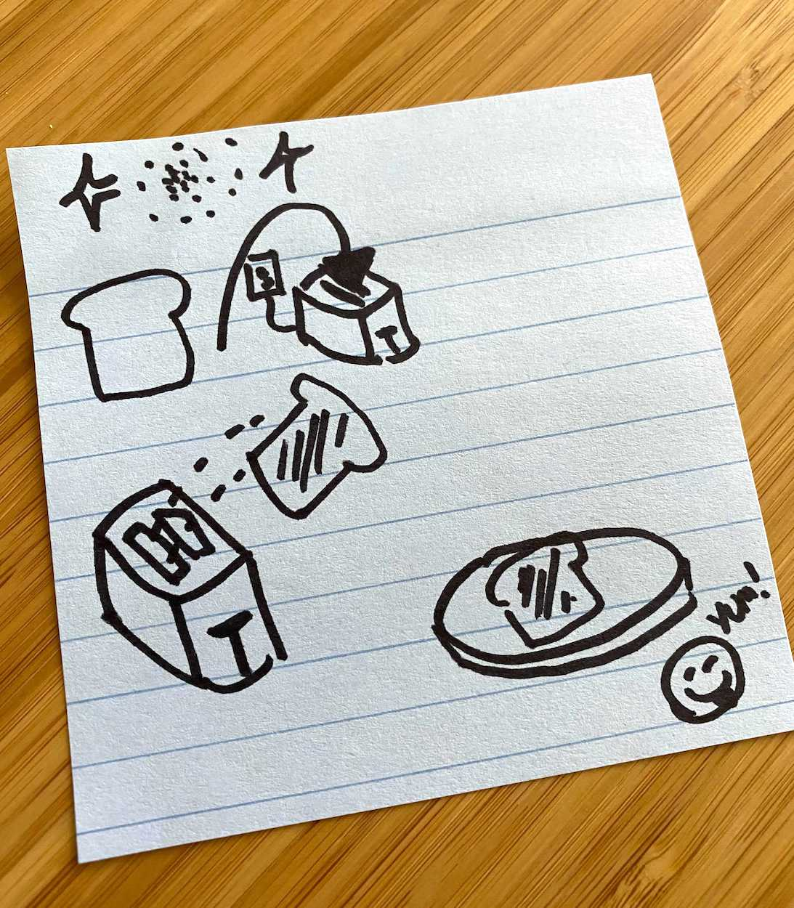
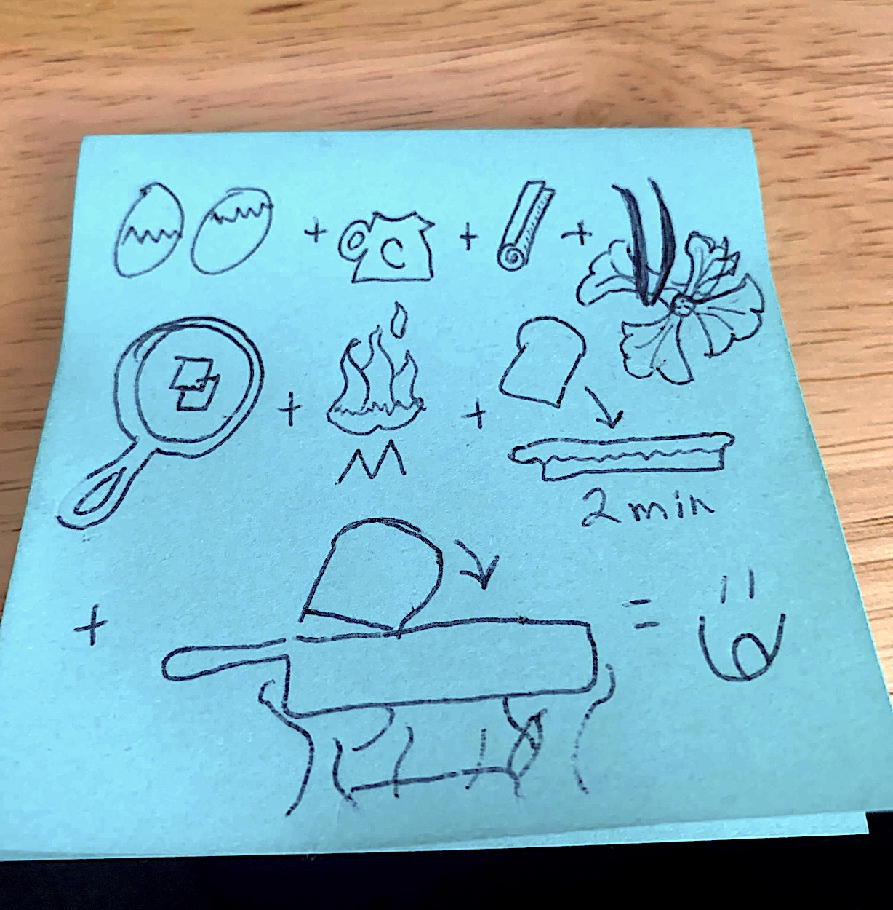
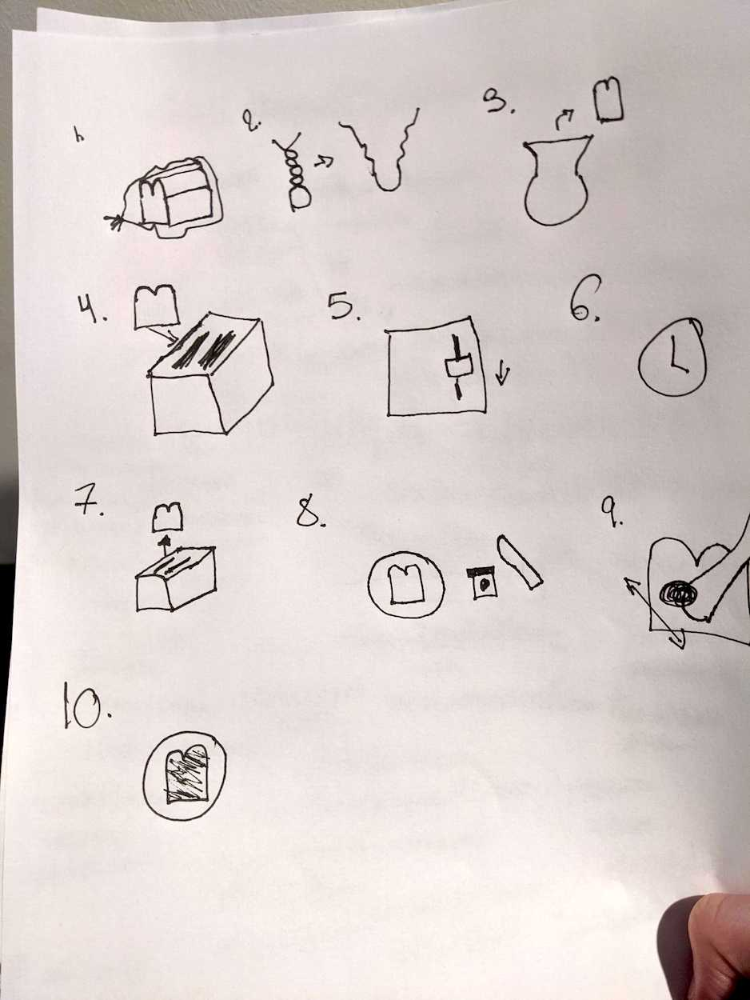
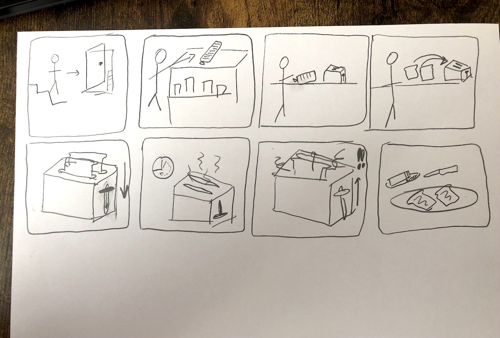

## How to Use this Method

{}
### Sample Agenda & Prompts
*Paraphrased from <a href="http://www.drawtoast.com/" target="_blank">DrawToast.com</a>. Draw Toast is part of Tom Wujec's Wicked Problem Solving™ toolkit to help you get playfully clear about what's important in your organization. This work is licensed under a <a href="https://creativecommons.org/licenses/by-nc-sa/3.0/deed.en_US" target="_blank">Creative Commons Attribution-NonCommercial-ShareAlike 3.0 Unported License</a>.*

1. Hand out paper and writing utensils to all the participants

   {}
   **Remote Tip:** For distributed teams, use [Miro](https://miro.com/) or a similar "digital whiteboard" and adapt the in-person aspects to the digital world, such as drawing and using sticky notes.
   {}

1. Hand out markers and paper to everyone and ask participants to **draw each step in the process of making toast**. Give them 2-3 minutes.

1. Have each person hold up their drawing for all to see and quickly explain their thought process. As facilitator, when relevant, point out trends or divergences that emerge. A follow up might be to ask how some could be made more lean or who thought it through in more steps versus just a few steps.

   Some great questions to ask about individual drawings during Step 3 include:
   - Could you tell me more about how you chose what to draw?
   - Why did you draw it the way you did?
   - How did you decide where to start?

1. Now that everyone can see how even a simple prompt has led to so much differentiation between each drawing, tie this point back to the group:

   {}
   **Example**: *"Even on a simple, daily activity we are all familiar with getting alignment and holding a shared vision is difficult. In software building it is even more difficult and that’s why we’re here today—to create alignment, understand the degrees of complexity, and find ways to work toward common goals."*
   {}
{}

{}
### Success/Expected Outcomes
You’ll know you’re successful when you see the diversity in thought that each person put in to such a simple, daily activity everyone is familiar with.

You’ll know you’re even more successful when you can use this as an analogy throughout the project to point out how complex software building really is and how critical alignment is. For example, you might remind participants *"Just like when we were drawing toast, everyone has a different idea in their mind and we need to get those ideas out so we can get some alignment."*
{}

{}
### Facilitator Notes & Tips
Sometimes people say “Do I have to draw? I don’t know how to draw.” Generally, it’s okay to encourage that person to draw and let them know no one will pass judgement on their drawing, but if they really hold out and want to write something out that’s okay too. Generally people who choose not to draw regret not drawing when everyone else in the room has done drawings.

If short on time, have everyone tape theirs up and just ask participants to take a look during a break.
{}

{}
### Related Practices

### Variations

#### For Remote Teams
You can still facilitate this workshop even if the team is remote. 

While many on-line collaboration solutions have drawing features, we suggest keeping thing low-tech: use paper and cameras. 

- Have people draw upon actual paper as described above.
- Next, have them take a photo on their phone and upload the photo to the collaboration space.
   
   Alternatively, people can send the photos to the facilitator via chat app, email, or even text message. They can even hold up their drawings to their webcam -- the facilitator can take a screenshot, then add the image to the collaboration space.

Here's a good example using a digital drawing tablet:

{}

{}
### Real World Examples

{}

{}

### Recommended Reading

<a href="http://www.drawtoast.com/" target="_blank">DrawToast.com</a> has a wealth of information including a TED talk and examples of others' work on this subject. One particularly helpful resource is <a href="http://www.drawtoast.com/downloads/DrawToast%20Systems%20Thinking%20Guide.pdf" target="_blank">A Primer in Systems Thinking</a> (PDF).
{}