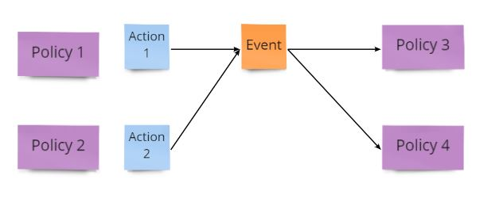
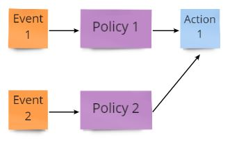
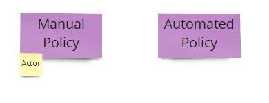
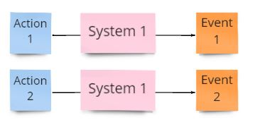
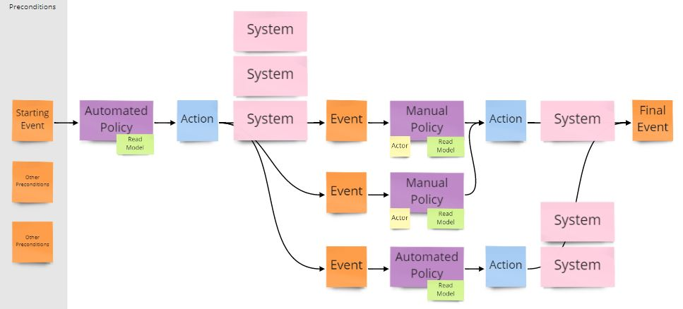

---
# remove "draft:true" when ready for final publication 
draft: false

title: "Event Storming | Process Modelling"
linkTitle: "Event Storming | Process Modelling - Will Appear in Links"
description: "A workshop for facilitating discussions around an outcome based view of a process or workflow, with flexible levels of detail and complexity."
# Note: remove any tags that are not relevant.
tags: ["Scoping", "Kickoff", "Discovery", "Framing", "Inception", "Transition", "Modernization", "Delivery"]
length: "1-2 hours"
participants: "Core Team and a focused group of Business Analysts, Executives or Domain Experts"
# custom "cover" image example: "boris/boris.png"
image: "default-cover.png" 
lastmod: "2021-05-21"
why: 
- To capture and model business processes, aligning balanced teams with stakeholders and Subject Matter Experts on business practice.
- To identify user interaction within a process and identify where user journeys are required.
- To align balanced teams with stakeholders and subject matter experts around a common and understandable language.
- To build a feature oriented context for future development.
- To draft, communicate and validate lean product assumptions, with stakeholders and subject matter experts.
- To identify a thin slice and first iteration with prioritized, lean assumptions.
- To create an algorithmic model of a business process.
- To break down large problem spaces into smaller more manageable problems.
- To identify where existing solutions exist, which support the process.
- To compare process changes to validate hypotheses and solutions.
- To identify future road map priorities.
when:
- You have identified a specific process from an Event Storming exercise.
- You have identified a need to create new software or re-write legacy software.
- You need to break down monolithic systems.
- You are validating process changes that might help solve a problem.
what:
- Large wall or digital collaboration space like [Miro](https://miro.com/).
- Sticky notes of 5+ different colors. When using this in conjunction with other flavors of Event Storming and/or BORIS + SNAP keep consistency in colors.
- Sharpies.

---
## How to Use this Method
### Event Storming Background
Event Storming is a workshop created by Alberto Brandolini, which aims to discover a set of domain events, each represented as a colored sticky (usually orange) and ordered along a timeline. The fundamentals of this practice are already described in the Tanzu Developer Center [here](/practices/event-storming) and in Alberto Brandolini's book [Introducing Event Storming](https://leanpub.com/introducing_eventstorming).

The book also describes Event Storming in 3 different exercises:
- Bigger Picture
- Process Modelling
- Software Design

This article focuses on the Process Modelling 

### Event Storming Grammar
Additional Event Storming exercises have the aim of adding layers of notation in the form of different colored stickies, also referred to as Grammar, to capture more information and validate assumptions. Alberto Brandolini suggests it is like making a pizza, where events and a timeline give you a margarita, but you can add more grammar to make different pizzas. Though he did warn that you might be tempted to put grammar that isn't suited for Event Storming, such as data tables. He likens this to pineapple, and insists it should never be on your pizza.

### Process Modelling Exercise
The Practice described below is the additional exercise used by Process modelling, as it was taught in Alberto Brandolini's workshop, [Remote Event Storming](https://www.eventstorming.com/). 

While formally this method is best used for understanding many large, complex and high-level processes across an entire company, the general principles and grammar of Process Modelling have been adopted successfully to discover or validate workflows and pipelines at much smaller scales and through existing systems.

The output from these workshops can be used to discover, validate or design software that supports an end-to-end business process. Engineers can see this as an algorithmic model of the problem space, as opposed to an Object Oriented model that you might achieve using Unified Modelling Language (UML).

### Sample Agenda & Prompts - 
#### Prerequisites: 
   Previously you should have run a [Bigger Picture](/practices/event-storming) exercise to provide enough events to find a process to model
   - Participants have organized stickies between pivotal events in a timeline.
   - Pain-points and opportunities have been added to the board and linked to stickies.
   - A copy or snapshot of the main storming board should be created before moving onto the process modelling exercise.

#### Modelling Exercise:
1. #### Breaking up the event storming board
   - Breakout processes
     - From the main storming board, choose a set of pivotal events that describe an end-to-end flow. Each flow could be one of the following types:
        - Main Business Flows: similar to a Customer Journey, often segmented on different personas. Small Company vs Big Corporation vs Freelance, or New vs Returning customer. This is the story on the surface.
        - Value Supply: Flows providing supporting services to the main business flow. A conference business is not only selling tickets, but also inviting keynote speakers and managing calls for papers, etc.
        - Supporting: Other processes that need to be there. Less correlated to the main flow, like billing and accounting, reporting, customer care, but also HR, and so on.
        - Strategy: Flows describing a results based business strategy. Events from other domains are used to build a strategy or forecast.
        - Making it Possible: Flows describing a path to production. The process of delivering a software product.
     - Move the chosen stickies to a new board.
     - Label the new board to identify a name for the process being explored.
   - Repeat until there are no more stickies on the main storming board.
2. #### Prioritize Processes
   To narrow down the scope of discovery a single process should be prioritized.
   This might be based on pain points and opportunities, business value etc.
   There are many exercises described in the Tanzu Developer Center that can be used to identify priorities.
3. #### Arrange the process modelling board
   Each board needs to be arranged to prepare for the exercise and introduce the new grammar. This can be done when you create a new board or as you start modelling a process.
   - Add a grammar legend to your board (as shown below with grammar definition).
   - Preconditions: Identify events which need to have happened before this process can begin and put them in a grayed area on the left under the title Preconditions.
   - Post-conditions: Identify at least one suitable event which describes the optimal outcome of the process.
   - Arrange any remaining events in chronological order from left to right between the preconditions and post-conditions. Do not worry about accuracy. As the events are narrated, be prepared to change, add or remove events.
4. #### First Narration
   As described in the prerequisites, when moving from the storming board you will have chosen a flow of interest to model. Usually the main goal of the first narration is to complete this flow to a satisfactory golden path outcome. A golden path is a flow through a process, where everything goes smoothly and no failures or issues arise.

   ##### Roles:
   - There are typically 3 roles:
     - A Narrator reads through the process from left to right.
     - The Audience listens to the narrator and assists in discovering the process.
     - A Scribe records the process on the board.
   - Any participant can take on any of these roles. Rotating roles should also be encouraged, so everyone develops both ownership of the process and a deeper familiarity with the exercise.

   Attempt to narrate the stickies on the board, describing the process of events as they happen from left to right. While you can add grammar in the first narration it is not necessary. The primary goal is to start from en entry point into the system and model the process until a final output that is agreed to be within the scope of your project.

   ##### Grammar:
      
      | Term | Definition | Rules |
      | --- | --- | --- |
      | <h4>Events</h4> | Represent a state change or notification that another part of the system wants to react upon. They can be raised as a result of an Action or raised automatically as a Timed Event. | <ul><li>An Event can be raised by many Actions.</li> <li>An Event can be listened to by many Policies.</li> <li>Events used in preconditions are assumed to be timed or modeled elsewhere and do not need additional grammar.</li> <li>Timed Events do not need to be raised by an Action.</li> <li>Timed Events should be identified with a symbol or tag on the Event sticky.</li></ul> |
      | <tr><td colspan=3>     </td></tr> |
      | <h4>Policies</h4> | Represent a decision to perform a task. Sometimes this is written as a short sentence or can be labeled and described somewhere else. Policies can be manually performed by an Actor or automated by an IT system. | <ul> <li>A Policy listens to a single Event.</li>  <li>A Policy should call one Action per decision outcome.</li> <li>Multiple Policies can call the same Action.</li> <li>A Policy description should include the Event they are listening to, an Actor if one is required, a decision to be made and an Action to take. </li> <li>A manual Policy should have an actor.</li> <li>An automated Policy should not have an actor.</li>  </ul> |
      | <tr><td colspan=3>     </td></tr> |
      | <h4>Actions</h4> | Represent a tasks that must be performed due to policy, and produces one or more interesting events. Also called Commands. | <ul> <li>An Action can require multiple Systems.</li> <li>An Action can raise multiple Events.</li> <li>If an Action raises more than one event, these should be placed in a column, with the most pivotal events at the top.</li> <li>Multiple Actions can raise the same Event.</li> </ul> | |
      | <tr><td colspan=3>   </td></tr> |
      | <h4>Actors</h4> | Represent a human interaction and should be placed with policies to identify who is responsible for making the decision and performing the Action. A policy without an actor is automated. | | |
      | <tr><td colspan=3>  </td></tr> |
      | <h4>Read Models</h4> | Represent data required to make decisions or perform Actions. Read Models should be small chunks of relevant structures or fields. | <ul> <li>Multiple Read Models can be assigned to a Policy.</li> <li>Read Models can be duplicated to multiple Policies.</li></ul> |
      | <tr><td colspan=3>  </td></tr> |
      | <h4>Systems</h4> | Represent 3rd party tools such as; email, excel, notepad, or any required commercial off the shelf (COTS) applications. | <ul> <li>Systems used by multiple Actions can be duplicated for each Action. You can also add tools developed in-house, that are outside of the scope of the project you are working on</li> </ul>  |
      | <tr><td colspan=3>  </td></tr> |

      | Legend |  |
      | --- | --- |
      |  |  |
      
   &nbsp;
   ##### Questions:
   If an assumption is being made or there is no way to clarify parts of the process with the people in the room, leave a question on the board and return to it later with the right people or new information.

   ##### Pain Points and Opportunities:
   - If pain points are identified and correlated to a sticky in the process, then they should be captured on the board near the associated sticky.
   - If opportunities are identified that correlate to either a pain point or a sticky in the process, then they should be captured on the board near the associated pain point or sticky.

   ##### New Flows: 
   While the main goal is to follow the flow chosen from the main storming board, you might discover other flows. These can be separated and moved to another board, with a connector drawn between the two to identify the transition between flows.

5. #### Narrate the process again
   The goal is to capture enough of the process over several narrations to identify a thin slice. Each time capturing more information to improve the participants understanding of the process and build a consensus.
   - Correct inaccuracies and add additional grammar stickies where needed.
   - If there is a prioritized pain point linked to a sticky that has not been included in the golden path flow, try to discover the flow that will include that sticky.
   - Repeat this until you are satisfied you have enough of the process to identify a thin slice to work on.

6. #### Review Questions, Pain Points and Opportunities
   - Try to answer as many questions as possible.
   - Simplify, remove duplication and affinity group pain points and opportunities.

## Success/Expected Outcomes
- Capture information to assist further in the development process:
  - Define Ubiquitous Language: A common language that cuts through assumption and clarifies a shared understanding. A glossary can also be maintained to capture important language that needs describing.
  - Identify Domain Events: Pivotal Events that describe communication between sub-domains. They are raised by one sub-domain and listened to by another, decoupling the dependency between the domains.
  - Identify Policies for Decision Making: Company policies describe business level decisions and relates them to users and data.
  - Identify Service Contracts: Events, write models and command inputs that are be used to create contracts for services.
  - Identify Integrations: external systems are needed to make decisions and perform actions.
  - Discuss Pain Points + Opportunities: An understanding of where problems are experienced and ideas of how they can be resolved.
- Identify one or more thin slices. Try to identify a simplified end-to-end process that can provide the most value. This will be your starting point for development.

  

Discovery of opportunities:
- The algorithmic model and use of Policies, can identify more opportunities to improve either the process and/or the user journey
- Read Models can identify opportunities to improve a user or automated decision making process
- Actors and automated Policies identify the potential for opportunities through automation

Decision Making:
All Process Modelling artifacts act as evidence of requirements and priorities. 
These can be used to re-enforce decisions and validate work being undertook

Thin Slice:
- The decomposition of an event storming board by workflow offers a first opportunity to define a thin slice.
- Flows can be prioritized by pain points and/or opportunities
- Additional grammar such as Preconditions, and Policies can be used to identify a number of scenarios that could be prioritized by value and complexity to narrow down the first iteration

Notional Architecture:
- Additional grammar such as policies and commands can identify and correctly name domain objects and events.
- An algorithmic model offers a simplified view of the process, readable by all members of the balanced team and stakeholders.
- Additional grammar assists in the interpretation of the process for synthesis and candidate selection.
- An algorithmic process model offers the chance to discover both a notional "north star" architecture and a notional architecture of existing systems.
- Additional grammar such as Policies, Actions and Read Models can offer a notional architecture at the code level.
- Preconditions, Actions, Read Models and Events can drive the discovery of data entering the system, and where it is used.
- Actors and automated Policies identifies the potential for synchronous and asynchronous operations.
- Domain Objects offer a notional microservice architecture.

Story Writing:
- Actors identify the user of stories where value is achieved through improved human interaction, and offers a focused role from which to start investigation of user needs
- Policy makers, subject matter expert's best suited to define the decision made in a policy on behalf of the business, identify the user of stories based on business requirements and offers a focused subject matter expert from whom to obtain further requirements
- All grammar can be used to better define a story and offer more detail as to it's value
- Policies, can identify more opportunities to improve either the process and/or the user journey
- Read Models can identify opportunities to improve a user or automated decision making process

## Related Practices
#### Event Storming 
As mentioned Process Modelling is a form of Event Storming, and as taught by Alberto Brandolini, is a natural follow on exercise to the more common Bigger Picture workshop. Therefore the Process Modelling exercise naturally offers a way to enrich any Event Storming session with additional grammar. The exercise can also be carried out with smaller more focused groups of subject matter experts to help with planning and managing attendance.
#### Software Design
Typically there will be a follow on exercise to rationalize the information and transform it from an algorithmic model to a different architectural model, such as Event and Domain Driven microservice architecture, a simple Pipeline or even CQRS and Event Sourcing patterns. However this is often where you lose Subject Matter Experts, and the conversation often continues from a more technical perspective. It can be useful to revisit this board and get both technical and business clarity on the problem and the solution being delivered.
##### Event Storming | Software Design
As with Process Modelling exercise, Software Design offers additional grammar to enrich your Bigger Picture and Process modelling workshops.
##### Unified Modelling Language (UML) / C4 Component Diagrams 
If you are using an Object-Oriented based notation to model your architecture, Process Modelling offers an algorithmic view of the problem you are solving and can be used to complete a number of diagrams as the process is narrated.
##### Boris and SNAP
The grammar used by Process Modelling offers a lot of information that can be directly used in the completion of [Boris](/practices/boris) and [SNAP](/practices/boris) exercises, to map out the flow through the system from a technical perspective.
#### User Journey Mapping
##### Service Blueprint
Stickies from the main storming board, policies and other grammar can be used to complete a [Service Blueprint](/practices/service-blueprint) to map out the journey through the system from the users perspective.
##### User Story Mapping
Policies with actors can help identify high-level user stories that can be broken down through story mapping exercises
##### User Interviews
The thin slice defined in this exercise, can help focus user interviews and identify good questions to ask.
##### Story Writing
The process identifies both users and policy makers. These personas and their objectives for each policy can be used to write stories that deliver value to either the user or the business.
#### Swift Methodology
Process Modelling can be used as part of the [Swift Method](/practices/swift-method), created by Shaun Anderson. A further article will be published to detail how to use Process Modelling as part of the Swift Method
## Facilitator Notes & Tips
#### Ubiquitous Language: 
- Naming can be contentious and often disagreements can be hard to settle. It is important not to spend too much time discussing names, and to use questions to allow for a less than perfect settlement to keep the conversation going.  
#### Events: 
Finding suitable events is important to getting a good model
 - When discovering new events, do not apply strict rules on how events should be formed. Allow wordy descriptions, that can be used to break down the grammar.
 -  When discovering new events, do not apply strict rules on the nature of events. Allow for non-domain events to be highlighted and discussed. It is always possible to filter a set of events by pivotal events, pipeline events, user journey events or even path to production events. This information might not be needed for the process model you are working on, but it can be used in another exercise.
 - Identify the important state change by understanding the action and who might listen to it. Write the event to make the subject of the event, the object that changed state. 
  e.g. the "Customer created an order", in this sentence the state of the Order is more important and will be listened to by other parts of the system so we re-write it as "Order was created". Another might be "Customer Changed Address", in this instance the change of state to the customer's address is important, so the event could be written as "Customer's Address Changed".
 - Filter or aggregate events that represent "Passive-Aggressive Commands" as described in Martin Fowler's blog [What do you mean by “Event-Driven”?](https://martinfowler.com/articles/201701-event-driven.html). These are often found when the object raising state changes is a listener to that event. One way to handle this could be to squash all policies, commands and events into a new policy and command, written to describe the whole process. Identify which events are listened to and what negative events might be raised as a result of any failures from the squashed commands, again only if they are listened to.

#### Policies: 
Writing Policies can be important to ensure you have the correct flow and capturing the correct business requirement
 - Policies should be written as a business decision that guides an actor or system to the correct action. 
 - The actor may be responsible for implementing the policy but are rarely responsible for defining the policy. When discovering Policies, it is always helpful to identify Policy Makers. 
   - Add a sticky to each policy to identify a name and role of someone in the company that can both detail and influence the policy.
   - If good Roles are identified in the Event Storming stage then you should be able to identify roles that influence the business decision.

#### Thin Slices: 
Thin Slices can be heavily influenced by the goals of your project, but a good start might be to pick out a golden path and reduce it to the least set of events required to achieve the final outcome.

## Recommended Reading
- [Alberto Brandolini - 50,000 Orange Stickies and Counting](https://www.youtube.com/watch?v=1i6QYvYhlYQming/)
- [Alberto Brandolini - 100,000 Orange Stickies Later](https://www.youtube.com/watch?v=fGm62ra_mQ8)
- [Remote Event Storming](https://blog.avanscoperta.it/2020/03/26/remote-eventstorming/)
- [What do you mean by “Event-Driven”?](https://martinfowler.com/articles/201701-event-driven.html)
- [DDD Crew Starter modelling Process](https://github.com/ddd-crew/ddd-starter-modelling-process)
