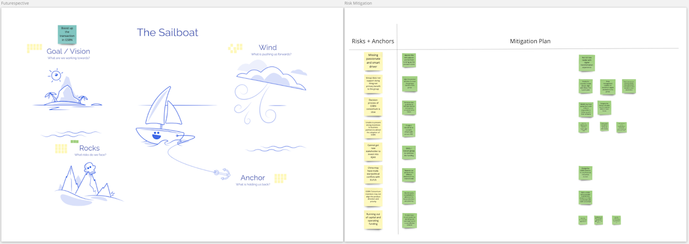

## How to Use this Method

{}
### Sample Agenda & Prompts

1. Write or reveal the following prompt for the group: 

   > “Imagine that it’s half a year from now and you just heard back from the users of your product that they are extremely happy with it. In short - it’s everything they expected, and more.”

   Ask the team to take 10 minutes to write down one idea per sticky note what that goal or vision would look like.

1. Take 5 minutes to discuss and vote on the top 1 goal members have ideated on.

1. Write or reveal the following prompt for the group to consider:

   > “Imagine the actions you have done to achieve the said goal or vision. Which practices did you use and how did you do them? How did you work together as a team, with your stakeholders, customers, and users? What have you tried that worked out well?”

   Ask the team to take 10 minutes to write down these positive practices.

1. Write or reveal the following prompt for the group: 

   > “Next, imagine the problems (anchors) that you had along the way and how you dealt with them.”

   Take 10 minutes for members to scribble down the problems and/or impediments the team has experienced in the imaginary past.

   Ask the team to take 10 minutes to write down ways they dealt with the problems. 

   In other words, what can the team do today to mitigate or minimize problems that may occur in the future that could impede on achieving the goal or vision?
{}

{}
### Success/Expected Outcomes

You know you are done when the team has a group of positive practices and assigned actions upon at the end of the exercise.
{}

{}
### Facilitator Notes & Tips
- Use futurespective templates (Sailboat, racecar, etc.) to help the team better visualize the exercise
- Some Futurespectives may have additional sections (example: risks that may occur which should be proactively dealt with) to further facilitate the conversation on how to achieve the goal or vision.
- Consider discussing the difference between a retrospective and futurespective at the beginning to avoid any confusion during the exercise
- Templates (public): [Public Trello Board with many Retrospective types, including Futurespectives.](https://metroretro.io/templates/the-sailboat-retrospective)
{}

{}
### Real World Examples

{}

{}
### Recommended Reading
[Speed Car Futurespective Miro Template](https://metroretro.io/templates/the-speed-car-and-the-abyss)
{}