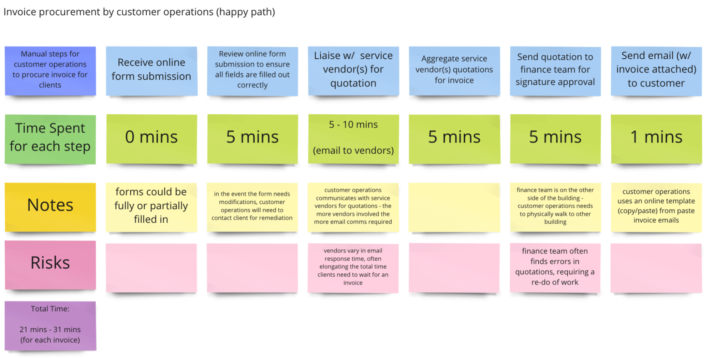

## How to Use this Method

{}

### Sample Agenda & Prompts
1. Identify a key metric you wish to quantify a baseline from performing impact analysis. For instance, if a business goal of the project or product is to decrease time spent on a particular manual process, you could re-state this at the start of this activity.
   
   
   **Example**: “We will be performing impact analysis on our invoice generation process to see the opportunities for time efficiency.”
   

1. Identify the [Persona](/practices/personas) your team will be mapping the workflow against.

1. Identify which specific workflow the team is mapping; examples might include contracts flow or booking an event. Explain that you will start mapping the “happy flow” workflow. You can define the “happy flow” as the workflow that typically occurs when the business carries out a particular flow or process.

   
   **Example:** “We will start by mapping out the invoice generation process. We will assume, for our ideal workflow, that no amendments or errors in the invoice during generation will occur.”
   

1. Write each step in the workflow on an individual sticky note along with the participants.

1. After a first draft workflow has been mapped, walk through each step with participants to ensure there is alignment and no step has been misinterpreted or neglected.

1. For each step in the workflow, discuss and append the quantity.

   
   **Example:** “This step takes 25 seconds each time”, “This step costs the company $1.25 every transaction."
   

1. Tally the total quantity spent for the “happy flow” workflow.

   
   **Example:** “The contracts manual process costs the company 125 minutes for every contract creation”, “The manual hiring process costs the company $1,432 for each new hire.”
   

1. Consider edge cases that may arise and map them to the workflow.

   
   **Example:** “If step X during invoice generation results in erroneous figures, then the 'ideal flow' workflow will need to take on an additional step.”
   

1. Tally the total quantity spent for each of the edge cases like in the “happy flow”. This will allow you to understand the different ranges of impact that can be added to the “ideal flow” workflow.

   
   **Example:** “If we were to require an amendment to a contract during contract creation, this would represent an additional 30 minutes on top of the baseline estimate of 125 minutes.”
   

1. Optional: Your participants may want to add notes and/or risks to each of the steps. This will better help identify additional areas of opportunities for improvement.

{}

{}
### Success/Expected Outcomes
You know you are done when we have an estimated value of the impact on a key business metric from an entire workflow.

An example key business metric might be: *Total time spent to fulfill manual contract process is 215 minutes.*

In addition, by attaching a value to the key business metric, the Product Manager should be able to confidently align a product goal/metric. This will help better influence product decisions and prioritization of efforts.
{}

{}
### Facilitator Notes & Tips
- While several variables can be discovered through impact analysis, it is suggested to focus on one for each impact analysis activity.
- Oftentimes, quantifying a manual process and identifying business opportunities leads to employee redundancy. Sensitivity and consideration may be required where the business metric involves operational costs incurred from headcount. It is advisable to discuss with stakeholder(s) how deep you want to conduct the analyses in front of participants, and which parts to discuss in private.
- Be sure to include at least 2 Subject Matter Experts (SMEs) in this exercise to avoid missed steps and inaccurate estimations.
You can use an existing Tanzu practice ([Journey Map](/practices/journey-map)) here as a reference when mapping out the workflows.
- The journey for which we are measuring the business impact may not always be the same as that for the primary user of the product
- Optional: Add notes (insights, pain points) to any step in the workflow. This may come in handy for future product development.
{}

{}
## Related Practices
- [Goals & Anti-Goals](/practices/goals-anti-goals/)
Objectives and Key Results (OKRs)
- [Product Valuation](/practices/product-valuation/)
- [Journey Map](/practices/journey-map/)
{}

{}
## Real World Examples

The above example details a manual workflow by a customer operations team procuring an invoice from a client via online form submission.

{}
