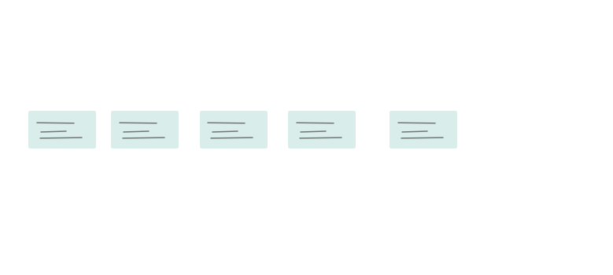
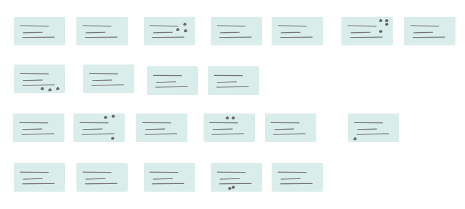
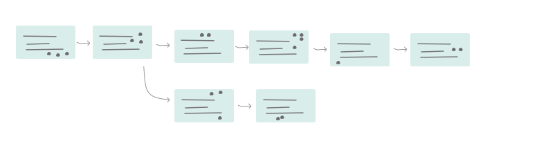
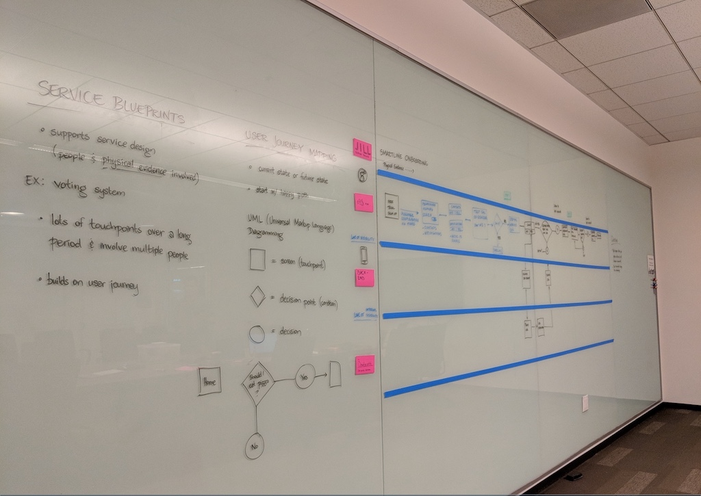

## How to Use this Method

{}
### Sample Agenda & Prompts
1. Identify which users journey the team is mapping. Leverage existing [Personas](/practices/personas) and if multiple choose the most important one to start

1. Map alone, together (10 minutes)
   - Have each person create a user journey in front of them, separating each step into individual sticky notes. This looks like a horizontal timeline of no-more-than 10 sticky notes

   

1. Share individual journeys with the team (10 minutes)
   - One at a time, each person sticks their timeline on the whiteboard. Each timeline should stack beneath the last so all are aligned from the first step onward

   

1. Dot voting (10 minutes)
   - Have everyone review each others journey and ask any clarifying questions. After questions, everyone is given dot stickers to vote on steps they think are interesting or important

   

1. Consolidate into one big story (10 minutes)
   - Throw out all sticky notes without dots
   - Combine duplicate stickies and rearranges the stacked timelines into one large timeline
   - Draw arrows between stickies and mark the amount of time between steps, if possible. If there are multiple “routes”, you can split the timeline up vertically

   

1. Mark customers emotions and pain points (10 minutes)
   - As a group, read through the finished timeline and mark points in time that the persona experiences a “pain point” (use a different color marker for this on the whiteboard or on sticky notes)
   - If you have the data to support it, track the persona’s emotions throughout the journey using a horizontal line that rises and falls in accordance with the pain points

1. Identify opportunities along the journey (10 minutes)
   - Have the team read through the completed journey map one more time, asking all participants to write “how might we” statements on a sticky note, whenever they identify a moment for intervention/improvement.
{}

{}
### Success/Expected Outcomes
At the end of a Journey Map the team will have a shared holistic view of a Persona’s experience. The process reveals opportunities to address user pain points and prevents misalignment during the “framing” process.
{}

{}
### Facilitator Notes & Tips

- Create one Journey Map per Persona. If there are other [Personas](/practices/personas)
 to consider, map them as touch points from a single [Personas](/practices/personas) perspective.
- To understand more detail and complexity consider using a Service Blueprint to map a product/service’s “backstage actions” and “support processes” to an individual customer journey.
{}

{}
### Preceding
- [Personas](/practices/personas)
- [Research Synthesis](/practices/research-synthesis)
{}

{}
### Following
[Service Blueprint](/practices/service-blueprint)
[Scenario Writing](/practices/scenario-writing)
{}

{}
### Real World Examples

{}

{}
### Recommended Reading

[Design Sprint journey mapping technique](https://sprintstories.com/the-design-sprint-note-n-map-a9bf0ca88f51)  
[The difference between a journey map and a service blueprint](https://blog.practicalservicedesign.com/the-difference-between-a-journey-map-and-a-service-blueprint-31a6e24c4a6c)  
[Adaptive Path's guide to Experience Mapping (PDF download)](https://adaptivepath.s3.amazonaws.com/apguide/download/Adaptive_Paths_Guide_to_Experience_Mapping.pdf)
{}