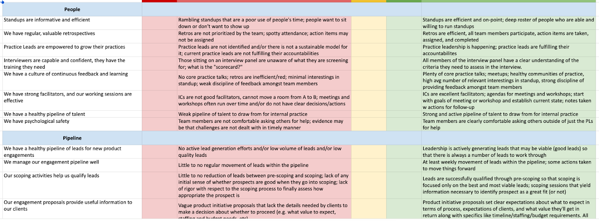

## How to Use this Method

{}
### Sample Agenda & Prompts

1. As a team, define what you want to measure the health of (e.g. psychological safety, collaboration, feedback management, project assignment process). These measures should be about how you work together as a team to deliver on your objectives, not an assessment of the health of the entire organization (which should come from a variety of sources including health checks at the product team level). Here’s a common template to use as a starting point:

   - Our meetings are informative and efficient
   - We have regular, valuable retrospectives 
   - We have a culture of continuous feedback and learning 
   - We have psychological safety 
   - We have the right people staffed to the right projects 
   - Our product teams are solid in our core practices 
   - We have healthy interactions with product teams 
   - We have healthy relationships with adjacent organizations (platform, security, etc.) 
   - We have clarity of vision and responsibilities 
   - We are working on the right projects 

1. Create a Miro board or spreadsheet for capturing results and tracking them over time (see example below).

1. Have each person evaluate each topic individually. 

1. Discuss the results for each topic.

1. Identify action items related to scores that are not green  or trending green.

1. This can be done one topic at a time (vote, discuss, move to next topic) or with all voting done at the start (vote on all topics, aggregate scores and choose topics to discuss based on results). For the first time or two, we recommend the one-topic-at-a-time approach. 

{}

{}
### Success/Expected Outcomes
You know you’re done when you have aggregated scores for each topic, and clear action items with owners for how to improve the scores in the next health check. 
{}

{}
### Real World Example

{}