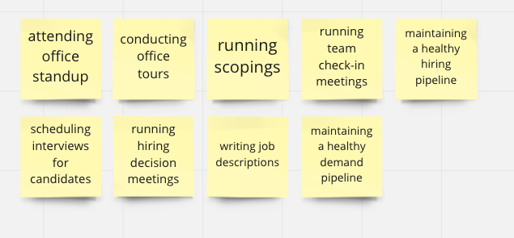
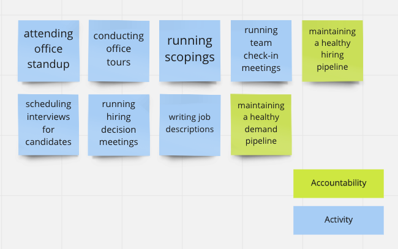
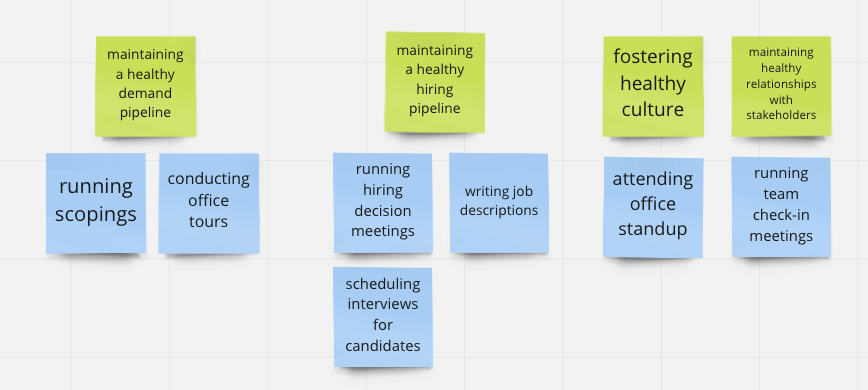
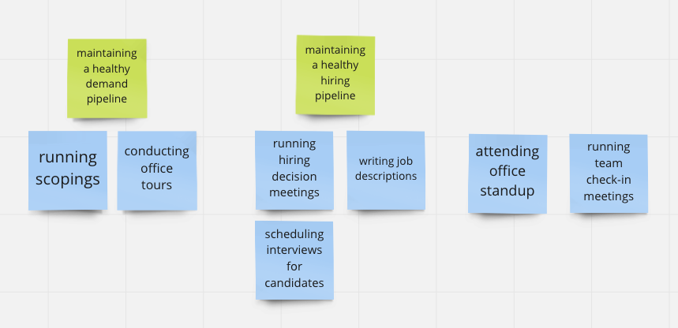
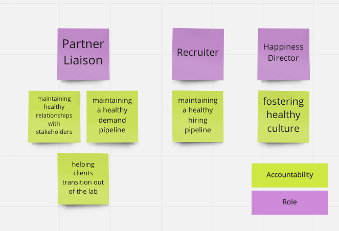

## How to Use this Method


**Regarding Participants:** All members of the leadership team who need to define their roles should attend. For example, on a portfolio leadership team, you might include the Portfolio Manager, Portfolio Designer, and Portfolio Engineer. 

Make sure not to leave out any team members, and don't attempt to define their role without them present to share their perspective.


{}
### Sample Agenda & Prompts

1. Brainstorm
   
   Working individually, have each person capture the work they do on sticky notes. Set a timer for 5 minutes, and write one activity per sticky note, using short phrases (3-8 words) starting with an _“-ing”_ verb like “creating.” Use calendars for inspiration! If people need more time, add 5 more minutes to the timer. 

   

1. Deduplicate
   
   As a group, merge like activities together, and replace the groups with single sticky notes that capture the essence of the group.

1. Identify “activities” and “accountabilities”
   
   The work captured typically falls into two groups: the activities that contribute to our outcomes, and the outcomes themselves. Often the first step in this workshop generates a mix of activities and accountabilities. We don’t want our roles to be described as “how” someone succeeds, but instead we want to show what it means to succeed.

   Color code the items generated, using one color for activities and a different color for accountabilities (if you’re doing this in person, you can give this instruction at the start in order to reduce rewriting of sticky notes). 

   

1. Associate activities with accountabilities
   
   Arrange activities underneath the accountability they contribute to. 

   

1. Create accountabilities for orphan activities
   
   Don’t expect brainstorming to capture everything. This step is about catching items we missed in the first pass. For each activity that is not associated with an accountability, brainstorm what accountability it should contribute to. The two most likely outcomes of this are: 1) a new accountability to associate the activity with, or 2) the revelation that the activity does not lead to an outcome. 

   

   
   **Tip**: If you can’t come up with a valuable accountability for an activity, consider not doing it anymore, and remove it from the board. 
   

1. Group related accountabilities into roles
   
   Until this point, we’ve avoided the concept of roles. In particular, we’ve avoided capturing any existing roles or titles. The reason for this is that many organizations create and name roles without having a clear understanding of the results of the activities we do. This process evolves our roles from the outcomes we want to achieve as a team. 

   Set aside the activities for now, and group accountabilities by the purpose they serve, the areas they interact with, or the domains they are responsible for.  

   For instance, say two accountabilities concern our relationships with external partners. Thus we decide to group those two partner relationship accountabilities into   a single role which we name Partner Liaison.

   Write the name of each role above the accountabilities group. 

   

   
   **Tip:** One person can fill multiple roles. Wait until the end of the workshop to determine if roles and titles should have a 1:1 relationship or not. 
   

1. Discover missing accountabilities by role 

   Just as we discovered accountabilities that we had missed for orphaned activities, we next take the opportunity to lean on the newly named roles to remind us of accountabilities that we missed in our earlier brainstorm.

   Understanding the purpose of a role can go a long way to illuminating additional accountabilities (see next step).

1. Define the purpose for each role
   
   Define the reason that the role exists, and write it beneath the role. The Partner Liaison might have a purpose of, “Shepherding Partner Engagements to Success”.

1. Optional: Identify gaps 

   If you generated accountabilities for things that should be happening, but no one is doing, discuss how you’ll address these gaps at this stage. You will likely need a follow up working session to discuss how to handle this. If your team is at capacity, will you let go of some accountabilities, or delegate to someone else, or hire a new team member? 

1. Document and radiate

   After the workshop, create a document that maps roles, accountabilities, and activities. Share it with the workshop attendees, direct reports, superiors, and anyone else in the organization who would benefit from clarity on these roles.

1. Follow up
   
   This workshop often generates follow up work. You may want to revisit job postings, adjust how you manage performance, or reorganize your team to better align to your organization’s needs. 

{}

{}
### Success/Expected Outcomes
At the end of this workshop, you should have improved your shared understanding of people’s roles and accountabilities. You may also have follow up action items to address any gaps or changes you want to make as a result. 

It’s important to recognize that you won’t “get it right” in the first pass (or ever), but it’s safe to move forward and improve over time.
{}

{}
### Facilitator Notes & Tips
It’s best to have an outside facilitator for this activity, so that you can participate in generating information about your role and accountabilities, and so that the facilitator can remain impartial and balance the participation of everyone. 
{}