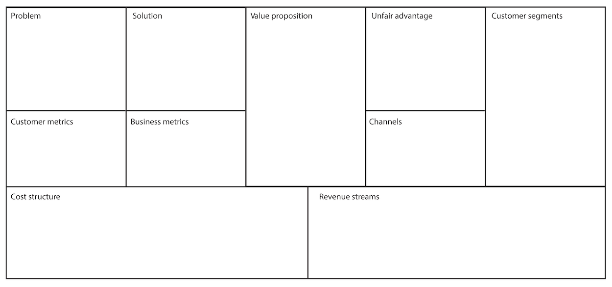
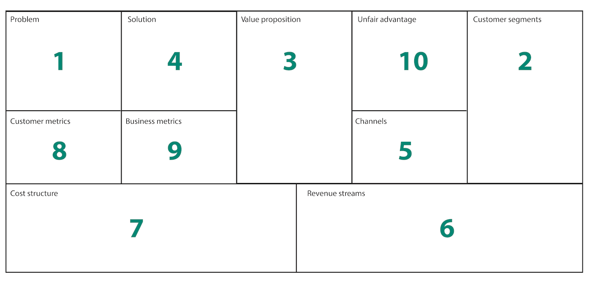
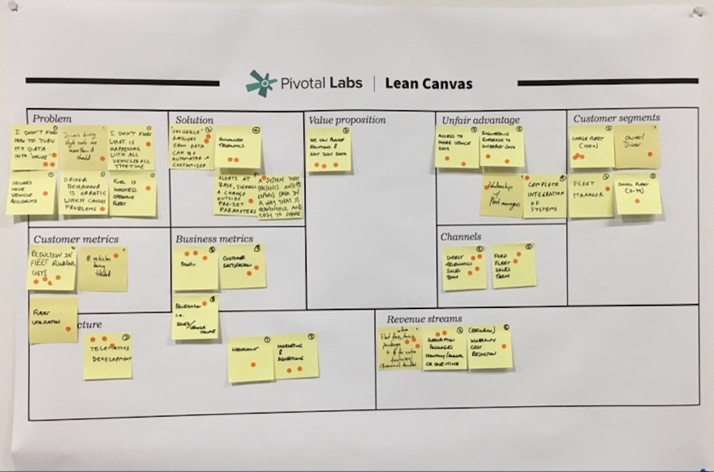

## How to Use this Method

{}
### Sample Agenda & Prompts
1. Draw the lean business canvas on the whiteboard

   

1. Explain the lean business canvas, one section at a time, using a common business as an example (e.g. “yelp”)

1. After the explanation, start to ideate by having each participant write what they think should fill into **one section** (starting with the “Problem”)

   {}
   **Tip**: If you are working with a larger group, instead of asking each person to fill in the canvas, you can split into groups of three.
   {}
1. After 2-3 minutes, go around the room and “de-duplicate” the ideas (e.g. when Joe reads his sticky note and Sally wrote the same thing, Sally will not read that when her turn comes around)

1. Put all the "de-duplicated" stickies on the board (outside of the canvas) and proceed to “dot vote”

1. The single or few stickies that have the most dots should be moved to the section they belong in.

1. Repeat steps 4-6 for each section in the following order:
   - Problem
   - Customer segments
   - Value proposition
   - Solution
   - Channels
   - Revenue streams
   - Cost structure
   - Customer metrics
   - Business metrics
   - Unfair advantage

   
{}

{}
### Success/Expected Outcomes
Success is when you have agreement and understanding of the product market fit, what value we’re delivering from a customer perspective, and an idea of how to sustain this business.
{}

{}
### Facilitator Notes & Tips

- If the group is small, dot voting may be unnecessary.
- later sections may not need as much (or any) ideation time since participants may be able to shout out a shared set of answers.
- Revenue is one way to measure success, that box could be renamed to **Outcomes**
- Update this business model week over week, it’s meant to be used over time.
{}

{}
### Preceding
- [Molecule Map](/practices/molecule-map)
- [Personas](/practices/personas)
{}

{}
### Real World Examples

## Recommended Reading

[Business Model Generation book](https://www.strategyzer.com/books/business-model-generation)  
[Business Model Canvas Yelp](https://www.innovationtactics.com/business-model-canvas-yelp/)
{}