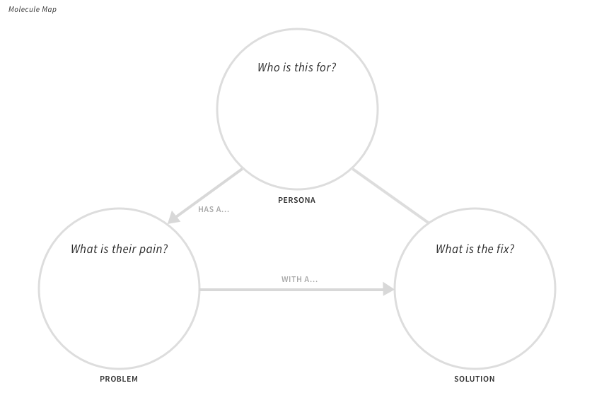
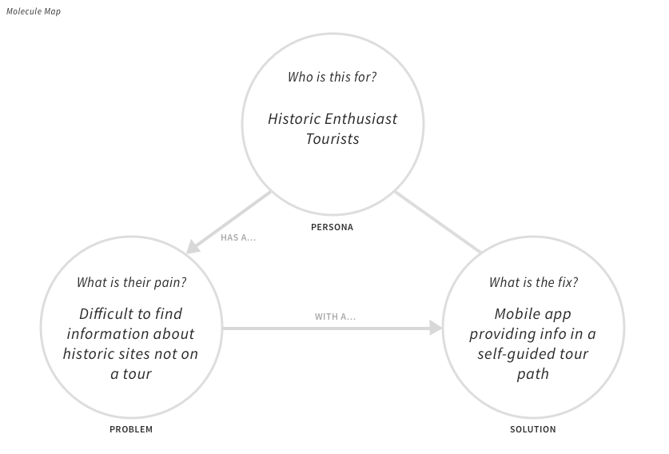
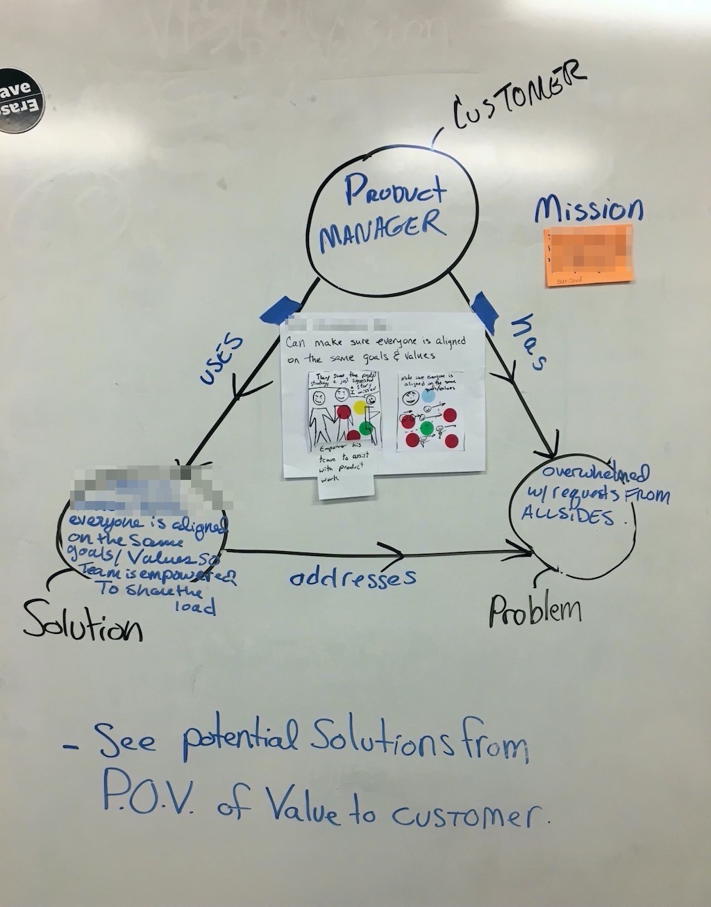
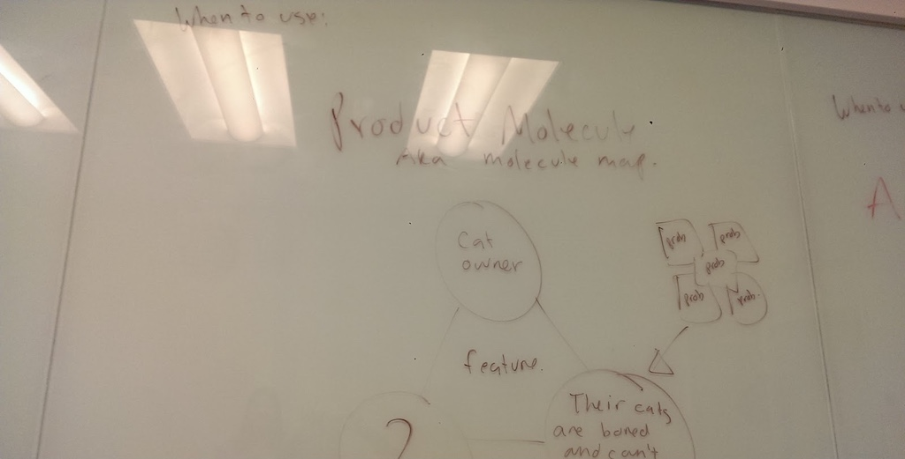

## How to Use this Method

{}
### Sample Agenda & Prompts
1. Review the [Crafting a Molecule](https://tanzu.vmware.com/content/vmware-tanzu-developer-center-slides/molecule) presentation and familiarize yourself with the concept, how to arrive at solutions, and how to identify anti-patterns.

   <iframe src="//www.slideshare.net/slideshow/embed_code/key/1wtb5448ncVV6E" width="595" height="485" frameborder="0" marginwidth="0" marginheight="0" scrolling="no" style="border:1px solid #CCC; border-width:1px; margin-bottom:5px; max-width: 100%;" allowfullscreen> </iframe> 
 <strong> <a href="//www.slideshare.net/VMwareTanzu/molecule-242998322" title="Molecule" target="_blank">Molecule</a> </strong> from <strong><a href="https://www.slideshare.net/VMwareTanzu" target="_blank">VMware Tanzu Developer Center Slides</a></strong> 

1. Draw an example molecule on the physical or digital whiteboard

   - Persona — Who are we helping? (use the [Personas](/practices/personas) practice) practice if you haven't created one yet)
   - Problem — What is one of their problems?
   - Solution — What is our solution?

   

1. Get into groups of 3 or ask each person to draw 3 circles on a piece of paper and draw multiple molecules. Come up with as many solutions as possible.

   {}
   **Remote Tip:** Many video chat systems support "breakout rooms" or similar means to temporarily divide large groups into smaller groups for closer collaboration. Also, feel free to use real paper and hold it up to the camera when the group is remote.
   {}

   
   
1. Tape or upload molecules onto the board. Treat these as assumptions to go validate.

1. Silent read & dot vote to get down to 1 molecule
{}

{}
### Success/Expected Outcomes
Success is when you have agreement on the problem and solution (aka snapshot)to move forward with as a team. You’re doing it right when you are thinking of users as humans.
{}

{}
### Real World Examples

{}