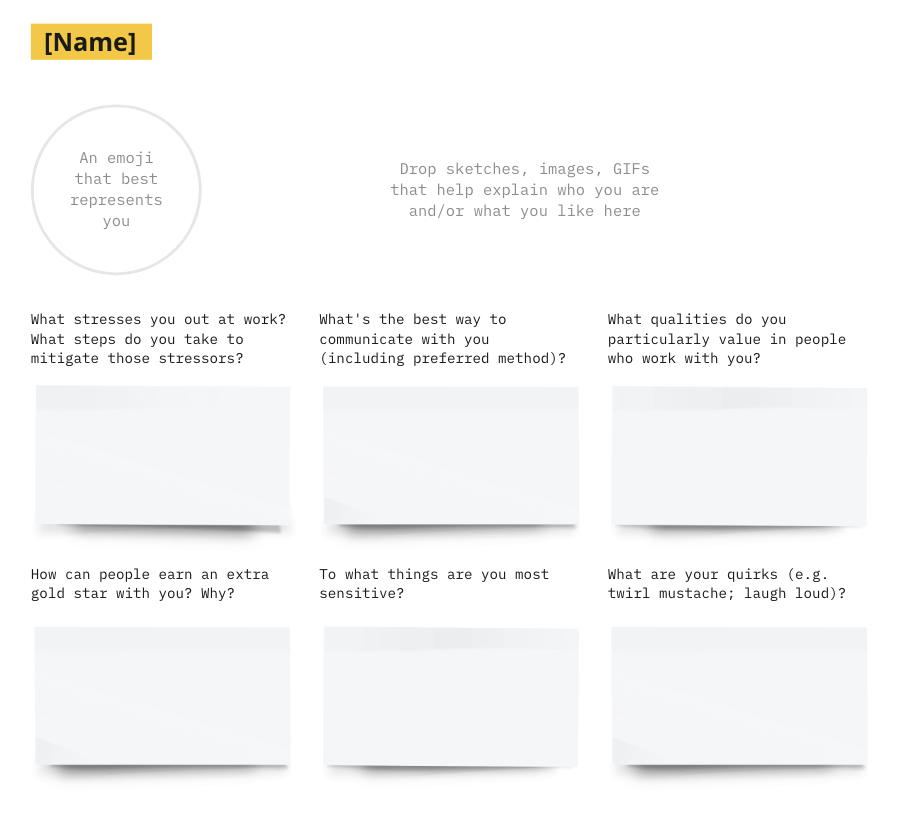
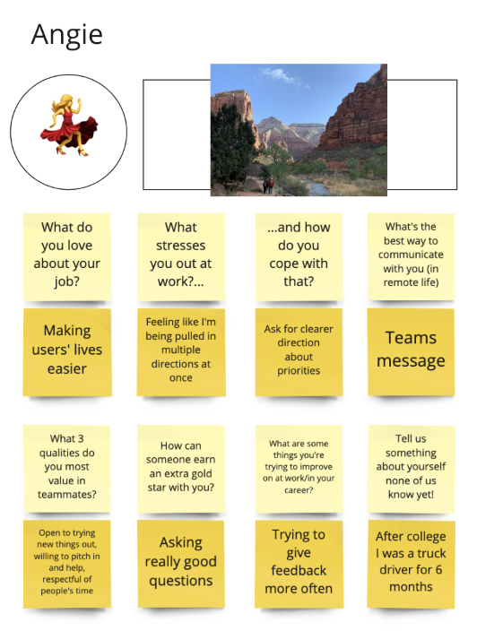

## How to Use this Method

{}
### Preparation
1. Choose 6-12 questions you want to ask. Aim for a balance between fun, icebreaker-style questions and ones that are more targeted towards working together and conflict management.

   {}
   **Tip**: Use the [Personal User Manual **Miro Template**](https://miro.com/miroverse/personal-user-manual/) to help facilitate this session.
   {}

1. Create templates in a remote whiteboard, a physical whiteboard, or on paper. Include each question as well as a place to paste or sketch pictures.

   

1. Create an example for a made-up persona to talk through with the team.

   

1. Schedule a workshop that everyone on the team can attend. Plan for 5 minutes intro, 10 minutes for manual creation, and around 3 minutes per person to discuss.

{}
{}

### Workshop
1. Explain the activity and walk through your example persona.

1. Give the group 10 minutes to create their own manuals.

1. Share and discuss the user manuals. Two good ways of doing this:
   - Go through the group one by one and have each person read through and discuss their “personal user manual.” Let people ask questions after each one.
   - Give the team a few minutes to silently add comments and questions to each other’s manuals, then give each person a chance to respond out loud to the comments on their manual. 

1. Discuss your takeaways as a group. Look for patterns that might inform your team norms.

1. Save the manuals (or photos of them) somewhere where the team can easily access them. Encourage the team to refer back to them throughout the project when they are wondering how to improve their relationships on the team.

{}

{}
## Success/Expected Outcomes
By the end of this exercise, the team should have a better sense of how to have the best working relationship with each other—and have had a fun time getting to know each other a little better!
{}

{}
## Facilitator Notes & Tips
This exercise can be done asynchronously as well as in a workshop. You can give people the template in advance and give them the option to work on their user manual before the workshop, then use your time together to discuss and ask questions.

Sample questions below.

**Fun**
- What’s something on the team no one knows about you?
- What are you currently obsessed with?
- What’s something you’re surprisingly bad at?
- What’s the last good book you read?

**Work-related**
- What do you love about your job?
- What are three qualities you appreciate in a teammate?
- How does someone earn an extra gold star with you?
- What are your goals on this project?

**Conflict management**
- What stresses you out at work?
- How do you respond to stress at work?
- How do you like to receive feedback?
- What are some things you’d like to gather feedback on?

Avoid asking direct personal questions, but rather leave them open-ended so people don’t feel pressured to share more than they’re comfortable with.

{}

{}
## Related Practices
[Speedback Feedback](/practices/speedback)

Setting up regular 1-on-1s with your teammates (this gives you ideas for things to talk about)

{}

{}
## Sources
[My User Manual](https://www.atlassian.com/team-playbook/plays/my-user-manual) from from Atlassian.

[Communicating to yourself and others — Your Personal User Manual and other great tools](https://medium.com/10x-curiosity/communicating-to-yourself-and-others-your-personal-user-manual-and-other-great-tools-cb015400ee02) by Tim Connor.

{}
