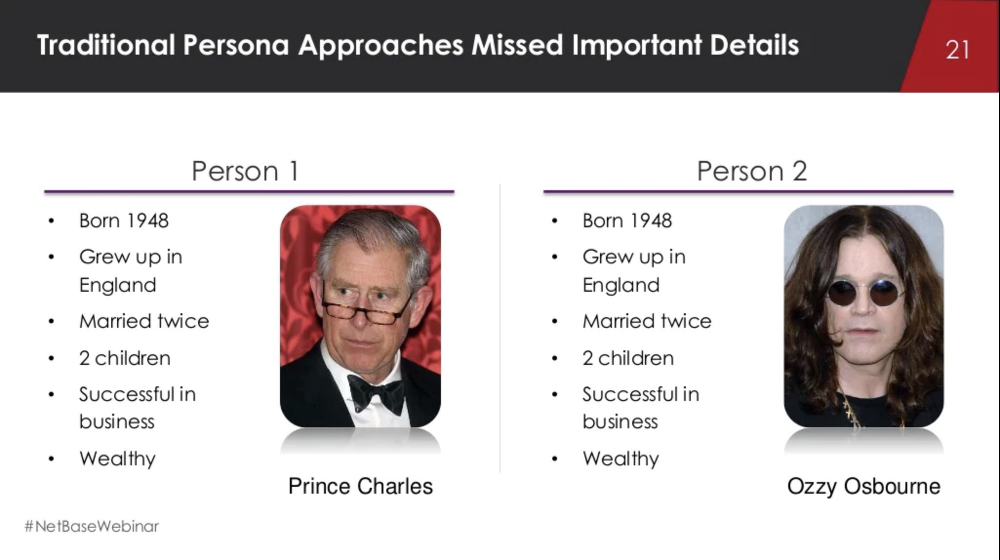

<h2 id="how-to-use-this-method">이 방식을 활용하는
방법</h2>

<svg height="30"
aria-hidden="true" focusable="false"
data-prefix="far" data-icon="lightbulb"
role="img" xmlns="http://www.w3.org/2000/svg"
viewBox="0 0 352 512" class="svg-inline--fa
fa-lightbulb"><path fill="currentColor"
d="M176 80c-52.94 0-96 43.06-96 96 0 8.84 7.16 16 16 16s16-7.16
16-16c0-35.3 28.72-64 64-64 8.84 0 16-7.16 16-16s-7.16-16-16-16zM96.06
459.17c0 3.15.93 6.22 2.68 8.84l24.51 36.84c2.97 4.46 7.97 7.14 13.32
7.14h78.85c5.36 0 10.36-2.68 13.32-7.14l24.51-36.84c1.74-2.62 2.67-5.7
2.68-8.84l.05-43.18H96.02l.04 43.18zM176 0C73.72 0 0 82.97 0 176c0
44.37 16.45 84.85 43.56 115.78 16.64 18.99 42.74 58.8 52.42
92.16v.06h48v-.12c-.01-4.77-.72-9.51-2.15-14.07-5.59-17.81-22.82-64.77-62.17-109.67-20.54-23.43-31.52-53.15-31.61-84.14-.2-73.64
59.67-128 127.95-128 70.58 0 128 57.42 128 128 0 30.97-11.24
60.85-31.65 84.14-39.11 44.61-56.42 91.47-62.1 109.46a47.507 47.507 0
0 0-2.22 14.3v.1h48v-.05c9.68-33.37 35.78-73.18 52.42-92.16C335.55
260.85 352 220.37 352 176 352 78.8 273.2 0 176 0z"
class=""></path></svg>

<strong>원격
팁:</strong> 분산된 팀의 경우 <a href="https://miro.com/"
target="_blank" rel="nofollow">Miro</a>
또는 이와 유사한 “디지털 화이트보드”를 사용하고 디지털 환경에 그리기 및 스티커 메모 사용과 같은 대면 환경의 요소를
도입하십시오.

<strong><a href="#variations">추가 원격 팁은
아래 변형 섹션에 있습니다</a>.</strong>

<h3 id="sample-agenda--prompts">샘플 안건 및 메시지</h3>

<ol>

<li>

회의실을 작은 그룹으로 나누고 각 그룹에게 종이를 한 장씩 나누어 줍니다.

<svg height="30"
aria-hidden="true" focusable="false"
data-prefix="far" data-icon="lightbulb"
role="img" xmlns="http://www.w3.org/2000/svg"
viewBox="0 0 352 512" class="svg-inline--fa
fa-lightbulb"><path fill="currentColor"
d="M176 80c-52.94 0-96 43.06-96 96 0 8.84 7.16 16 16 16s16-7.16
16-16c0-35.3 28.72-64 64-64 8.84 0 16-7.16 16-16s-7.16-16-16-16zM96.06
459.17c0 3.15.93 6.22 2.68 8.84l24.51 36.84c2.97 4.46 7.97 7.14 13.32
7.14h78.85c5.36 0 10.36-2.68 13.32-7.14l24.51-36.84c1.74-2.62 2.67-5.7
2.68-8.84l.05-43.18H96.02l.04 43.18zM176 0C73.72 0 0 82.97 0 176c0
44.37 16.45 84.85 43.56 115.78 16.64 18.99 42.74 58.8 52.42
92.16v.06h48v-.12c-.01-4.77-.72-9.51-2.15-14.07-5.59-17.81-22.82-64.77-62.17-109.67-20.54-23.43-31.52-53.15-31.61-84.14-.2-73.64
59.67-128 127.95-128 70.58 0 128 57.42 128 128 0 30.97-11.24
60.85-31.65 84.14-39.11 44.61-56.42 91.47-62.1 109.46a47.507 47.507 0
0 0-2.22 14.3v.1h48v-.05c9.68-33.37 35.78-73.18 52.42-92.16C335.55
260.85 352 220.37 352 176 352 78.8 273.2 0 176 0z"
class=""></path></svg>

<strong>팁</strong>:
그룹이 소규모인 경우, 개인 단위로 이 연습을 진행해도 괜찮습니다. 여러 화상 채팅 시스템이 보다 긴밀한 협력을 위해
일시적으로 대규모 그룹을 더 작은 그룹으로 분리하는 “소회의실” 또는 이와 유사한 수단을
지원합니다.

</li>

<li>

회의실의 “페르소나”를 정의하고 모든 참가자에게 이 사람은 임시 페르소나라는 것을 상기시킵니다. 연구를 통해
우리가 이 사람에 대해 알고 있다고 생각하는 바를 바꾸고 발전시킬 수 있습니다.

<svg height="30"
aria-hidden="true" focusable="false"
data-prefix="far" data-icon="lightbulb"
role="img" xmlns="http://www.w3.org/2000/svg"
viewBox="0 0 352 512" class="svg-inline--fa
fa-lightbulb"><path fill="currentColor"
d="M176 80c-52.94 0-96 43.06-96 96 0 8.84 7.16 16 16 16s16-7.16
16-16c0-35.3 28.72-64 64-64 8.84 0 16-7.16 16-16s-7.16-16-16-16zM96.06
459.17c0 3.15.93 6.22 2.68 8.84l24.51 36.84c2.97 4.46 7.97 7.14 13.32
7.14h78.85c5.36 0 10.36-2.68 13.32-7.14l24.51-36.84c1.74-2.62 2.67-5.7
2.68-8.84l.05-43.18H96.02l.04 43.18zM176 0C73.72 0 0 82.97 0 176c0
44.37 16.45 84.85 43.56 115.78 16.64 18.99 42.74 58.8 52.42
92.16v.06h48v-.12c-.01-4.77-.72-9.51-2.15-14.07-5.59-17.81-22.82-64.77-62.17-109.67-20.54-23.43-31.52-53.15-31.61-84.14-.2-73.64
59.67-128 127.95-128 70.58 0 128 57.42 128 128 0 30.97-11.24
60.85-31.65 84.14-39.11 44.61-56.42 91.47-62.1 109.46a47.507 47.507 0
0 0-2.22 14.3v.1h48v-.05c9.68-33.37 35.78-73.18 52.42-92.16C335.55
260.85 352 220.37 352 176 352 78.8 273.2 0 176 0z"
class=""></path></svg>

<strong></strong>sd

“페르소나는 인구 통계와 관련된 것이 아니라, 개인이 마주하는 문제, 그리고 당면 과제와 관련된
것입니다.”

<em>이미지 출처: <a
href="https://www.slideshare.net/netbasemarketing/the-5-hottest-trends-in-social-analytics/22"
target="_blank" rel="nofollow">NetBase
Solutions Inc.</a></em>

</li>

<li>

각 그룹 또는 개인에게 종이를 사분면으로 접으라고 지시합니다.

</li>

<li>

보드에 다음의 각 사분면으로 템플릿을 그립니다.

<ul>

<li>왼쪽 상단 &rarr; 한 장소에서 작업을 수행하는 사람의 그림, 이름, 얼굴, 감정, 생각이
포함됨</li>

<li>왼쪽 하단 &rarr; 인구 통계(이름, 나이, 역할, 수입, 위치, 성별과 같은 사실
정보)</li>

<li>오른쪽 상단 &rarr; 행동(하는 일, 좋아하는 것, 싫어하는 것, 취미)</li>

<li>오른쪽 하단 &rarr; 요구와 목표(원하는 것, 해결 과제, 희망하는 것)</li>

</ul>

</li>

<li>

팀(또는 개인)에게 7~8분 동안 조용히 템플릿을 따라 종이를 작성하도록 합니다.

</li>

<li>

각 팀의 대표자(또는 각 개인)에게 보드 앞으로 나와 페르소나를 걸고 그룹에 대해 자신들이 생성한 각 인물을
설명해 달라고 요청합니다.

</li>

<li>

각 사람에게 4개의 점을 나누어 주고 사용자를 가장 잘 설명한다고 생각하는 사분면에 점을 부착하도록 합니다.
모든 종이의 각 사분면에 하나씩 총 4개의 점이 놓아집니다.

</li>

<li>

가장 점수가 높은 사분면을 하나의 통합된 페르소나에 함께 붙이고 그룹에게 읽어 줍니다.

<svg height="30"
aria-hidden="true" focusable="false"
data-prefix="far" data-icon="lightbulb"
role="img" xmlns="http://www.w3.org/2000/svg"
viewBox="0 0 352 512" class="svg-inline--fa
fa-lightbulb"><path fill="currentColor"
d="M176 80c-52.94 0-96 43.06-96 96 0 8.84 7.16 16 16 16s16-7.16
16-16c0-35.3 28.72-64 64-64 8.84 0 16-7.16 16-16s-7.16-16-16-16zM96.06
459.17c0 3.15.93 6.22 2.68 8.84l24.51 36.84c2.97 4.46 7.97 7.14 13.32
7.14h78.85c5.36 0 10.36-2.68 13.32-7.14l24.51-36.84c1.74-2.62 2.67-5.7
2.68-8.84l.05-43.18H96.02l.04 43.18zM176 0C73.72 0 0 82.97 0 176c0
44.37 16.45 84.85 43.56 115.78 16.64 18.99 42.74 58.8 52.42
92.16v.06h48v-.12c-.01-4.77-.72-9.51-2.15-14.07-5.59-17.81-22.82-64.77-62.17-109.67-20.54-23.43-31.52-53.15-31.61-84.14-.2-73.64
59.67-128 127.95-128 70.58 0 128 57.42 128 128 0 30.97-11.24
60.85-31.65 84.14-39.11 44.61-56.42 91.47-62.1 109.46a47.507 47.507 0
0 0-2.22 14.3v.1h48v-.05c9.68-33.37 35.78-73.18 52.42-92.16C335.55
260.85 352 220.37 352 176 352 78.8 273.2 0 176 0z"
class=""></path></svg>

<strong>팁</strong>:
재조립을 위해 사분면을 잘라야 할 경우를 대비하여 가위를 준비해 두는 것이
좋습니다.

</li>

<li>

이 페르소나가 대표하는 사람에 대한 접근 계획과 이 페르소나를 평가하기 위해 수행할 <a
href="https://tanzu.vmware.com/developer/practices/user-research-introduction-session/">사용자
연구 활동</a> 계획을 수립합니다. Tanzu Practices 센터에서 Discovery(탐색)로 레이블이
지정된 활동을 확인하면 다른 옵션을 볼 수 있습니다.

</li>

</ol>

<h3 id="successexpected-outcomes">성공/예상되는
성과</h3>

통합된 프로토 페르소나를 생성했으며 회의실의 모든 사람이 이 페르소나가 대상 청중을 가장 잘 나타낸다고
느낀다면 연습이 성공적인 것입니다. 중요한 다음 단계는 인터뷰를 비롯한 <a
href="https://tanzu.vmware.com/developer/practices/user-research-introduction-session/">사용자
연구</a>를 통해 이 페르소나를 검증하는 것이라는 사실을 기억하십시오.

<h3 id="variations">변형</h3>

<h4 id="machina-personas">기계 페르소나</h4>

API와 같은 “기술” 제품을 구축하고 사용자가 시스템인 경우(통합해야 하는 기존 애플리케이션 등) 기계
페르소나를 생성해야 합니다.

주요 차이점은 사용하는 사분면입니다.

<ul>

<li>왼쪽 상단 &rarr; 기계 페르소나를 의인화한 그림</li>

<li>왼쪽 하단 &rarr; 정보(시스템의 이름, 나이, 유형, 시스템이 이해할 수 있는 언어/형식과 같은
사실 정보)</li>

<li>오른쪽 상단 &rarr; 요구 및 책임(필요한 입력, 이러한 입력으로 시스템이 수행하는 것, 시스템이
일반적으로 수행하는 것)</li>

<li>오른쪽 하단 &rarr; 특이 사항(시스템과 통합/상호작용할 때의 모든 어려움 또는
특이점)</li>

</ul>

<h4 id="for-remote-teams">원격 팀의 경우</h4>

팀이 원격 환경에 있더라도 이 워크샵을 추진할 수 있습니다.

많은 온라인 협업 솔루션이 그리기 기능을 갖추고 있지만, 디지털 기술을 덜 사용하고 종이와 카메라를 더 많이
사용하는 것이 좋습니다.

<ul>

<li>

사람들에게 위에 설명한 대로 실제 종이에 그림을 그리도록 지시합니다.

</li>

<li>

다음으로, 팀에게 휴대폰으로 사진을 찍고 공동 작업 공간에 올리라고 요청합니다.

또는 사람들이 채팅 앱, e-메일 또는 텍스트 메시지를 통해 진행자에게 사진을 보낼 수도 있습니다. 사람들은
웹캡으로 자신의 그림을 찍을 수도 있습니다. 이 경우 진행자가 스크린샷을 찍고 이미지를 공동 작업 공간에 올리면
됩니다.

</li>

</ul>

<h3 id="real-world-examples">실제 예시</h3>

