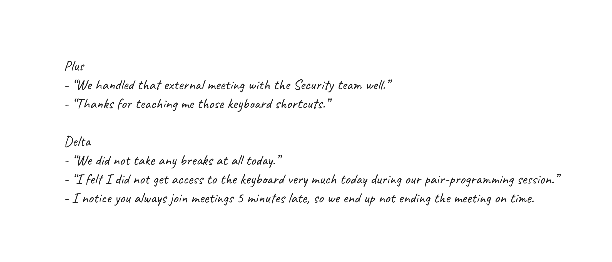

{}

## How to Use this Method
Plus/Delta allows feedback to focus on individual actions rather than team or group based actions generated from a group setting. It focuses on a more frequent feedback with a small audience.

{}
For teams that do not currently have a culture of feedback, the Plus / Delta is a light-weight technique to introduce a regular feedback cycle at a 1:1, individual level.
{}

{}
{}
### Sample Agenda & Prompts
1. Preparation: Set aside 3-5 minutes to think of any Pluses / Deltas during the day, ranging from small to large topics.

   **For example _(Plus)_:**
   - “We handled that external meeting with the Security team well.”
   - “Thanks for teaching me those keyboard shortcuts.”
   - "Your suggestion that we should talk to the Design lead when starting the next user story was spot-on."

   **For example _(Delta)_:**
   - “We did not take any breaks at all today.”
   - “I felt I did not get access to the keyboard very much during our pair-programming session today.”
   - "I notice you always join meetings 5 minutes late, so we end up not ending the meeting on time."

   

2. Find a quiet area or video conference session with just the two of you.

3. Take turns each going over a plus / delta, alternating between pluses and deltas.

5. Depending on the feedback, suggest changes for future working sessions.
   
   For example:
     - "Let's ensure that tomorrow at 11 AM and 3 PM we take a 10-minute break."
     - "Let's try the [Pomodoro technique](/learningpaths/application-development/pair-programming/#describe-the-mechanics-of-the-drivernavigator-style-of-pair-programming) tomorrow and see if it helps us have more balanced pairing sessions."
     - "If we have back-to-back meetings, let's make sure we end the first meeting on time, so we're not late to the next one."
{}

{}
## Success/Expected Outcomes
Both parties feel comfortable regularly providing feedback to each other in a clear and concise way. Eventually evolving to feedback that can be given when needed rather than a plus/delta session.

After a session of plus/delta both parties will take away actions they should continue doing and activities they can improve during their daily work day.
{}
{}

## Facilitator Notes & Tips
If the process took longer than 10-15 minutes a longer, more formal feedback session might be warranted.

Start doing this daily, scale down to less frequent as both participants feel comfortable.

Sometimes one or both parties are uncomfortable providing deltas or other constructive feedback. If plus/delta sessions consistently do not yield any deltas, try the following techniques: 
- start the session by describing how the day went. Both parties can then work together to extract the pluses and deltas based on these descriptions.
- implementing a format of “two pluses, one delta” to prompt both parties to suggest deltas in a more structured, blameless manner.
{}

{}
## Related Practices
- [Speedback Feedback](/practices/speedback)
{}

{}
## Recommended References 
[Thanks for the Feedback](
https://www.penguinrandomhouse.com/books/313485/thanks-for-the-feedback-by-douglas-stone-and-sheila-heen/) By Douglas Stone and Sheila Heen
– Recommended reading as a way to understand how people may interpret your feedback.

[REwork](https://basecamp.com/books/rework) by Jason Fried and David Heinemeier Hansson
{}
