## How to Use this Method
The time needed varies greatly for several reasons. For example, if you have the data already and are producing a fairly high level estimate, this could take a half day. If you have a complex product, need to gather a lot of data, and are producing a detailed estimate, it could take weeks.

{}
### Sample Agenda & Prompts
1. **Brainstorm Your Value** (30 min)
        
   Bring the full core team together.

   Give them 5 minutes to silently generate the value that they believe the team is creating. You can use some of these prompts to help them focus:

   - How are we making someone’s life/job easier?
   - What can they do now that their life is easier?
   - What connection did we make that wasn’t there before?
   - How is the system that we’re working within more efficient now?

   Have the group share out what they’ve written and affinity map (group) related items; you’ll use these in **Step 2.** Visit the ["brainstorm your values" part of the related Miro board](https://miro.com/app/board/o9J_lNuKt0U=/?moveToWidget=3074457356234182070&cot=14) for examples and more ideas on how to frame the prompts for your team.

   {}
   **Tip**: If appropriate, you can include stakeholders during this step. Use your judgement.
   {}
   
   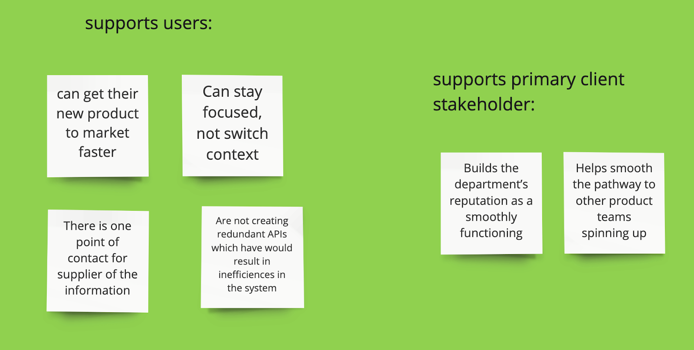

1. **Identify Assumptions**

   Choose the assumptions upon which you will base your calculations. This usually means:
   - **Prioritized pieces of value**. Take your brainstormed and affinity-mapped value ideas from **Step 1**, and pick the top few. There will be a long tail of value created, but if you include too many, you’ll make this exercise difficult and distract from the most important items.
   - **A unit**. Often value is communicated in terms of dollars, but hours is another popular choice. You can use whatever unit makes the most sense for your team.
   - **System boundary**. This is very important, but easy to overlook. You need to decide:
     - What amount of time you’ll include (i.e. “we’ll include value generated for the next 2 years”)
     - How many users you’re creating value for (i.e. just the people who use your product, or maybe also the people who use THOSE people’s product too, and so forth)

   Visit the ["identifying assumptions" section of the Miro board](https://miro.com/app/board/o9J_lNuKt0U=/?moveToWidget=3074457356234182071&cot=14) for more notes and examples on how to identify clear assumptions.

   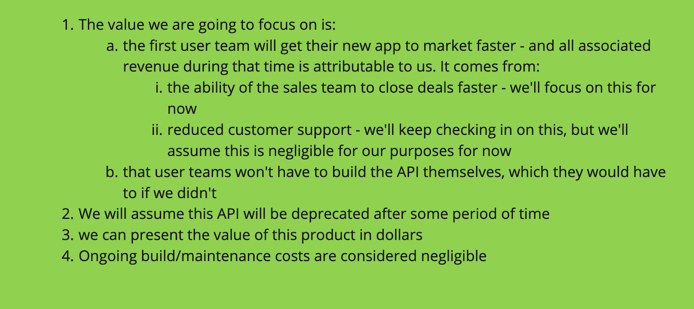

1. **Identify Input Numbers**

   Gather data through normal user research means, like talking to users, experts, etc. Make sure to gather:
   
   - A high, low, and average to support the range you’ll be building
   - The reasoning behind an opinion

   
   >“You don’t need to be precise - you just need to outrun your intuition.” -- Donald Reinertsen from *The Principles of Product Development Flow*
   

   Visit the ["identifying input numbers" section of the Miro board](https://miro.com/app/board/o9J_lNuKt0U=/?moveToWidget=3074457356234182072&cot=14) for more notes and examples about identifying the right input numbers.

   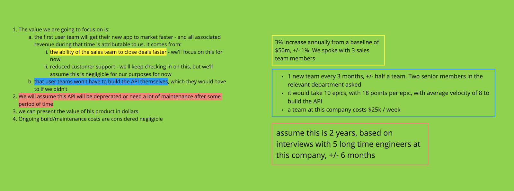

1. **Calculate Your Value & A Range**

   Plug your numbers into a spreadsheet to calculate the end valuation, as well as a range. The range is very important for building trust because it allows you to be transparent about the accuracy of your estimate.
   
   {}
   **Tip**: Feel free to use [this sample spreadsheet](/files/PM-onomics-Examples.xlsx) of a fictional product valuation, complete with sample formulas.
   {} 
   
   Here's an example:
  
   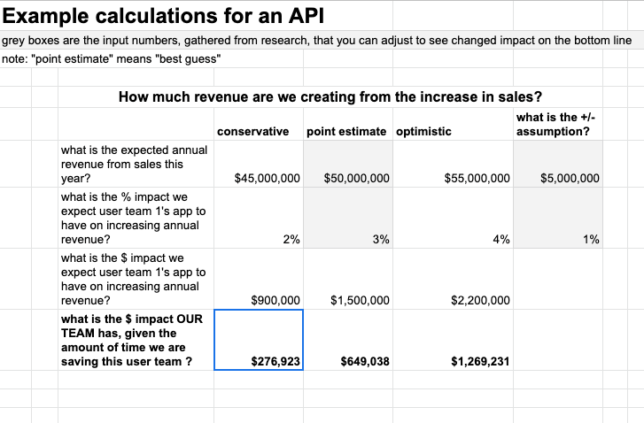
   
   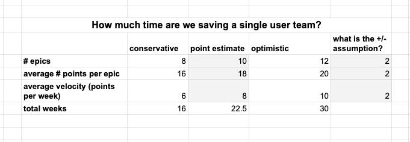
   
   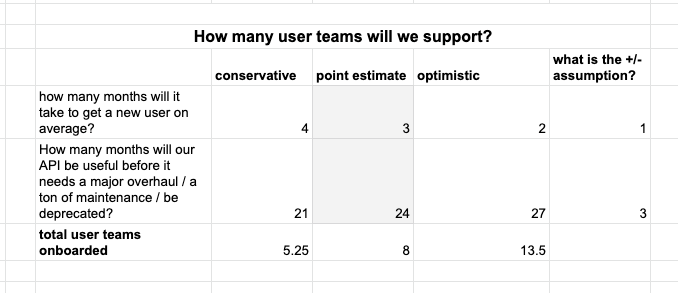
   
   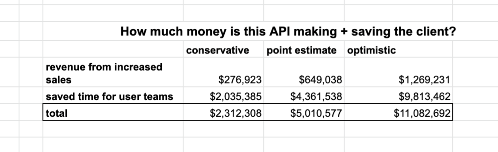

1. **Calculate Your ROI**

   Generate the return on investment in your team by dividing the product value you’ve calculated by the amount invested in your team.

   Visit the ["calculate the ROI of your team" section of the Miro board](https://miro.com/app/board/o9J_lNuKt0U=/?moveToWidget=3074457356234182074&cot=14) for more helpful notes.

   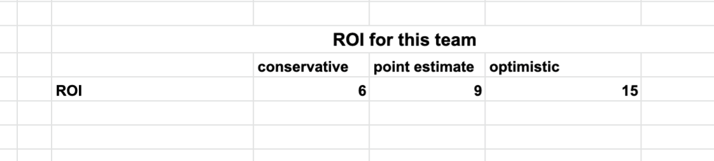

1. **Tell Your Story**

   Create a slide or other artifact to present the information you have gathered for your stakeholders. Remember:
   - Simplify, and put assumptions in the appendix
   - Transparency and consistency matter more than precision
   - ABI - Always Be Iterating: when you get new information,  use it to update and refine your calculations and resulting estimate

   Visit the ["tell your story" section of the Miro board](https://miro.com/app/board/o9J_lNuKt0U=/?moveToWidget=3074457356234182075&cot=14) for more helpful notes. 

   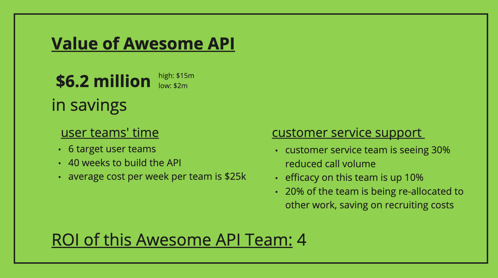
{}

{}
### Success/Expected Outcomes
A single slide that demonstrates the value prop that you can present to stakeholders, and is easily understood.
{}

{}
### Facilitator Notes & Tips

Remember to do a gut check at every step of the way - that means checking in with your stakeholders and other experts to make sure that you’re staying aligned with them and getting their input.

You may have some of the concerns listed below:

- "I can’t prove it"
- "Seems like we’re over-simplifying and therefore not representing the situation accurately"
- "Someone will poke holes in my calculations"
- "The situation will change and the numbers will get stale"

Our advice is to remember that:

- Your product valuation is a product itself - you’ll continue to user-test and iterate on it
- You can lean on your assumptions at all times - your assumptions might be wrong, but that’s ok. When you get better information, you’ll change them, and the resulting calculations
- Estimating the product valuation is just adding details to the intuition that your stakeholders already have that this product is valuable.
- The practice of making assumptions, building calculations on top of them, and making decisions based on those calculations is extremely common. People across industries do this every single day.
{}

{}
### Related Practices

In step 1 or 2, you may want to use a prioritization exercise similar to [Insight Prioritization](/practices/insight-prioritization).
{}

{}
### Real World Examples

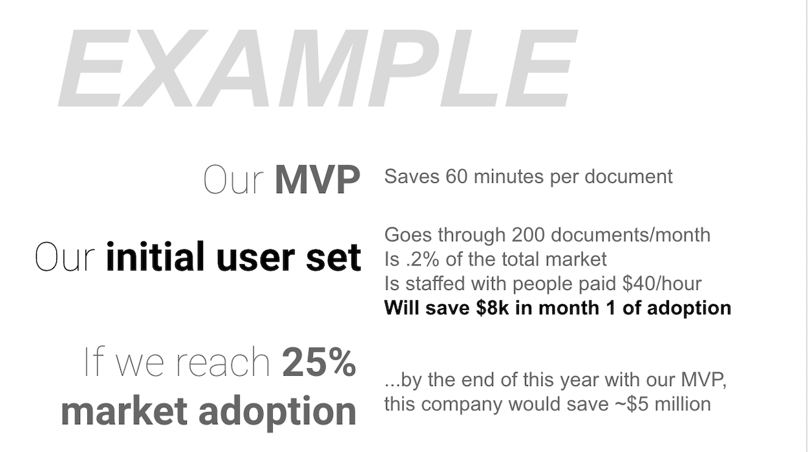

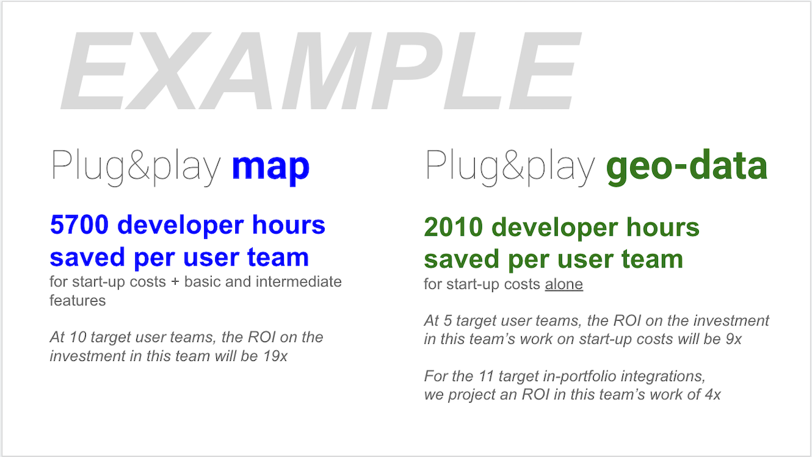
{}

{}
## Recommended Reading

["How to Measure Anything" by Douglas W. Hubbard](https://www.howtomeasureanything.com/) -- Book

[Measuring the Immeasurable](/blog/measuring-the-immeasurable) -- Blog Post

Particularly helpful for step 1
- <a href="https://www.brainpickings.org/2011/12/21/steve-jobs-bicycle-for-the-mind-1990/" target="_blank">The Computer as the Bicycle of the Mind</a>
- <a href="https://www.interaction-design.org/literature/article/google-s-heart-framework-for-measuring-ux" target="_blank">Google’s HEART Framework for Measuring UX</a>
- <a href="https://medium.com/@ms.mbalke/aarrr-framework-metrics-that-let-your-startup-sound-like-a-pirate-ship-e91d4082994b" target="_blank">Pirate Metrics</a>
{}