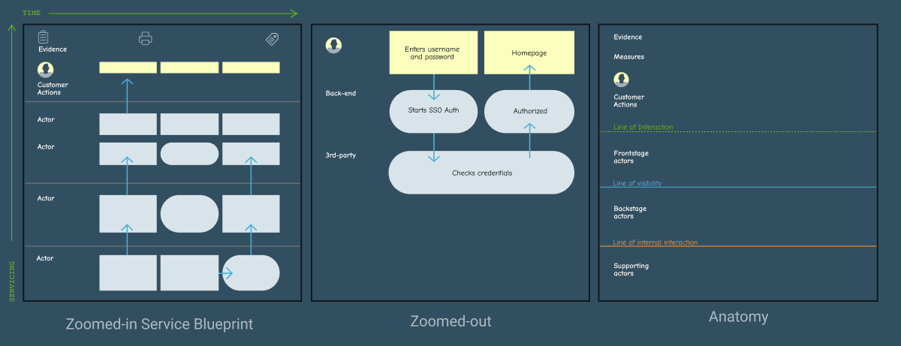

## How to Use this Method

### Sample Agenda & Prompts

1. Prepare for the workshop.

   **Interview customers** to find out their steps during a journey. Record these steps along the Customer Actions row.
   
   **Invite stakeholders** and actors to the workshop. If the actor is a digital service then invite the subject-matter expert (SME).

   {}
   TIP: Pull steps from a [customer journey map](/practices/journey-map)
   {}

2. Running the workshop (1-2 hours).

   

   **Fill in customer journey** before the workshop begins
   
   **Start** on the first column. Give each actor 5-10 minutes to fill in their row.

   **Agree** upon the steps then move on to the next customer action.

   Lastly, **record** the tangible evidence produced from interactions, such as emails, UI, texts, or notifications. Physical or digital evidence are parts of the experience that can be consumed or controlled by the service.

   {}
   TIP: It’s helpful to look into data that the evidence provides to understand what users already know.
   {}

4. Measure the customer experience by isolating areas of improvement.

   Experience: isolate **fail points** that could cause the system to break, or **simplify workflows**.

   Optimization: record **times** and **costs** to create baseline measurements.

   Redundancies: consolidate **data**, streamline **evidence** produced, record **pain points**, and introduce **standards**.

   {}
   TIP: Use metrics tied to business outcomes. Measure what you think can be compared against in the future, such as number of steps, user frustration, etc.
   {}

5. **Iterate** on the existing service by finding opportunities to improve the experience, optimize the service, and reduce redundancies.

6. **Share** the blueprint with your team to align on the existing or future service. Feedback will help fill in any gaps and answer questions.

7. When you feel that the service design has improved, **validate assumptions** of the new model using usability tests or solution-assumption tests.

   {}
   TIP: Work with simpler concepts when iterating services at a high level, then at a more granular level when figuring out the details.
   {}

## Success/Expected Outcomes
You know you are done when you can compare measurements, have reached alignment on a single version of the service, or have gained a clearer understanding of how the service works.

## Facilitator Notes & Tips
Getting your team aligned on a single vision of the process will be the greatest benefit of the activity. The blueprint can be built in Miro, a whiteboard, or even a spreadsheet to stay lean and work in lower fidelity.

**Asynchronous Blueprinting**

Create blueprints asynchronously from a workshop when synthesizing with many smaller groups who are not co-located. This takes more time, and will require more iterations until a full blueprint is produced.

**Terms:**
- **Service design** is the activity of planning and organizing a business’s resources (people, props, and processes) in order to (1) directly improve the employee’s experience, and (2) indirectly, the customer’s experience. See [NNGroup Service Design 101](https://www.nngroup.com/articles/service-design-101/).
- An **Actor** is a person, digital interface, or back-end system that consumes or delivers a resource to another actor, which eventually reaches the **customer**.
- **The line of interaction** - this is the point at which customers and the service interact in the front stage.
- **The line of visibility** - beyond this line, the customer can no longer see into the service in the backstage.
- **The line of internal interaction** - is where steps occur outside of the timeline and is usually where partners step to **support** the service.

**Optional Measures:**
- **Time** - some services are provided at different times or have steps that take varying amounts of time to complete.
- **Thoughts/Emotions** - understanding emotions of fear/anxiety provides context to customer decisions.
- **Phases** - services can unfold over time; e.g. rent, use, return.
- **Split up Backstage** - breaking backend technology into Employees, Data, Apps, Infrastructure, Name of Dept/Team can clarify various domains of the service.

**Alternative Rows:**
- **Photos / Sketches** - the team can visualize a step using pictures or drawings.
- **Challenges** - the team can discuss difficulties within the existing process.    
- **Ideas** - the team can generate solutions that solve pains.

## Related Practices
[Customer Journey Map](/practices/journey-map)

## Recommended Reading
[Service Blueprints: Laying the Foundation](https://www.izacross.com/thoughts/blueprintfoundations) by Izac Ross of Cooper

[Service Design 101](https://www.nngroup.com/articles/service-design-101/) by NNGroup
