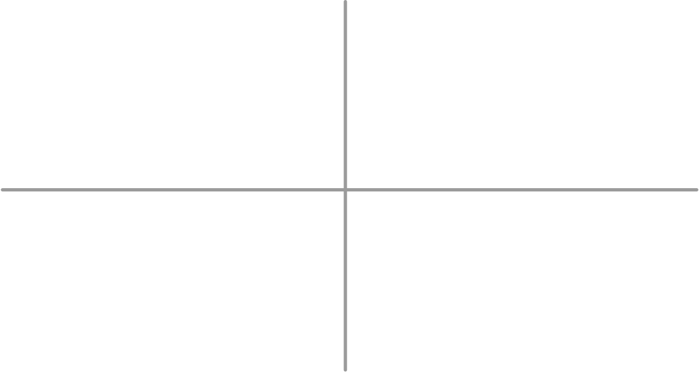
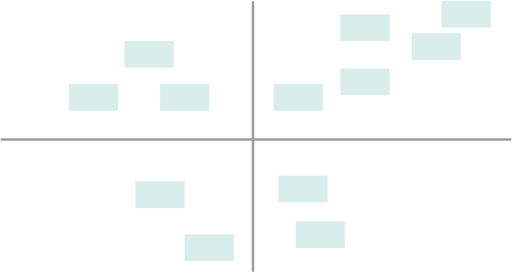
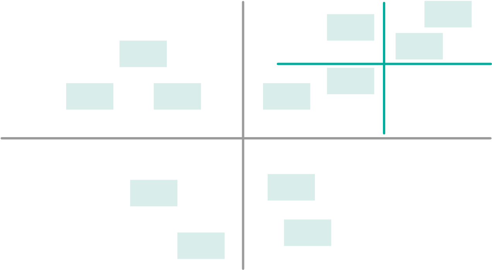
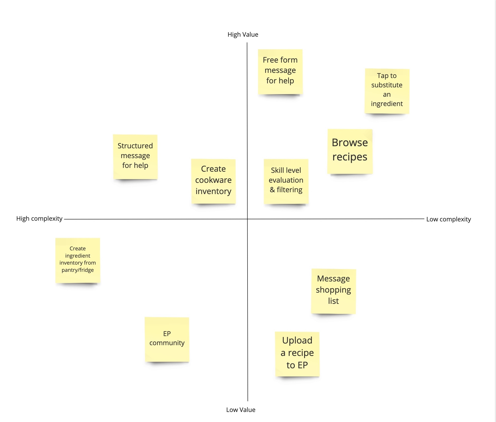

---
## How to Use this Method

{}
### Sample Agenda & Prompts
1. Construct a 2x2 matrix on the whiteboard using the blue painter's tape and label the axes clearly using parameters that make sense for your context. For example:
        
   - X-Axis — Higher Complexity (left) to Lower Complexity (right)
   - Y-Axis — Lower User Value (bottom) to Higher User Value (top)

   {}
   **Tip**: Make sure you define “higher value” in relationship to the top “how might we...” questions
   {}

   If whiteboard space is limited, you can do this exercise on a window

   

1. Plot the solution sticky notes on the 2x2 (can go around in a circle, person by person, if desired) and discuss

   {}
   **Tip**: Let everyone (PM, design, engineering) weigh-in on user value but only let engineering identify relative complexity
   {}

   Use this opportunity to extract any immovable requirements from product - especially if they're business driven
   
   

1. Do your best to end with manageable number of solutions in the top right quadrant. The team should feel comfortable about where you land.

   {}
   **Tip**: If there are too many priority solutions in the top right quadrant, re-draw the axes within that quadrant to further separate the solutions. Remember that this is possible because the axes are relative, not absolute. Keep adjusting until you land somewhere manageable.
   {}

   
{}

{}
### Success/Expected Outcomes
You know you are done when the team has prioritized their solutions and is comfortable that they've identified a manageable list of top solutions to explore.
{}

{}
### Facilitator Notes & Tips

This is an activity that you can time box if it feels drawn out. Many of the tips embedded above are intended to help you avoid rabbit holes, but if that happens you should feel empowered to move things forward by refocusing the team, setting a timer, or forcing a decision.
{}

{}
## Related Practices
- [2x2 Prioritization](/practices/2x2)
{}

{}
### Preceding
- [Solution Brainstorming](/practices/solution-brainstorming)
- Solution Grooming -- coming soon!
{}

{}
### Following
- Scenario Walkthrough -- coming soon!
- [Design Studio](/practices/design-studio)
{}

{}
### Real World Examples

{}
