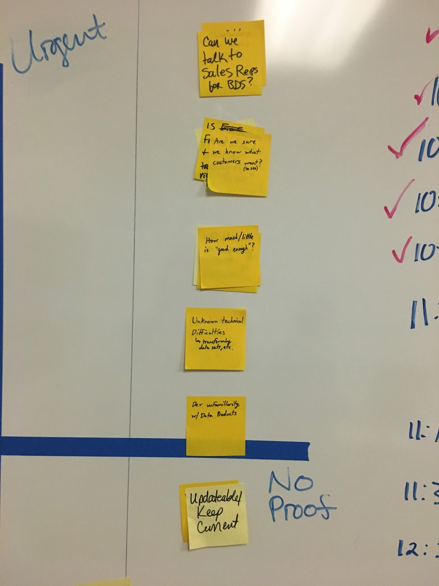

## How to Use this Method


**Note:** This technique is very effective for prioritizing and gaining alignment on ideas and problems, but is no longer viewed as a best practice for **_employee performance_**. Please refer to these two article for more details: 
- [How stack ranking corrupts culture, at Uber and Beyond](https://www.perdoo.com/resources/stack-ranking/)
- [What Is ‘Stack Ranking’ and Why Is It a Problem \[for talent management\]? ](https://lattice.com/library/what-is-stack-ranking-and-why-is-it-a-problem)


## Sample Agenda & Prompts
1. Gather all the options to be prioritized and write each one on individual sticky notes (or digital equivalent).

2. Decide together on a criterion on which to evaluate and prioritize these options.

   
   **Example**: user delight, technical complexity, business driver impact, etc.
   

3. Create a vertical line and label it with the chosen criterion.
   
   
   **Example**: “Greater user delight”, “Lower impact on business driver”
   

   

**From here, there are multiple techniques to engender team discussion as you collectively place the options along this single axis.**

### Variation - [Bubble Sort](https://en.wikipedia.org/wiki/Bubble_sort) Technique: 10 or fewer options

4. Pick an option at random and place it alongside the middle of the vertical line.

   

5. Pick a second option at random and ask the team, “Should this option be higher or lower than the first option, according to the criterion?” Place the second option above or below the first, according to the team’s prioritization decision.

   

6. Continue placing remaining options relative to other items as done in steps 4 and 5 until all options are stacked vertically against the line.

### Variation - Triage Technique: 10 or more options

4. As a group, divide the options into three groups based on the criterion: highest, moderate and least. Place the groups along the vertical axis accordingly.

5. Starting with the highest stack, discuss and place the individual items vertically on the axis with the higher valued items above lower valued ones. Work to place all items in that stack vertically against the line.

6. Continue as needed or as time allows with the remaining stacks, until enough options to take action on are stacked vertically against the line.

### Variation - Individual Ranking and Group Comparison: 3-9 options and situations where there is an unbalanced power dynamic in the group
4. Make copies of the options and the criterion axis for each individual in the group to rank on their own.

5. Set a 5 minute timer for everyone to individually rank the options along their own criterion axis, with the most highly valued options (according to the criterion) placed vertically above lower valued options.

6. When everyone has their own stack rank, start by asking a lower-powered individual to share their end result. Continue from there to compare everyone’s results and discuss the rationale behind any significant discrepancies.
    Work towards a final stack ranked list that everyone in the group can support.

## Success/Expected Outcomes
You know you are done when your group has a prioritized stack of options in descending order, and can identify the top prioritized options.

## Facilitator Notes & Tips
- If there are 20+ items, consider spending time removing options that are irrelevant to the criterion selected. 
- If not mutually understood by all participants, it may help to first discuss and define what the criterion means (e.g. what do we mean by "business impact"?). This will help the prioritization to go more smoothly.
- Consensus (where everyone agrees 100% on priorities) is rarely feasible. The objective is to achieve alignment on what to focus on.
- This practice can be used at the end of a 2x2 prioritization session to take the top right quadrant of items and turn them into an actionable order of attack for the items discussed.

## Related Practices
[Insight Prioritization](/practices/insight-prioritization)

[Problem Prioritization](/practices/problem-prioritization)

[Solution Prioritization](/practices/solution-prioritization)

[2x2 Prioritization](/practices/2x2)

## Real World Examples

## Recommended Reading

[Bubble Sort](https://en.wikipedia.org/wiki/Bubble_sort)