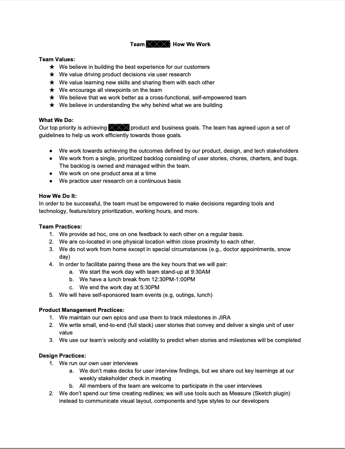

## How to Use this Method

### Sample Agenda & Prompts
1. On a physical or digital/online whiteboard, create three columns of equal size and label them the “Ideas”, “Working Agreements” and “Ice Box” from left to right.

2. Explain to the team that as a group you are going to co-create and then agree on a set of behaviors and standards to guide how to work together.

   {}
   Tip: ask the team to keep an open mind, that everyone contribute, and try and avoid interrupting people or dominating the conversation.
   {}

3. Before writing any stickies, ask everyone to take a moment to think about what is important to them when working in a team. Encourage them to note these down privately.

   {}
   Tip: Encourage the team to reflect on times they have worked in great teams and what made them great as well as teams that were challenging and what could have been different to have made them less challenging.
   {}

   {}
   Tip: If team members are not taking many notes you can suggest topics you yourself might have observed; for example: 
   - “We've never agreed on core working hours.”
   - “During our remote standups, some people have their cameras on, others have them off. How do you feel about that?”
   - “How do you feel about the haphazard manner by which we are scheduling meetings?”
   {}

4. Now ask that each member of the team write one agreement that they believe will help create a successful team and to add it to the “Ideas” column.

   {}
   Tip: if your team has fewer than 5 people you may want everyone to write 2 agreements
   {}

   {}
   Tip: add/call out a list of examples that anyone may use which cover some of the overlooked healthy values a team may need; e.g. Cameras on calls, no phones during standups, flexibility across time zones.
   {}

   {}
   Tip: you can strive for participation by checking the number of agreements against the number of attendees and prompting the group until they are equal.
   {}

5. As a group read through the agreements and combine any similar agreements into a single agreement.

   {}
   Tip: Make sure the agreements are written at a high level and focused on values rather than minutiae. Example: “Always take lunch at 12pm EST,” can be turned into “Make sure we take a lunch break every day.” 
   {}

6. It is strongly advised that your working agreements cover the following topics so if these are not on the board, take the lead and add them:
   - Core working hours
   - Meeting schedules
   - Breaks
   - Call etiquette
   - How and when to give feedback

7. If suggestions are too specific or feel unrelated to the ethos of working agreements, move them to the “Ice Box” column.

1. Go through each agreement as a team, reading them out loud and then initiate a vote to commit to the agreement.

   An agreement is only agreed to if it receives a unanimous vote. Make sure everyone participates. If any “no” votes arise, ask the team member for clarification on what would turn their vote into a “yes.”

   If accommodating this seems feasible, discuss what you can do together as a team to make it happen and adjust the written agreement to bring harmony.

   If it is unfeasible to get 100% yes votes on an agreement, move it to the “Ice Box” column.

1. Once you have done this for every agreement - take a final poll of the team to agree on the total set of agreements. Again this requires a unanimous vote to continue. If this is not possible go back to the previous step.

1. Finally, post your agreements publicly and make sure everyone has access to them.
   
   {}
   Tip: email the agreements to everyone and add them to the weekly retro space as fuel for thought.
   {}

   Here is an example PDF: [Team working agreement document example](images/team-working-agreement-example.pdf)

## Success/Expected Outcomes
You have successfully completed this task when you gave a clear set of working agreements that 100% of the team have voted on and agreed to.

## Facilitator Notes & Tips
This is an activity that you can time box if it feels drawn out. Many of the tips embedded above are intended to help you avoid rabbit holes, but if that happens you should feel empowered to move things forward by refocusing the team, setting a timer, or forcing a decision.

Also, just because a behavior does not get added to the working agreements does not mean that a team member cannot behave that way nor ask that others behave that way. On rare occasions you may need to remind the team of this if they end up in heated disagreement over an agreement.

## Related Practices
[Team Values](/practices/team-values)

## Real World Examples

Team working agreement document example:

