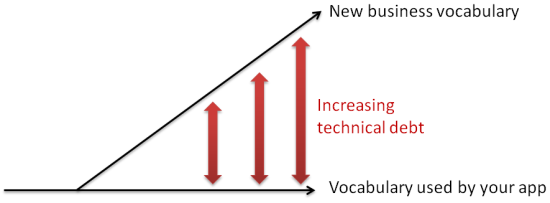
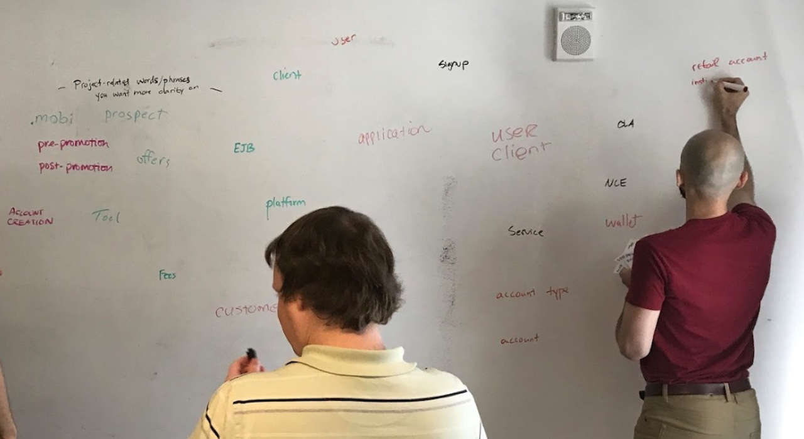

## How to Use this Method

{}
### Sample Agenda & Prompts
1. Clearly outline the goal of the meeting:

   {}
   **Example**: "A form of technical debt we don't often think of is the distance between the language used by domain experts and the one used in the codebase."
   {}
 
   {}
   **Example**: "Our goal today is to get ahead of this debt by creating a shared understanding of terminology for our team that focuses on understanding, not semantics."
   {}

   {}
   **Tip**: You can also present any anti-goals that may help steer the team away from rabbit holes. This is optional.
   {}
 
   

1. Give everyone 10 minutes (or less) to individually write down as many terms as they can, 1 term per sticky note

   {}
   **Tip**: If you have many people participating in this activity, break into small groups. This will make the output more manageable.
   {}

1. Next, set a timer for 30 minutes and have everyone write a brief definition for each of the sticky notes they’ve generated

   {}
   **Tip**: If you’re concerned about the volume of terms you may end up with, consider having participants only write definitions for the terms they think are least understood by the team.
   {}

1. Have each person share out the terms and definitions they’ve identified. Cluster similar terms on the whiteboard or wall as they’re read aloud.

1. Discuss any variances in the definitions, focusing on shared understanding over semantics. Avoid going into concrete definition mode.

   {}
   **Tip**: You will find that there might be multiple names being used for the same definition. Converge on **one** name and definition. If one does not exist, create one together.
   {}

1. Take a picture of the wall to memorialize.

   {}
   **Tip**: If your team is fully co-located, consider keeping the sticky notes. Set notice space on a wall in your team area and reconstruct the term list there. This will provide the team with an always-accessible vocab reference wall.
   {}
{}

{}
### Success/Expected Outcomes
Success happens when you’ve identified a starting list of common terms and given a definition to each. Congratulations—you’ve created a Ubiquitous Language glossary!
{}

{}
### Facilitator Notes & Tips

If you find yourself running low on time during share out, consider prioritizing the terms most closely related to upcoming work. This way you’ll be able to work those terms in the most imminent stories so they get built into the codebase.

Try as hard as you can to have one or more domain experts in the room with you. Without people present who can represent the subject matter, it will be tougher to converge on a shared language that represents the business reality.
{}

{}
### Real World Examples

{}

{}
### Recommended Reading

[Ubiquitous Language & the joy of naming](https://blog.carbonfive.com/2016/10/04/ubiquitous-language-the-joy-of-naming/)  
[DDD: Questions around ubiquitous language](https://richarddingwall.name/2013/02/16/ubiquitious-language-handling-change/)  
[Domain-Driven Design Distilled (1st Edition)](https://www.amazon.com/Domain-Driven-Design-Distilled-Vaughn-Vernon/dp/0134434420)  
[Domain-Driven Design: Tackling Complexity in the Heart of Software (1st Edition)](https://www.amazon.com/Domain-Driven-Design-Tackling-Complexity-Software/dp/0321125215)
{}