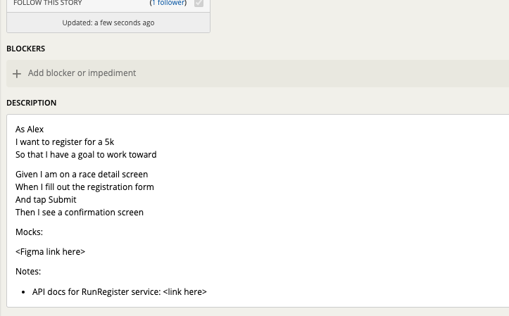
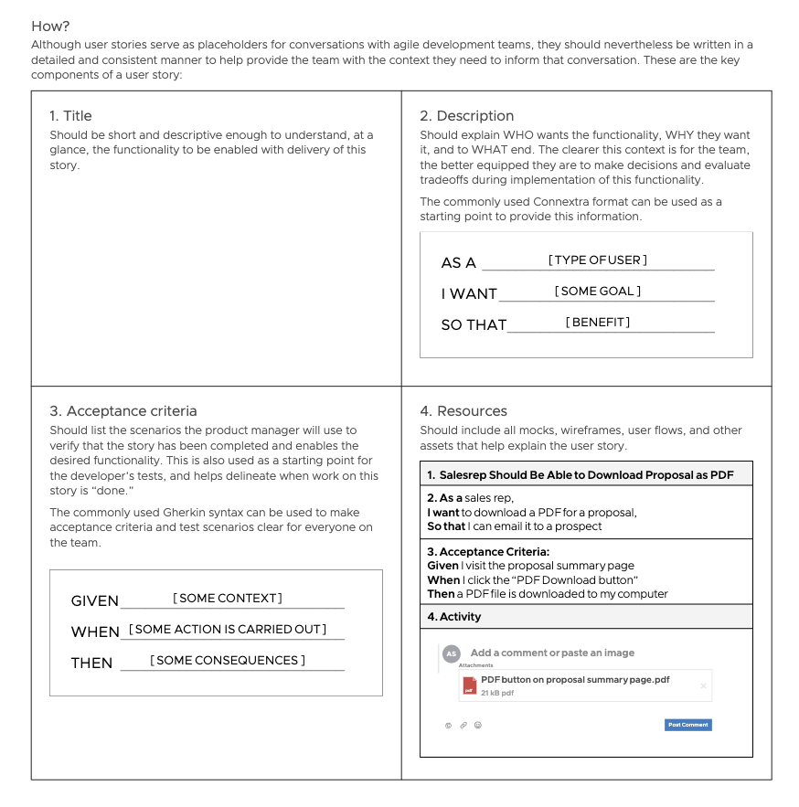

## How to Use this Method
You’ll need stories ready for three main project phases:
- User stories groomed and ready for the next [Iteration Planning Meeting](/practices/ipm) (1-2 weeks out)
- User stories ready for high-fidelity design, but not all details finalized (2-4 weeks out)
- User stories sketched out with a rough idea, to signal where the product is headed and help inform research efforts (1-3 months out)

### Sample Agenda & Prompts
1. Start by reviewing the idea, feature, or user flow that you are going to break down into user stories. You may have done a Story Mapping exercise, or a casual ideation
session with your team, to generate the feature or user flow.

2. **Write a title.** Make it short and descriptive. An actionable title ensures your backlog is easy to understand for the whole team.

   
   Example title: _A Sales rep can download a sales proposal as a PDF_

   

3. **Write a description.** Using the “As a [persona] … I want to … so that …” format, describe the value this story will deliver from the perspective of a user.

   {}
   Example description:
   
   **AS** _Alex the sales rep_
   
   **I WANT** _to download a PDF version of a sales proposal_
   
   **SO THAT** _I can email it to a prospective customer_
   {}

   The description helps your team understand who we are building for, why that user wants this feature in the software, and what it will help them accomplish. If you use a name  in your description, the name should represent a [persona](/practices/personas) your team has created, such as "Alex the sales rep", and not a random name, and should be consistent across all stories where that persona is the intended user.

   {}
   Tip: Try making the “so that …” portion of your story about something that happens outside your app. This can help you ensure you’re understanding the value to the user. If you’re having trouble writing the “so that …” portion, ask yourself if the story is really valuable.
   {}

   {}
   Tip: Your users don't have to be human! Sometimes the actors and consumers of a system are themselves other systems, or software, or devices. This can be common in event-based or internet-of-things systems. Please see our Tanzu guide for [Writing User Stories for Event-Based Systems](https://tanzu.vmware.com/developer/guides/writing-agile-user-stories/) for how to write stories for these systems.  
   {}

5. **Write acceptance criteria.** These are scenarios that the engineers will use to write automated tests during development, and the Product Manager will use for acceptance testing when the story is delivered. Acceptance criteria describe what “done” looks like from a user’s perspective. They help the team understand what needs to be done, identify blockers and dependencies, understand and estimate complexity, understand how the work will be tested and accepted, and think about a test-driven development approach.

   {}
   Example acceptance criteria: 
   
   **GIVEN** _I visit the proposal summary page_
   
   **WHEN** _I click the button labeled “PDF Download”_
   
   **THEN** _a PDF file of the sales proposal downloads to my computer_
   {}

1. **Add supporting documentation and notes as needed.** If needed, include additional information to make the user story clear. This most often includes design mockups, but can also include general notes about the story, documentation related to integrations, etc.

   In some cases it is helpful to add notes about things that are NOT part of the story. Avoid writing a list of all the things that are out of scope, but if there’s 1-2 things that seem like they could be part of the story but aren’t, it can provide clarity to call those out.

   Here is a complete example:
   {}

   **STORY TITLE:** _A Sales rep can download a sales proposal as a PDF_
   
   Description:

   **AS** _Alex the sales rep_
   
   **I WANT** _to download a PDF version of a sales proposal_
   
   **SO THAT** _I can email it to a prospective customer_
   
   Acceptance Criteria:
   
   **GIVEN** _I visit the proposal summary page_
   
   **WHEN** _I click the button labeled “PDF Download”_
   
   **THEN** _a PDF file of the sales proposal downloads to my computer_
   
   Resources:
   - Example of this feature from one of our other products: `<link to example>`
   - Developer note: here is the PDF conversion library our other teams use: `<link to resource>`
   {}

   {}
   Tip: For clarity and high-fidelity implementation, most user stories with a user interface component should include some kind of mockup or documentation from designers. This can be anything from a wireframe, to a high-fidelity mockup, to a clickable prototype or references to components in a design system.
   {}

## Success/Expected Outcomes
You’ll know you’ve got good user stories when:
- The whole product team can read a story and understand what value it provides to the user
- Discussions about stories in IPM are smooth, and are about clarifying details, not questioning what the overall approach is - if you’re having trouble getting here, consider [IPM pre-planning](/practices/iteration-pre-planning) to help smooth out story grooming
- Engineers can tell from the story when they are done developing it
- You can easily accept a story once it’s been delivered
- The team delivers several user stories per week
- Most of the stories in your backlog can be completed independently and in parallel with other stories
- Your stories don’t go into implementation details, but instead describe what is to be built (not _how_ to build it)

## Facilitator Notes & Tips
**INVEST** is a mnemonic for remembering the qualities of a good user story.

**Independent** – does not have dependencies on other stories to deliver. Any given story should not have a dependency on other stories in order to deliver it. A developer pair should be able to pick up a story from the top of the backlog and do everything needed to deliver the value it describes, without touching other stories in the backlog, or stepping on another developer’s toes in the code. If you’re having trouble avoiding dependencies within your own backlog, consider how you can re-slice the stories to be more independent.

**Negotiable** – not a specific contract for features. A story is lightweight documentation of a shared understanding of a piece of value to deliver, not contractual agreement between engineers and the PM (or between the product team and stakeholders) about what will be delivered. Stories should be updated based on new information from users, stakeholders, or input from your team, as often as needed up until development begins. Once development begins, avoid changing a story unless the people working it are aware of and understand the change. Even then, be wary of scope creep and the need for re-estimation based on new acceptance criteria and implementation.

**Valuable** – delivers real value to a user, is not a horizontal slice of technology. Each story, once delivered, should provide real value. Stories should not be broken out into horizontal slices (e.g. front end, back end). Full-stack stories ensure the app is always in a deployable (and potentially releasable) state, and keeps the team focused on the outcomes of the work, not delivery of lines of code.

**Estimatable** – can be estimated to a good approximation. A developer on your team must be able to understand the scope of the story well enough to give some estimation of the effort or complexity involved. Be wary of getting overly detailed in an effort to make things estimate – implementation details should be left to developers, not written into stories.

**Small** – as small as possible, fitting within an iteration. Stories should be as small as possible while still delivering value. Ideally you will deliver multiple stories in each iteration. This enables short feedback cycles, which allow the team to learn fast and course correct as needed. Small stories also support continuous delivery to your testing or staging environment.

{}
Tip: A good sign that a story has gotten too big is when it has several blocks of acceptance criteria (especially a lot of “AND”s), when it is estimated as high complexity by developers (i.e. 8 in fibonacci pointing), or when it generates an ongoing, divergent conversation during the Iteration Planning Meeting. Too-big stories should be broken up into smaller, independent stories to ensure tight feedback loops and clear testing scenarios.
{}

**Testable** – in principle, even if there’s not a test written yet. This doesn’t mean you have already written the tests, but there must be a way to test the story once delivered.

## Related Practices

### Preceding
- [Story Mapping](/practices/story-mapping)
- [Personas](/practices/personas)
 
### Following
- [Iteration Pre-Planning](/practices/iteration-pre-planning)
- [Iteration Planning Meeting](/practices/ipm)

## Real World Examples

## Recommended Reading
Tanzu Guide: [Writing User Stories for Event-Based Systems](https://tanzu.vmware.com/developer/guides/writing-agile-user-stories/)

Tanzu Learning Path - Foundations of Modern Application Development Practices: [Prioritizing Impactful Outcomes: User Stories, Estimation, and Velocity](/learningpaths/application-development/prioritizing-outcomes/)